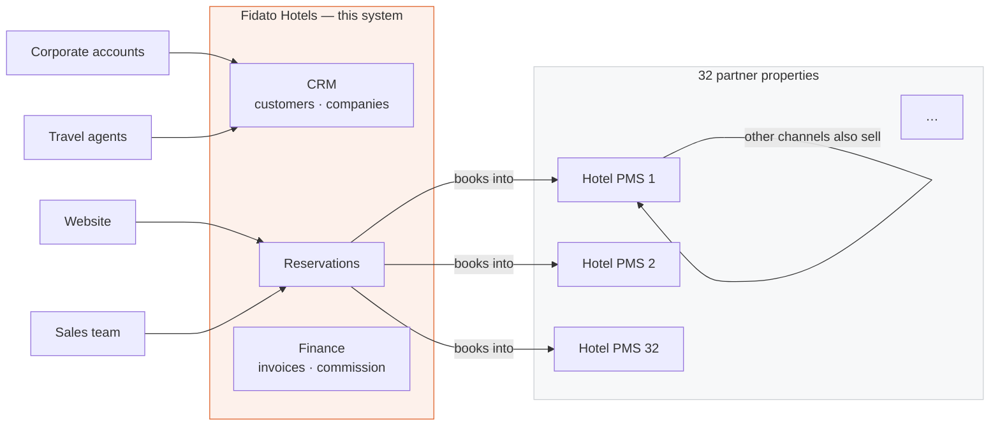
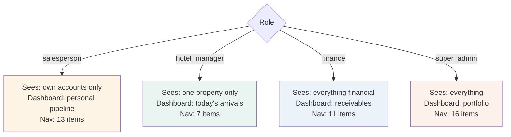
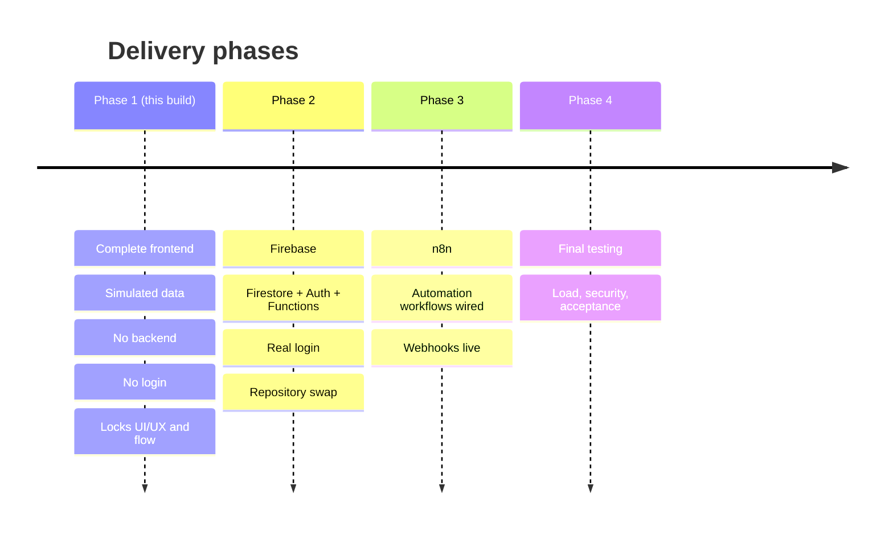

← [Manual index](README.md) · Next: [II — Architecture](02-architecture.md)

---

# Volume I — System overview

## 1.1 What this system is

Fidato Hotels is a hospitality management company that does **not own** the properties it
sells. It holds commercial agreements with 32 partner hotels across India and sells room
nights into them through a sales team, corporate accounts, travel agents and its own website.

That business shape determines everything about this software.

A property management system (PMS) runs *one hotel* — it knows every room, every housekeeping
status, every walk-in. Fidato does not need that; each partner already has one. What Fidato
needs is a **central reservation system (CRS) with a CRM and a back office bolted to it**: a
system that knows *its own* customers, *its own* bookings, *its own* commission, spread across
32 properties it does not control.



### The consequence that catches everyone out

Fidato sells **a slice** of each partner hotel. Other channels — the hotel's own website,
OTAs, walk-ins, other agents — sell the rest. This single fact invalidates the most obvious
metric in the product:

> Occupancy is **not** Fidato's reservations divided by the hotel's total rooms.

That ratio, computed over this portfolio, comes out below one percent. It is not a low
number; it is a *meaningless* number, because the denominator describes something Fidato does
not control. Volume VI §6.9 and ADR-19 cover how occupancy is actually derived.

---

## 1.2 Who uses it

Eight roles, and they want genuinely different things from the same data.

| Role | Population | Primary question they open the app to answer |
|---|---:|---|
| Super Admin | 1 | "Is anything broken, and who did what?" |
| Admin | 2 | "What needs administering today?" |
| Sales Manager | 3 | "How is my team performing, and what needs my approval?" |
| Salesperson | 8 | "What's in my book, and what do I need to chase?" |
| Hotel Manager | 5 | "Who is arriving at *my* property today?" |
| Finance | 3 | "What have we billed, what's outstanding, what's overdue?" |
| Support | 1 | "What happened on this booking?" |
| Viewer | 1 | "Show me, don't let me touch." |

These are not cosmetic differences. A salesperson and a sales manager looking at
`/crm/companies` see **different rows**, not the same rows with different buttons. A hotel
manager's dashboard is a different dashboard, with different KPIs, not the portfolio
dashboard filtered.



---

## 1.3 The phase plan

The build is deliberately staged. Phase 1 exists so that Phases 2–4 are plumbing rather than
redesign.



### Why front-end first, and why this is not the usual advice

The conventional order is data model → API → UI. It was inverted here on purpose, for three
reasons specific to this project:

1. **The requirements were a description, not a specification.** The brief was a
   twenty-document product engineering specification that did not yet exist. Building the
   screens *is* the fastest way to discover what the fields actually need to be. Several
   fields in the data model exist only because a screen demanded them.

2. **The expensive mistake here is a wrong flow, not a wrong query.** Rewriting a Firestore
   query is an afternoon. Rewriting a reservation wizard after the sales team has been trained
   on it is a quarter. Phase 1 puts the reversible work first.

3. **Simulation is cheap and honest.** Because the repository layer was written to Firestore's
   shape from the first line (Volume VIII), the simulation is not throwaway. It is the same
   interface with a different implementation behind it.

The risk of this order — that the UI assumes data the backend cannot cheaply provide — is
managed by ADR-06: the mock repository is deliberately restricted to operations Firestore can
actually perform. There are no joins in the repository layer, because Firestore has none.

---

## 1.4 What Phase 1 includes

| Area | Included |
|---|---|
| Screens | All 38 routes, fully built, no stubs |
| Data | 1,100 reservations, 32 real properties, 180 customers, 40 companies, 450 invoices, and 13 more collections |
| Interactions | Create, edit, cancel, approve, merge, import, filter, sort, paginate, print |
| Roles | All 8, switchable, genuinely affecting navigation, scoping and available actions |
| Business rules | All 8 encoded and enforced in the UI |
| States | Empty, loading, error and no-results on every list |
| Responsive | Down to tablet; drawer navigation below `lg` |
| Accessibility | Keyboard navigation, focus management, ARIA on all custom controls |
| Print | Invoices and report covers |
| Documentation | This manual, plus four working documents and two self-documenting screens |

## 1.5 What Phase 1 deliberately excludes

| Excluded | Why | Arrives in |
|---|---|---|
| Login / authentication | A login screen proves nothing about the product. The role switcher demonstrates the permission model *better* than a login would, because you can move between roles in one second | Phase 2 |
| Firebase | Committing to a schema before the screens exist is the mistake this phase avoids | Phase 2 |
| n8n | The workflow definitions are written; only execution is deferred | Phase 3 |
| Real email / PDF / WhatsApp | Delivery is an integration concern, not a UX one. Buttons show what *would* happen | Phase 2–3 |
| File uploads | Needs storage; nothing in Phase 1 depends on it | Phase 2 |
| Server | There is nothing to serve | Phase 2 |
| A real language model | The assistant computes from live data instead — see ADR-22 | Phase 2 |
| Data persistence across refresh | Deliberate. Every review starts from an identical state | Phase 2 |

⚠️ **The exclusions are not gaps to be apologised for.** Each is a decision with a stated
reason. If a reason stops holding, the decision should be revisited — that is what Volume III
is for.

---

## 1.6 The demo date

The entire seeded world is built around a fixed "today":

```ts
// src/data/seed/index.ts
export const TODAY = new Date(2026, 6, 28);   // 28 July 2026
```

Everything is positioned relative to it: reservations span −330 to +150 days around it,
invoices age from it, audit entries trail behind it, and the inventory grid projects forward
from it.

**Why fix the date at all?** Because a demo that drifts is a demo that decays. If the seed
used the real clock, then in three months the "upcoming arrivals" panel would be empty, every
forward booking would have become historical, and the approval queue would be stale. A fixed
date means the manual you are reading now describes the screens you will see next year.

🔧 **Phase 2 removes this.** Once data comes from Firestore, `TODAY` is replaced by
`new Date()` and the seed module is deleted. There are 43 references to `TODAY` across the
codebase; Volume XIV §14.6 lists them.

---

## 1.7 The single most important thing to understand

The product has **one idea** running through every screen:

> Show people what they cannot do, and tell them why.

A blocked action is never hidden. The Edit button on a rate plan does not disappear for a hotel
manager — it is replaced by the word **Locked**, and a banner at the top of the page explains
that pricing is owned centrally by the revenue team.

This costs more to build than hiding things. It is worth it because:

- A product that hides things looks **broken** to the person who cannot see them.
- A rule that is never surfaced is a rule nobody learns, so it gets asked about forever.
- When a permission is wrong, a visible restriction gets reported. A hidden one does not.

The same principle produces the `Forbidden` screen instead of a 404 (ADR-11), the disabled
Cancel button with a tooltip on completed reservations, and the explicit statement on the
Occupancy report that the number does not mean what you might assume.

---

Next: [Volume II — Architecture](02-architecture.md)
