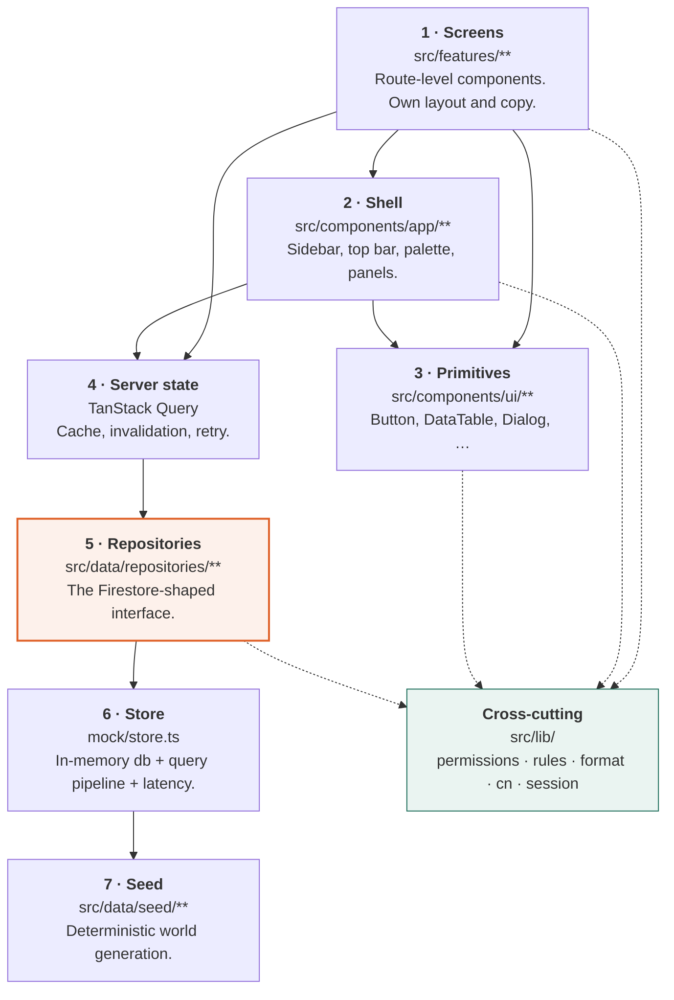
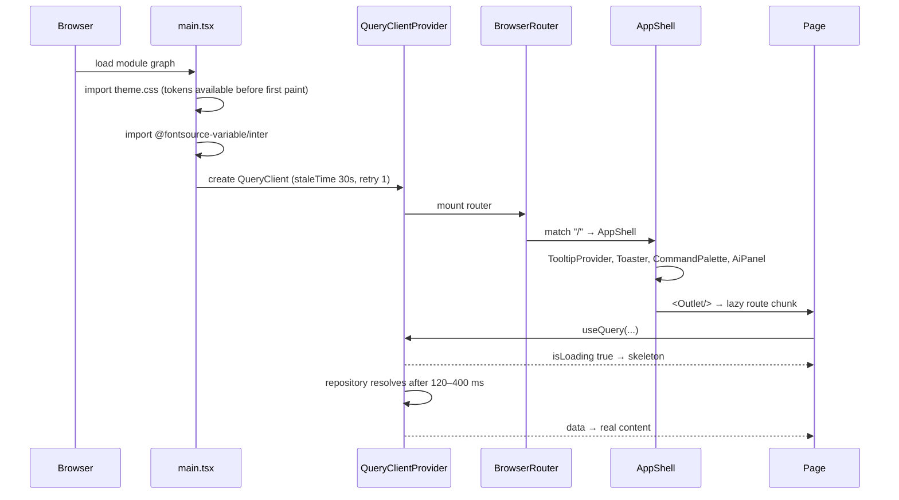
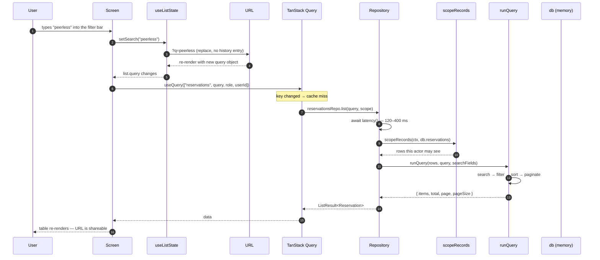
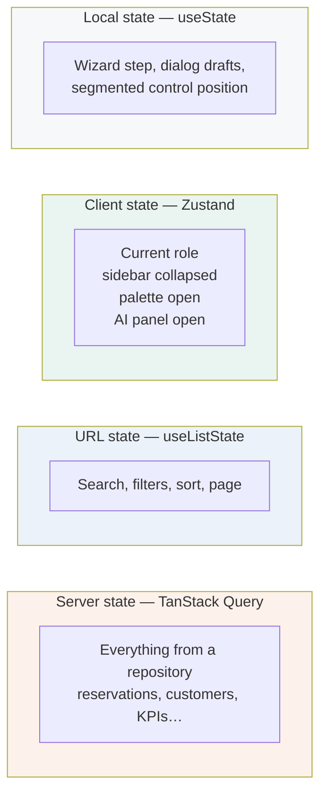
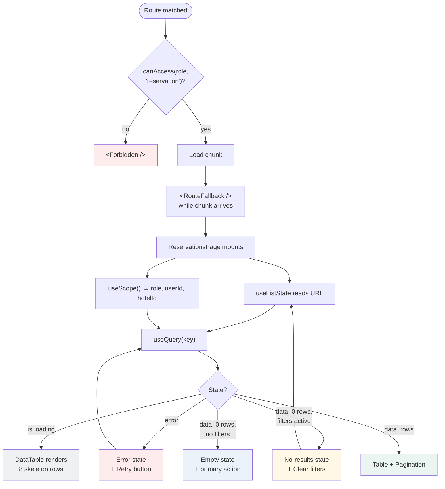

← [I — System overview](01-system-overview.md) · [Index](README.md) · Next: [III — Decision log](03-decision-log.md)

---

# Volume II — Architecture

## 2.1 The layer model

Seven layers. Each may only call downward. That constraint is what makes the Phase 2 swap a
one-folder change instead of a rewrite.



### The rules of the layer model

| Rule | Enforced by | Why |
|---|---|---|
| Screens never import from `repositories/mock/` | Convention + review | Phase 2 replaces `mock/`. Any screen that reaches past `repositories/index.ts` breaks the swap |
| Primitives never import from `features/` | Convention | A primitive that knows about reservations is not a primitive |
| Primitives never import repositories | Convention | A component that fetches is not reusable |
| `lib/` imports nothing from `components/` or `features/` | Convention | It is the bottom of the dependency graph and must stay there |
| Business rules live only in `lib/rules.ts` | Review | A rule duplicated in a component is a rule that will drift |

⚠️ **The one deliberate exception:** several screens import `db` directly from
`@/data/repositories` for cheap synchronous derived counts (for example, the invoice totals
strip on `/finance/invoices`). This is a Phase 1 shortcut for values that do not warrant a
query. Volume XIV §14.4 lists all 11 occurrences, because each becomes a real aggregate in
Phase 2.

---

## 2.2 Directory map

```
D:\fidato crs\
├─ index.html                    Entry document; sets <title> and favicon
├─ vite.config.ts                Aliases, chunking strategy
├─ tsconfig.app.json             strict: true, noUnusedLocals, noUncheckedIndexedAccess
├─ .npmrc + win-ca-bundle.pem    Local CA trust for this machine's TLS proxy
├─ docs/
│   ├─ design-system.md          Working doc
│   ├─ data-model.md             Working doc
│   ├─ screen-inventory.md       Working doc
│   ├─ role-matrix.md            Working doc
│   └─ manual/                   ← this manual
└─ src/
    ├─ main.tsx                  Root: providers, router, query client
    ├─ routes.tsx                All 38 routes + permission guard
    ├─ styles/theme.css          Every design token. Single source of truth
    ├─ assets/brand/             logo-full.svg, logo-mark.svg
    ├─ lib/
    │   ├─ cn.ts                 clsx + tailwind-merge
    │   ├─ format.ts             Money, dates, numbers, text — 20 functions
    │   ├─ permissions.ts        Roles, resources, actions, matrix, scoping
    │   ├─ rules.ts              The 8 business rules
    │   └─ session.ts            Zustand: current role + UI state
    ├─ components/
    │   ├─ ui/                   28 primitives + index.ts barrel
    │   └─ app/                  AppShell, Sidebar, TopBar, RoleSwitcher,
    │                            CommandPalette, AiPanel, navigation.ts
    ├─ features/
    │   ├─ shared/               Forbidden, NotFound, RouteFallback, useListState
    │   ├─ dashboard/            1 screen
    │   ├─ reservations/         5 screens
    │   ├─ crm/                  8 screens
    │   ├─ hotels/               4 screens
    │   ├─ finance/              4 screens
    │   ├─ reports/              6 screens + ReportShell
    │   ├─ automation/           3 screens
    │   ├─ notifications/        2 screens
    │   ├─ ai/                   1 screen + responses.ts
    │   ├─ admin/                5 screens
    │   └─ design-system/        1 screen (living style guide)
    └─ data/
        ├─ types.ts              46 exported types
        ├─ seed/
        │   ├─ index.ts          The generator
        │   ├─ hotels.data.ts    32 real properties from the fact-sheet PDFs
        │   ├─ names.ts          Name pools, industries, preferences
        │   └─ random.ts         Seeded PRNG
        └─ repositories/
            ├─ index.ts          ← the only import path screens use
            └─ mock/
                ├─ store.ts      db, latency, runQuery
                └─ index.ts      11 repositories
```

---

## 2.3 Application bootstrap

`src/main.tsx` is the whole startup sequence. Four providers, in this order, for reasons:



**Why the query client sits outside the router:** cache must survive navigation. Move it
inside and every back-navigation refetches, which in a data-dense internal tool feels broken.

**Why `theme.css` is imported first:** tokens must exist before the first component renders,
or the first paint flashes unstyled.

### Query client configuration and its reasoning

| Option | Value | Reasoning |
|---|---|---|
| `staleTime` | 30 s | Internal tool. Data changes slowly; refetching on every focus is noise. Long enough to make tab-switching feel instant, short enough that a colleague's change appears within a coffee refill |
| `retry` | 1 | The mock layer does not fail randomly. In Phase 2 one retry absorbs a transient Firestore hiccup without hiding a real outage behind four |
| `refetchOnWindowFocus` | false | An accountant with the invoice list open and a spreadsheet beside it should not see rows shuffle every time they alt-tab |

---

## 2.4 The request lifecycle

This is the path every piece of data on screen has taken. Understanding it is most of
understanding the system.



### Two properties worth noticing

**Scope is applied before search.** A salesperson searching for a company they do not own
finds nothing — not "access denied", just nothing, because the record was removed from the
set before the search ever ran. This is the correct behaviour: it does not leak the existence
of records the actor may not see.

**The URL is the state.** Search, filters, sort and page all live in the query string
(§2.6). The React state is a mirror of the URL, not the other way round.

---

## 2.5 Routing and code splitting

All 38 routes are declared in `src/routes.tsx`. Every feature screen is `React.lazy`.

```tsx
// src/routes.tsx
const ReservationsPage = lazy(() => import("@/features/reservations/ReservationsPage"));
// … 33 more
```

The route tree has an unusual shape — a nested `<Routes>` inside a `path="*"` element:

```tsx
<Routes>
  <Route element={<AppShell />}>
    <Route path="*" element={
      <Suspense fallback={<RouteFallback />}>
        <Routes>
          {/* all 38 routes */}
        </Routes>
      </Suspense>
    } />
  </Route>
</Routes>
```

**Why nested rather than flat?** Because the `<Suspense>` boundary must sit *inside* the
shell, not around it. With a flat tree, every lazy route transition would unmount the sidebar
and top bar while the chunk loaded — the whole frame would flash. Nesting puts the boundary
below the persistent chrome, so only the content area shows the skeleton.

### The permission guard

```tsx
function Guard({ resource, children }: { resource: Resource; children: ReactNode }) {
  const role = useSession((s) => s.role);
  if (!canAccess(role, resource)) return <Forbidden resource={resource} />;
  return <>{children}</>;
}
```

Eleven lines, wrapping every protected route. It renders `Forbidden`, never a redirect and
never a 404 — see ADR-11.

### Bundle output

| Chunk | Raw | Gzipped | Contents |
|---|---:|---:|---|
| `index` | 390.6 kB | 120.4 kB | React, Router, Query, Zustand, shell |
| `BarChart` | 359.1 kB | 103.9 kB | Recharts — loaded only when a chart-bearing route is opened |
| `ui` | 257.6 kB | 81.4 kB | Radix primitives + the component library |
| `schemas` | 100.4 kB | 29.4 kB | Zod + react-hook-form resolvers |
| Largest screen | 37.0 kB | 11.3 kB | `RevenueReportPage` |
| Median screen | ~6 kB | ~2.2 kB | — |

Recharts being its own chunk is the point of the splitting: it is the single heaviest
dependency, and eleven of the thirty-eight routes never touch it.

---

## 2.6 URL as state

`src/features/shared/useListState.ts` puts list state in the query string.

```
/reservations?q=peerless&status=confirmed&sort=totalAmount&dir=desc&page=3
```

| Parameter | Meaning |
|---|---|
| `q` | Free-text search |
| *(named keys)* | One per filter, e.g. `status`, `channel`, `tier` |
| `sort` | Field to sort by |
| `dir` | `asc` or `desc` |
| `page` | 1-based; omitted when 1 |

**Why not component state?** Three reasons, in order of how often they matter:

1. **A filtered view is a thing people send each other.** "Look at this" with a link is worth
   more than "filter by overdue then sort by due date".
2. **Refresh should not lose your place.** In a tool people keep open all day, losing a
   filter to an accidental reload is a real irritation.
3. **Back should work.** Browser back returning to the previous filter is what every user
   already expects.

The implementation uses `replace: true`, so typing in the search box does not create thirty
history entries — only navigation does.

One nuance: the search input is *mirrored* in local state (`searchDraft`) so typing feels
instant, while the URL is the authority. Without the mirror, every keystroke would round-trip
through the router and the input would feel laggy.

---

## 2.7 State ownership

Three kinds of state, three different mechanisms. Choosing the wrong one is the most common
architectural mistake in React applications, so the boundaries here are explicit.



| State | Mechanism | Test for "does it belong here?" |
|---|---|---|
| Server | TanStack Query | Does it come from a repository? |
| URL | `useListState` | Would you want to send it to a colleague? |
| Global client | Zustand | Do two distant components both need it? |
| Local | `useState` | Does anything outside this component care? |

Zustand holds exactly two stores and deliberately no more:

```ts
// src/lib/session.ts
export const useSession = create<SessionState>()(
  persist((set) => ({ role: "sales_manager", setRole: (role) => set({ role }) }),
          { name: "fidato.session" }),
);

export const useUi = create<UiState>()(
  persist((set) => ({ /* sidebar, mobile nav, palette, AI panel */ }), {
    name: "fidato.ui",
    partialize: (state) => ({ sidebarCollapsed: state.sidebarCollapsed }) as UiState,
  }),
);
```

⚠️ **`partialize` matters.** Without it, `commandOpen: true` would persist to localStorage,
and the next page load would open with the command palette already up. Only the durable
preference — sidebar collapsed — is worth surviving a reload.

---

## 2.8 The rendering pipeline for a typical screen

Taking `/reservations` as the worked example.



The distinction between **empty** and **no-results** is not pedantry. They need different
words and different exits:

- *Empty* — "No reservations yet. Bookings raised by the sales team, the website or a travel
  agent all land here." Exit: **Raise the first booking**.
- *No results* — "No reservation matches the current search and filters." Exit: **Clear
  filters**.

Offering "Raise the first booking" to someone who has simply mistyped a filter is a small
insult. Offering "Clear filters" to a genuinely empty system is confusing. Every list in the
application distinguishes the two.

---

## 2.9 Build configuration

```ts
// vite.config.ts — the parts that matter
export default defineConfig({
  plugins: [react(), tailwindcss()],
  resolve: { alias: { "@": path.resolve(__dirname, "./src") } },
  build: {
    rollupOptions: {
      output: {
        manualChunks: {
          ui: [/* radix packages */],
          schemas: ["zod", "@hookform/resolvers", "react-hook-form"],
        },
      },
    },
  },
});
```

TypeScript runs at `strict: true` with two additional flags that caught real bugs during the
build:

| Flag | What it caught |
|---|---|
| `noUnusedLocals` | Four dead imports left after refactors |
| `noUncheckedIndexedAccess` | Array access assumed non-empty in the calendar packing algorithm — would have thrown on an empty month |

---

Next: [Volume III — Decision log](03-decision-log.md)
