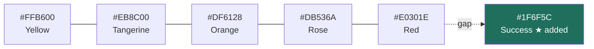

← [II — Architecture](02-architecture.md) · [Index](README.md) · Next: [IV — Design system](04-design-system.md)

---

# Volume III — Decision log

Twenty-four decisions. Each states the problem, the options that were genuinely considered,
what was chosen, and — most importantly — **what it costs**. A decision record without a
stated cost is marketing, not engineering.

| # | Decision | Volume |
|---|---|---|
| [ADR-01](#adr-01) | Build the frontend before the backend | I |
| [ADR-02](#adr-02) | React + Vite over Next.js | II |
| [ADR-03](#adr-03) | Tailwind v4 over CSS Modules or styled-components | IV |
| [ADR-04](#adr-04) | Hand-built components on Radix, not shadcn/ui | V |
| [ADR-05](#adr-05) | TanStack Query even with no server | II |
| [ADR-06](#adr-06) | Repository interface shaped to Firestore from line one | VIII |
| [ADR-07](#adr-07) | Simulated latency of 120–400 ms | VIII |
| [ADR-08](#adr-08) | Deterministic seed, reset on refresh | VII |
| [ADR-09](#adr-09) | Real property data from the fact-sheet PDFs | VII |
| [ADR-10](#adr-10) | Role switcher instead of a login page | IX |
| [ADR-11](#adr-11) | Forbidden, not 404, not redirect | IX |
| [ADR-12](#adr-12) | Show blocked actions, never hide them | I |
| [ADR-13](#adr-13) | Permissions and scoping as separate concepts | IX |
| [ADR-14](#adr-14) | Inter instead of the brand guide's Georgia + Arial | IV |
| [ADR-15](#adr-15) | Adding a success colour to the brand palette | IV |
| [ADR-16](#adr-16) | Hairline borders instead of shadows | IV |
| [ADR-17](#adr-17) | URL as the home of list state | II |
| [ADR-18](#adr-18) | Zustand for client state, not Context | II |
| [ADR-19](#adr-19) | Occupancy from the inventory model, not from reservations | VI |
| [ADR-20](#adr-20) | Reservations are cancelled, never deleted | IX |
| [ADR-21](#adr-21) | Duplicate detection warns; it never blocks | X |
| [ADR-22](#adr-22) | The assistant computes; it does not generate | X |
| [ADR-23](#adr-23) | Recharts over D3, Visx or Chart.js | X |
| [ADR-24](#adr-24) | No test framework in Phase 1 | XIII |

---

## ADR-01
### Build the complete frontend before any backend

**Status:** Accepted · **Volume:** I

**Problem.** The brief described a 20-document product engineering specification covering
1,200 pages that did not yet exist, and a system spanning CRM, reservations, finance,
reporting and automation. Something had to be built first.

**Options considered.**

| Option | For | Against |
|---|---|---|
| Write the full PES first, then build | Complete specification; no rework | 1,200 pages written against zero feedback. Most of it would be wrong, and being wrong on paper is invisible until you build |
| Data model → API → UI (conventional) | Solid foundations; UI is thin | The expensive mistake in this project is a wrong *flow*, not a wrong query. This order defers the risky part |
| **Frontend first with simulated data** ✓ | Discovers the real requirements by building them; flows can be reviewed in week one | Risk of assuming data the backend cannot cheaply supply |
| Thin vertical slice through all layers | Proves the stack end to end | Answers "can we build it" — never in doubt — not "what should it be" |

**Chosen:** frontend first.

**How the risk is managed.** The stated risk — a UI that assumes impossible data — is
controlled by ADR-06. The repository layer was written to Firestore's capabilities from the
first line. There are no joins anywhere, because Firestore has no joins. Denormalised fields
(`reservation.hotelName`, `reservation.customerName`) exist on the documents exactly as they
will in Firestore.

**Cost accepted.** The seed engine (`src/data/seed/index.ts`, ~1,180 lines) is throwaway work.
That is roughly one day, spent to make every subsequent review meaningful.

---

## ADR-02
### React + Vite over Next.js

**Status:** Accepted · **Volume:** II

**Problem.** Choose the application framework.

| Option | For | Against |
|---|---|---|
| **React + Vite SPA** ✓ | Dev server starts in 600 ms; no server runtime to host; the product is behind a login and gains nothing from SSR | No SSR, no file-based routing, no built-in data layer |
| Next.js App Router | Server components, streaming, built-in routing | An internal tool behind auth has no SEO and no cold-visitor problem. Server components would fight the client-heavy, filter-heavy nature of every screen. Adds a Node runtime to host in Phase 2 |
| Remix / React Router 7 framework mode | Good data loading story | Loaders assume a server. In Phase 1 there is none, and in Phase 2 Firestore is queried from the client |
| Vue / Svelte | Smaller, faster | The stated deliverable was "every React component". Team familiarity is React |

**Chosen:** React 19 + Vite 8 SPA.

**The deciding argument.** Every screen in this product is a dense, filterable, interactive
table or form behind authentication. That is the exact workload SSR helps least with, and the
exact workload a client-side SPA with a good cache handles best.

**Cost accepted.** First load ships ~120 kB gzipped before any route chunk. For an internal
tool opened once and kept open all day, this is the right trade.

---

## ADR-03
### Tailwind CSS v4 over CSS Modules or styled-components

**Status:** Accepted · **Volume:** IV

| Option | For | Against |
|---|---|---|
| **Tailwind v4** ✓ | `@theme` makes design tokens first-class CSS variables; no runtime; utilities keep spacing and colour honest by making deviation visible in review | Verbose class strings; needs `tailwind-merge` for override safety |
| CSS Modules | Scoped, plain CSS | Tokens live in a separate system from usage. Nothing stops a hand-typed `#df6128` |
| styled-components / Emotion | Co-located, dynamic | Runtime cost on every render, in an app with 200-row tables. Serious SSR and React 19 friction |
| Vanilla Extract | Type-safe, zero runtime | Build complexity for a benefit Tailwind v4's `@theme` already provides |

**Chosen:** Tailwind v4.

**What settled it.** In v4, `@theme` *is* the token system:

```css
@theme {
  --color-brand-orange: #df6128;
  --text-base: 0.875rem;
  --radius-md: 10px;
}
```

That single block generates the utilities *and* exposes the tokens as CSS variables for
Recharts, inline styles and print rules. One source of truth, no synchronisation step. With
CSS Modules the same tokens would exist twice.

**Cost accepted.** `className` strings get long. Mitigated by `cn()` (clsx + tailwind-merge)
and by extracting variants into lookup objects (see `Button.tsx`'s `VARIANTS` / `SIZES` maps)
rather than inlining conditionals.

---

## ADR-04
### Hand-built components on Radix primitives, not shadcn/ui

**Status:** Accepted · **Volume:** V

| Option | For | Against |
|---|---|---|
| **Radix primitives, styled by us** ✓ | Full accessibility for free; zero opinion about appearance; every visual decision is deliberate | ~28 components to write |
| shadcn/ui | Fast start; same Radix underneath | Its default look is *recognisable*. The brief asked for a system carrying Fidato's identity — shipping a widely-used default is the opposite. Restyling it to the brand costs about as much as writing it |
| MUI / Ant Design | Enormous component set | Both carry a strong, foreign design language. Fighting Material Design to look like Fidato is more work than not using it |
| Fully hand-rolled, no Radix | Total control | Would mean re-implementing focus trapping, roving tabindex, dismissable layers and typeahead. This is where accessibility bugs live |

**Chosen:** Radix primitives + our own styling.

**The reasoning.** The hard part of a component library is behaviour, not appearance. Radix
gives away the hard part. Appearance is precisely what should *not* be inherited when the
deliverable is a branded design system.

**Cost accepted.** 28 components, roughly 2,400 lines. Volume V documents each.

---

## ADR-05
### TanStack Query, despite there being no server

**Status:** Accepted · **Volume:** II

**Problem.** Phase 1 has no network. `useState` + `useEffect` would work.

| Option | For | Against |
|---|---|---|
| **TanStack Query** ✓ | Phase 2 becomes a change of fetcher, nothing else. Caching, dedupe, invalidation, retry and loading/error states all arrive already built | A dependency doing "nothing" in Phase 1 |
| `useState` + `useEffect` | No dependency | Every screen hand-rolls loading and error state. Phase 2 would then rewrite all 34 screens |
| SWR | Lighter | Weaker mutation and invalidation story, which this app leans on hard (approve, cancel, merge, import all invalidate several keys) |
| Redux Toolkit Query | Integrated | Pulls in Redux for an app with almost no global client state |

**Chosen:** TanStack Query.

**The argument.** The dependency is not doing nothing — it is defining the *shape* of every
screen's data handling. Because `useQuery` is already there, `isLoading` already drives a
skeleton and `error` already drives a retry button on all 34 screens. In Phase 2 the only
change is what `queryFn` calls.

**Evidence it was right.** Query key design already encodes the scope:

```ts
queryKey: ["reservations", list.query, scope.role, scope.userId]
```

Switching role changes the key, which invalidates automatically. No manual cache clearing
anywhere in the codebase.

---

## ADR-06
### The repository interface is shaped to Firestore from the first line

**Status:** Accepted · **Volume:** VIII

**Problem.** A mock data layer can be anything. If it is shaped conveniently, the Phase 2
migration becomes a rewrite.

**Chosen.** Every repository method mirrors an operation Firestore can actually perform.

| Constraint | Consequence in the code |
|---|---|
| Firestore has no joins | Documents are denormalised. `reservation` carries `customerName`, `companyName`, `hotelName`, `hotelCity`, `ownerName` |
| Firestore filters are equality/range on indexed fields | `applyFilters()` does equality only. No `LIKE`, no computed predicates |
| Firestore has no full-text search | `matchesSearch()` is a client-side substring scan over named fields — exactly what Phase 2 will do until Algolia or Typesense is added |
| Firestore paginates by cursor | `paginate()` is offset-based, which is the one honest deviation. Documented in Volume XIV §14.3 as requiring change |
| Firestore writes are per-document | Every write method touches one document, plus explicit denormalisation updates |

**Cost accepted.** Some screens are less efficient than a SQL backend would allow. The
Occupancy report aggregates in the client because Firestore cannot `GROUP BY`. That is not a
flaw in the mock — it is an accurate preview of Phase 2, which is the point.

⚠️ If this ADR is ever violated for convenience, the Phase 2 estimate in Volume XIV becomes
worthless.

---

## ADR-07
### Simulated latency of 120–400 ms

**Status:** Accepted · **Volume:** VIII

```ts
// src/data/repositories/mock/store.ts
const MIN_LATENCY = 120;
const MAX_LATENCY = 400;
```

| Option | Consequence |
|---|---|
| No latency | Skeletons never appear. Loading states are written, never seen, and rot. The app feels unrealistically instant, so nobody notices that a screen fires six sequential queries |
| Fixed 200 ms | Better, but uniform. Real networks jitter, and jitter is what exposes race conditions |
| **Random 120–400 ms** ✓ | Skeletons are exercised on every load. Out-of-order resolution surfaces stale-closure bugs during development, not in production |
| 1,000 ms+ | Realistic for a bad connection, but makes the app tedious to review |

**Chosen:** uniform random 120–400 ms, plus an extra 80 ms on writes to reflect a real round
trip.

**What this caught during the build.** The dashboard fires four independent queries. With
zero latency they appeared to resolve together. With jitter it became obvious that the KPI
row, chart, day sheet and approvals each needed their own skeleton rather than one shared
loading flag.

---

## ADR-08
### Deterministic seed, and data resets on refresh

**Status:** Accepted · **Volume:** VII

**Two decisions in one.**

*Deterministic:* a fixed-seed PRNG (`src/data/seed/random.ts`) rather than `Math.random()`.

*Resets:* the store is plain memory, not localStorage or IndexedDB.

| Option | For | Against |
|---|---|---|
| **Fixed seed + memory** ✓ | Identical data on every load. Screenshots stay comparable. A bug reported on "the Peerless Inn booking" is reproducible by anyone | Work is lost on refresh |
| `Math.random()` | Feels varied | Nobody can reproduce anything. "It looked wrong yesterday" becomes unfalsifiable |
| Persist to localStorage | Work survives | Every reviewer's copy diverges within a day. Demos become unpredictable, and stale persisted data outlives schema changes |
| Persist to IndexedDB | Larger, structured | All of the above, plus migration code for a database being deleted in Phase 2 |

**Chosen:** deterministic generation into memory.

**The argument for losing work on refresh.** In a review build, *reproducibility beats
persistence*. Every reviewer sees the same 1,100 reservations, the same four duplicate groups,
the same 66 pending approvals. That property is worth far more than remembering a test booking
someone made five minutes ago.

This is stated on-screen so it is never a surprise — the README and Volume I both say it
plainly.

---

## ADR-09
### The 32 properties are real data extracted from the fact sheets

**Status:** Accepted · **Volume:** VII

**Problem.** Seed a portfolio of hotels.

| Option | For | Against |
|---|---|---|
| **Extract from the 32 fact-sheet PDFs** ✓ | Reviewers recognise the properties. Room counts, room mixes, amenities and distances are all true. Bugs surface against real distributions | An extraction pass over 32 PDFs |
| Generate plausible fake hotels | Fast | "Grand Plaza Hotel, Mumbai — 100 rooms" teaches nobody anything. A reviewer cannot tell whether a screen handles their actual inventory |
| A handful of real ones, rest generated | Cheaper | The inconsistency is worse than either extreme; you never know which rows to trust |

**Chosen:** all 32 extracted into `src/data/seed/hotels.data.ts`.

**What came out of the PDFs:** name, city, state, star rating, category, description, total
rooms, room-mix breakdown, features, facilities, amenities, things to do, and road distances
to named landmarks.

So *Marigold Banquets 'n' Conventions, Pune* really is 150 rooms — 5 Suite, 115 Deluxe, 30
Business Class — and Shaniwar Wada really is 11.4 km away.

**The payoff, concretely.** The real portfolio spans a 17-key Udaipur property and a 236-key
Agra hotel. That 14× spread immediately exposed that ranking properties by revenue flatters
scale, which is why the Property Performance report offers *revenue per room* as an equal
sort (Volume X §10.24).

---

## ADR-10
### A role switcher instead of a login page

**Status:** Accepted · **Volume:** IX

**Problem.** The permission model is the most important thing to review, and Phase 1 has no
authentication.

| Option | For | Against |
|---|---|---|
| **"Viewing as…" role switcher** ✓ | Move between 8 roles in one second. Reviewing the permission model becomes trivial | Not how the real product behaves |
| Fake login page with 8 hardcoded accounts | Looks like the real thing | Eight sign-outs and sign-ins to review eight roles. Everyone stops after two |
| No role concept in Phase 1 | Simplest | The permission model is a third of the product's complexity. Deferring it means discovering its consequences in Phase 2, which is exactly backwards |
| Real Firebase Auth now | Real | Drags the entire Phase 2 backend forward |

**Chosen:** the role switcher, in the top bar, on every screen.

**Why this is better than a login page for this purpose.** A login page proves you can
authenticate — never in doubt. The switcher proves the *authorisation model works*, which is
the actual risk. Reviewing "does a hotel manager correctly lose access to rate editing"
becomes a one-second operation instead of a two-minute one.

**Verified behaviour:** switching from Super Admin to Hotel Manager takes navigation from 16
items to 7, changes the dashboard to a property day-sheet, and turns 12 Edit buttons on the
rate-plan screen into 12 "Locked" markers.

🔧 In Phase 2 the same Zustand store is fed by Firebase Auth, and the switcher becomes
dev-only. The store's interface does not change.

---

## ADR-11
### Forbidden, not 404, and never a silent redirect

**Status:** Accepted · **Volume:** IX

**Problem.** What should a route the current role cannot access render?

| Option | Consequence |
|---|---|
| Redirect to dashboard | The user's click appears to do nothing. Feels broken. The most common choice and the worst |
| 404 Not found | Actively misleading. The page exists; you cannot see it. Sends people to look for a bug that is not there |
| **Forbidden, naming the role and the resource** ✓ | Truthful, and teaches the permission model at the moment it becomes relevant |

**Chosen:** a dedicated `Forbidden` screen:

> **Not available for your role**
> You are viewing the platform as **Hotel Manager**, which has no access to **invoices**.
> Switch role from the top bar to see how the platform looks for another team.

**The security objection, addressed.** Revealing that a resource exists is a real
consideration in a public product. This is an internal tool where the *existence* of an
invoices module is not secret — it is on the org chart. What is protected is the data, and
none is shown.

---

## ADR-12
### Show blocked actions; never hide them

**Status:** Accepted · **Volume:** I

The product-wide principle. Applied consistently:

| Situation | Hidden approach | What this product does |
|---|---|---|
| Hotel manager on rate plans | Edit buttons absent | Banner explains pricing is owned by revenue; each row shows **Locked** |
| Completed reservation | Cancel button absent | Button present, disabled, tooltip: "Completed reservations are locked" |
| Salesperson viewing approvals | Page hidden | Page visible; a note explains approving is limited to sales managers and admins |
| Viewer on settings | Form absent | Form visible, inputs disabled, note explains why |

**Cost.** More markup, more copy, more conditional rendering. Every restriction needs a
sentence written for it.

**Why it is worth it.** Three reasons, in order of how much they matter:

1. A product that hides things **looks broken** to whoever cannot see them.
2. A rule never surfaced is a rule nobody learns — so it gets asked about forever.
3. **A visible restriction gets reported when it is wrong.** A hidden one does not. This is
   the strongest argument: the design makes permission bugs *self-reporting*.

---

## ADR-13
### Permissions and row-level scoping are separate concepts

**Status:** Accepted · **Volume:** IX

**Problem.** "A salesperson can edit customers, but only their own" mixes two different
questions.

**Chosen.** Split them:

```ts
can(role, action, resource)          // May this role touch this kind of thing?
scopeRecords(ctx, records)           // Which records may this actor see?
```

**Why not one combined check?** Because they run at different times and different granularity.
`can()` is synchronous, cheap and drives *rendering* — nav items, buttons, route guards.
`scopeRecords()` runs inside the repository against a record set and drives *data*. Fusing
them would mean either fetching everything and filtering in the UI (leaky and slow) or making
every permission check async (unusable for rendering).

**The security property this gives.** Scope is applied *before* search and filtering, inside
the repository. A salesperson searching for a company they do not own gets no results —
without any "access denied" message, because from their view the record simply is not there.
It does not leak existence.

---

## ADR-14
### Inter, not the brand guide's Georgia + Arial

**Status:** Accepted, flagged for brand review · **Volume:** IV

**Problem.** The visual identity guide (p.12) specifies two font duos: ITC Charter + Helvetica
Neue for design software, Georgia + Arial for Office. The brief asked for the feel of premium
Apple software.

| Option | For | Against |
|---|---|---|
| Strict Georgia + Arial | 100% guide-compliant; no licensing question | Reads as an Office document, not a product. Georgia has no variable axis, so weight control is coarse. Arial at 13 px in a dense table is noticeably less legible than a modern UI face |
| ITC Charter + Helvetica Neue | Also guide-compliant | Both are commercially licensed for web use. Neither was supplied |
| **Inter Variable everywhere, Georgia for print** ✓ | Closest free analogue to SF Pro; designed for UI at small sizes; variable weight and optical sizing; tabular figures | A documented departure from the guide |
| System font stack | Zero payload | Renders Segoe UI on Windows, SF on macOS. The product would look materially different per machine — unacceptable for a brand system |

**Chosen:** Inter Variable, self-hosted via `@fontsource-variable/inter`.

**Where Georgia survives.** Print. Invoice headers and report covers use `.print-serif`:

```css
@media print {
  .print-serif { font-family: var(--font-serif); }
}
```

This is not a token gesture. Printed documents are exactly where a serif still earns its
keep, and it keeps the brand's typographic voice on the artefacts that leave the building.

**Why self-hosted rather than Google Fonts CDN.** Three reasons: it works offline, it removes
a third-party request from an internal tool's critical path, and it is not subject to a CDN
being blocked by the corporate proxy on this network.

⚠️ **This is a real deviation from an approved brand document.** It is recorded in
`docs/design-system.md` and must be signed off by the brand team, not quietly absorbed.

---

## ADR-15
### Adding a success colour to the brand palette

**Status:** Accepted, flagged for brand review · **Volume:** IV

**Problem.** The brand palette is five warm colours — yellow, tangerine, orange, rose, red —
plus greys. There is no green. An ERP must express *confirmed*, *paid*, *reconciled*,
*synced*, *active*, *success*.

| Option | Consequence |
|---|---|
| Use tangerine for success | *Pending* and *confirmed* become the same colour. The status vocabulary collapses — the single most-used signal in the product stops signalling |
| Use grey for success | "Confirmed" reads as disabled or inactive. Semantically backwards |
| Use only iconography, no colour | Forces reading every row. Defeats the purpose of a status column, which exists to be scanned |
| **Add one green** ✓ | Status vocabulary works. One documented addition |

**Chosen:** `--color-success: #1f6f5c`.

**How the value was chosen.** Not an off-the-shelf green. A saturated `#22c55e` beside
`#df6128` looks like a traffic light and fights the warm palette. `#1f6f5c` is desaturated and
pushed toward teal so it reads as a *quiet confirmation* rather than a competing accent. It
carries 5.8:1 contrast on white, clearing WCAG AA for text.



A second addition, `--color-info: #2b6cb0`, was made on the same reasoning for *in progress*
and *checked in*. It is drawn from the ink family rather than the warm set so it reads as
neutral information rather than a fifth brand colour.

---

## ADR-16
### Hairline borders instead of shadows

**Status:** Accepted · **Volume:** IV

**Chosen.** Cards, tables, inputs and panels use a 1 px `--color-grey-200` border. Shadows are
reserved for things that genuinely float: dialogs, popovers, dropdown menus, toasts, the
command palette.

**Why.** A shadow is a claim about elevation. When every card casts one, the claim is
meaningless and the interface acquires a soft, undifferentiated haze — the visual signature of
a Bootstrap admin template. Reserving shadows for overlays means that when something *does*
cast a shadow, it reads immediately as sitting above the page.

Three shadow tokens exist, and only three:

```css
--shadow-overlay: 0 12px 32px -8px rgb(3 23 40 / 0.18), 0 2px 8px -2px rgb(3 23 40 / 0.08);
--shadow-popover: 0 8px 24px -6px rgb(3 23 40 / 0.14), 0 1px 4px rgb(3 23 40 / 0.06);
--shadow-raise:   0 1px 2px rgb(3 23 40 / 0.06);
```

All three are tinted with the brand ink (`rgb(3 23 40)`) rather than pure black. Black shadows
on a warm palette read as grey smudge; ink-tinted ones read as depth.

---

## ADR-17
### The URL owns list state

Covered in Volume II §2.6. Summary of the alternatives:

| Option | Against |
|---|---|
| Component `useState` | Filters lost on refresh; views cannot be shared; back button does nothing |
| Zustand store | Global state for something inherently per-screen; still not shareable |
| **URL query string** ✓ | Verbose keys; needs care to avoid flooding history (solved with `replace: true`) |

---

## ADR-18
### Zustand for client state, not Context

| Option | Against |
|---|---|
| React Context | Every consumer re-renders when any part of the value changes. The role lives in context consumed by the sidebar, top bar, every guard and most screens — a sidebar toggle would re-render the entire tree |
| Redux Toolkit | Substantial ceremony for two stores holding five values |
| Jotai / Valtio | Fine choices; Zustand's selector API and `persist` middleware fit exactly what was needed |
| **Zustand** ✓ | One more dependency (1.2 kB) |

The deciding feature is selector subscriptions:

```ts
const role = useSession((s) => s.role);   // re-renders only when role changes
```

---

## ADR-19
### Occupancy comes from the inventory model, not from reservations

**Status:** Accepted · **Volume:** VI · **Origin:** defect [D-04](12-defect-log.md)

**Problem.** The first implementation computed occupancy as Fidato room-nights ÷ (total rooms
× days). It reported **1%**, and the dashboard looked broken.

**The diagnosis.** The number was not wrong arithmetically; the *metric* was wrong.
Fidato books a slice of each partner hotel — other channels sell the rest. Dividing Fidato's
bookings by the hotel's entire inventory answers a question nobody asked.

| Option | Consequence |
|---|---|
| Inflate the seed until the number looks good | Dishonest. The portfolio is 1,969 rooms; a realistic 60% occupancy over 450 days is ~530,000 room-nights, needing ~90,000 reservations. Not generatable client-side, and faking it would misrepresent the business |
| Remove occupancy from the product | It is a genuine operational metric. Hotel managers need it |
| Relabel it "Fidato share of inventory" | Honest but useless — a number nobody acts on |
| **Take occupancy from the inventory model; label the Fidato slice separately** ✓ | Both numbers are true and both are useful |

**Chosen:** occupancy reads from `buildInventory()`, which models each property's real
position across *all* channels at 55–82%. The Fidato-booked portion is surfaced beside it as
**"Fidato room nights"**.

```ts
function occupancyForHotel(hotelId: string, days = 30): number {
  const rows = buildInventory(hotelId, days);
  const capacity = rows.reduce((s, r) => s + r.totalRooms, 0);
  const booked = rows.reduce((s, r) => s + r.booked, 0);
  return capacity > 0 ? (booked / capacity) * 100 : 0;
}
```

**The generalisable lesson.** When a metric reads absurdly, check whether the *denominator*
describes something you control before you assume the numerator is too small.

---

## ADR-20
### Reservations are cancelled, never deleted

**Status:** Accepted · **Business rule BR-01** · **Volume:** IX

There is **no delete control for a reservation anywhere in the product**. The rule is enforced
by absence, not by a confirmation dialog.

**Why.** The commercial history of a booking has to outlive the booking:

- A guest disputes a charge six months later. The cancelled reservation is the evidence.
- Commission is reconciled with the property quarterly. A deleted booking silently changes
  what is owed.
- The cancellation report is a management metric. Deletion would make cancellations
  *invisible*, which inverts the metric's purpose.

**Consequence in the data model.** `status: "cancelled"` plus `cancellationReason`,
`cancelledBy`, `cancelledAt`. The record stays in every list, greyed, filterable.

---

## ADR-21
### Duplicate detection warns; it never blocks

**Status:** Accepted · **Volume:** X

**Problem.** BR-06 says customer email and phone must be unique. What happens when someone
enters a duplicate?

| Option | Consequence |
|---|---|
| Hard block on save | The real world has genuine collisions — two colleagues sharing a company switchboard number, a couple sharing an email. A hard block leaves the user stuck with no path forward |
| Silent allow | The rule is not a rule |
| **Warn inline, allow save, resolve on the merge screen** ✓ | Honest about the real world; keeps the data clean via a dedicated tool |

**Chosen:** live inline warning under the field, with a link to `/crm/merge`:

> ⚠ Another customer already has this email. You can still save, then resolve it on the
> duplicates screen.

The import wizard applies the same philosophy with one sharpening: duplicates *inside the
uploaded file* are hard errors (a file containing the same person twice is a mistake in the
file), while collisions with *existing* records are warnings.

---

## ADR-22
### The assistant computes; it does not generate

**Status:** Accepted · **Volume:** X

**Problem.** Phase 1 has no backend, therefore no API key, therefore no language model.

| Option | Consequence |
|---|---|
| Omit the AI screen | The module is in the brief. Omitting it leaves the biggest UX question — how does an assistant fit into this product — unanswered until Phase 2 |
| Hardcoded lorem-ipsum responses | Reviewers cannot judge usefulness. Worse, quoted figures would contradict the dashboards, undermining trust in both |
| Ship an API key in the client | Unacceptable |
| **Compute real answers from live seed data** ✓ | Every figure the assistant quotes matches Reports exactly, because both read the same store |

**Chosen:** `src/features/ai/responses.ts` computes answers from `db`.

Ask "How did we perform this month?" and it returns real portfolio figures — live reservation
count, booked value, room nights, average booking value, cancellation rate, active properties
— all traceable to the same numbers on `/reports/revenue`.

Every response carries a footnote:

> *Generated from live platform data. Phase 1 uses scripted analysis, not a language model.*

🔧 The component contract is what Phase 2 keeps. `answerFor(question): ChatTurn` becomes an
async call to a real completion; nothing in `AiPage.tsx` changes shape.

---

## ADR-23
### Recharts over D3, Visx or Chart.js

| Option | Against |
|---|---|
| **Recharts** ✓ | 104 kB gzipped — the heaviest dependency. Mitigated by isolating it in its own chunk, loaded only by chart-bearing routes |
| D3 directly | Maximum control, but every chart becomes bespoke. Six report screens would each grow an axis implementation |
| Visx | Lower-level D3 primitives for React; excellent, but more assembly per chart than this project needs |
| Chart.js | Canvas-based — charts are then invisible to the accessibility tree and to text selection, and do not print cleanly. This product prints reports |

**The deciding factor.** Recharts renders SVG. That makes charts printable, selectable and
inspectable — and the print path is a real requirement here (report covers, invoices).

---

## ADR-24
### No test framework in Phase 1

**Status:** Accepted, with reservations · **Volume:** XIII

| Option | For | Against |
|---|---|---|
| **No framework; verify via typecheck, build and browser walkthrough** ✓ | Phase 1's deliverable is a UI for review, and the UI changed constantly. Tests written against churning markup are rewritten more often than they catch anything | No regression safety net |
| Vitest + Testing Library from the start | Real safety | Most value would be in testing the rules layer, which is small and stable — a narrow win for a broad cost during heavy churn |
| Playwright E2E | Tests the real flows | Slowest to write; most brittle against a UI in flux |

**Chosen:** none in Phase 1 — but this is the weakest decision in this log, and it is flagged
as such.

**What stands in for tests today:** `tsc --noEmit` at `strict` with `noUnusedLocals` and
`noUncheckedIndexedAccess`; a clean production build; and the browser walkthrough recorded in
Volume XIII.

**What this does not cover, honestly:** the reservation wizard end-to-end, the approve/cancel
dialogs, and the merge action were **not** click-tested, because the automated browser used
for verification did not deliver trusted input events to the React root (Volume XIII §13.4).
They are typechecked and structurally verified, not behaviourally verified.

🔧 **Recommendation for Phase 2, first task, before any Firebase work:** Vitest over
`src/lib/rules.ts` and `src/lib/permissions.ts`. That is ~160 assertions covering the
permission matrix and all 8 business rules, against code that is now stable. It is the highest
value-per-hour testing available in this codebase.

---

Next: [Volume IV — Design system](04-design-system.md)
