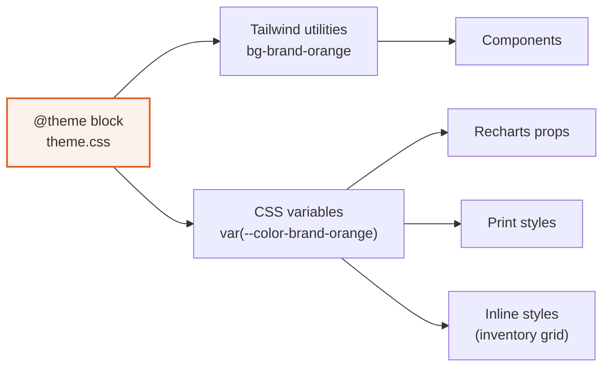

← [III — Decision log](03-decision-log.md) · [Index](README.md) · Next: [V — Component reference](05-component-reference.md)

---

# Volume IV — Design system

Source of truth: **`src/styles/theme.css`**. Living proof: **`/design-system`** in the running
app, which renders every token and component from the real modules and therefore cannot drift.

---

## 4.1 How the token system works

Tailwind v4 makes `@theme` the token layer. One declaration produces both a utility class and
a CSS custom property:

```css
@theme {
  --color-brand-orange: #df6128;
}
```

gives you `bg-brand-orange`, `text-brand-orange`, `border-brand-orange` **and**
`var(--color-brand-orange)` for Recharts, inline styles and print rules.



This is the whole reason for ADR-03. With CSS Modules these two representations would be
separate systems needing manual synchronisation, and they would drift.

---

## 4.2 Colour — complete reference

### Brand ink (Fidato Black family)

| Token | Hex | Swatch | Used for |
|---|---|---|---|
| `ink-950` | `#010d17` | ⬛ | Modal backdrops at 25% opacity |
| `ink-900` | `#031728` | ⬛ | **Fidato Black.** Primary text, headings, sidebar |
| `ink-800` | `#0b2135` | ⬛ | Sidebar hover states |
| `ink-700` | `#142b3a` | ⬛ | The logo wordmark's own colour (see §4.9) |
| `ink-600` | `#24384a` | ⬛ | Sidebar borders |

### Grey ramp

| Token | Hex | From the guide | Used for |
|---|---|---|---|
| `grey-700` | `#354552` | ✓ Dark Grey | Body text on white |
| `grey-600` | `#4c5b67` | derived | Secondary body |
| `grey-500` | `#67737e` | ✓ Medium Grey | Supporting text, hints |
| `grey-400` | `#9aa2a9` | ✓ Grey | Tertiary text, icons, placeholders |
| `grey-300` | `#ccd0d4` | ✓ Light Grey | Input borders, disabled |
| `grey-200` | `#e2e5e8` | derived | **The hairline border colour** |
| `grey-100` | `#eef0f2` | derived | Table row dividers, chart gridlines |
| `grey-50` | `#f7f8f9` | derived | Page background |

Four of these are directly from the guide (p.13). The other four are interpolated because an
interface needs more steps than a print palette does — specifically a border colour lighter
than Light Grey and a page background lighter still.

### The five warm brand colours

| Token | Hex | Guide name | Semantic role in this product |
|---|---|---|---|
| `brand-yellow` | `#ffb600` | Yellow | Pending, warning, awaiting approval |
| `brand-tangerine` | `#eb8c00` | Tangerine | Secondary accent, second chart series |
| `brand-orange` | `#df6128` | Orange | **Primary action, active navigation** |
| `brand-rose` | `#db536a` | Rose | Attention, no-show |
| `brand-red` | `#e0301e` | Red | Destructive, error, overdue |

**Why orange became the primary action colour** rather than red or yellow: it sits in the
middle of the warm range, so it is distinguishable from both the warning (yellow) and the
destructive (red) ends. A primary action adjacent to the destructive colour is a design that
produces mis-clicks.

### Tints

Soft surfaces for badges and banners. Each is its parent colour at roughly 8% and 20% over
white.

| Token | Hex | Used for |
|---|---|---|
| `brand-orange-50` | `#fdf1eb` | Active nav background, accent banners |
| `brand-orange-100` | `#f9dccd` | Selection highlight, progress track |
| `brand-orange-600` | `#c4521d` | Primary button hover |
| `brand-orange-700` | `#a34314` | Primary button active |
| `brand-yellow-50` | `#fff8e6` | Approval-needed banners |
| `brand-yellow-100` | `#ffedbf` | Approval banner borders |
| `brand-rose-50` / `-100` | `#fdeef0` / `#f8d4da` | No-show pills |
| `brand-red-50` / `-100` | `#fdeceb` / `#f9d0cc` | Error banners, overdue pills |
| `brand-tangerine-50` | `#fdf4e6` | Secondary accent surfaces |

### The two documented additions

```css
/* The brand guide has no success colour. An ERP cannot express
   confirmed / paid / synced without one. */
--color-success: #1f6f5c;
--color-success-50: #eaf4f1;
--color-success-100: #cde5de;
--color-success-600: #1a5f4f;

/* Info — neutral blue drawn from the ink family, not the warm set */
--color-info: #2b6cb0;
--color-info-50: #ebf2f9;
--color-info-100: #d2e2f2;
```

Rationale in [ADR-15](03-decision-log.md#adr-15). Both are flagged for brand review.

### The logo gradient

```css
--color-accent-from: #fe611f;
--color-accent-to:   #f4bf54;
```

Sampled from the flame mark in `FH SVG.svg`. Exposed as the `brand-gradient` utility.

**Where it may appear:** the logo mark itself, the collapsed sidebar rail, the AI assistant
avatar, and exactly one hero stat on the dashboard.

**Where it may never appear:** buttons. A gradient primary button would compete with the flat
`brand-orange` primary and destroy the single-primary-action-per-view rule.

---

## 4.3 Contrast audit

All values against the surface they actually sit on.

| Foreground | Background | Ratio | WCAG AA |
|---|---|---:|---|
| `ink-900` | white | 16.8:1 | ✅ AAA |
| `grey-700` | white | 9.2:1 | ✅ AAA |
| `grey-600` | white | 6.9:1 | ✅ AAA |
| `grey-500` | white | 4.9:1 | ✅ AA |
| `grey-400` | white | 2.8:1 | ⚠️ decorative / large only |
| `brand-orange` | white | 3.6:1 | ⚠️ large text and UI only |
| white | `brand-orange` | 3.6:1 | ⚠️ ≥16 px or bold |
| `success` | white | 5.8:1 | ✅ AA |
| `brand-red` | white | 4.6:1 | ✅ AA |
| `info` | white | 5.4:1 | ✅ AA |
| white | `ink-900` | 16.8:1 | ✅ AAA |

⚠️ **Two known constraints, handled deliberately:**

- `grey-400` is used only for icons, placeholders and disabled text — never for content a
  user must read.
- `brand-orange` on white clears AA for *large* text and UI components but not for body copy.
  It is therefore used for links and 14 px+ medium-weight labels, never for paragraphs. White
  on `brand-orange` (primary buttons) is at 14 px medium, which qualifies as UI component
  text under WCAG 1.4.11.

---

## 4.4 Typography

### The stack

```css
--font-sans: "Inter Variable", "Inter", -apple-system, BlinkMacSystemFont,
             "Segoe UI", Roboto, sans-serif;
--font-serif: Georgia, "ITC Charter", "Times New Roman", serif;
--font-mono: ui-monospace, "SF Mono", "Cascadia Mono", Menlo, monospace;
```

Self-hosted via `@fontsource-variable/inter`. Rationale in [ADR-14](03-decision-log.md#adr-14).

### The scale

Eleven steps. Deliberately more granular than a typical 6-step scale, because dense data
interfaces need fine control between 11 px and 15 px — the range where most of this product
lives.

| Token | rem | px | Line height | Used for |
|---|---:|---:|---:|---|
| `text-2xs` | 0.6875 | 11 | 16 | Pills, eyebrows, table micro-labels |
| `text-xs` | 0.75 | 12 | 18 | Captions, footnotes, timestamps |
| `text-sm` | 0.8125 | 13 | 20 | Secondary text, hints, sub-rows |
| `text-base` | 0.875 | **14** | 22 | **Body, table cells, form inputs** |
| `text-md` | 0.9375 | 15 | 24 | Card titles, section headings |
| `text-lg` | 1.0625 | 17 | 26 | Sub-page headings |
| `text-xl` | 1.25 | 20 | 28 | Page titles |
| `text-2xl` | 1.5 | 24 | 32 | KPI figures |
| `text-3xl` | 1.875 | 30 | 36 | Reserved |
| `text-4xl` | 2.25 | 36 | 40 | Reserved |

**Why 14 px body and not 16 px.** 16 px is the correct default for reading text on the web.
This is not reading text — it is an operational interface where a table row must show eight
columns without truncation and a user scans rather than reads. 14 px with a 22 px line height
is the density point at which an internal tool stops feeling like a website. Every major
professional tool in this category sits at 13–14 px for the same reason.

### Letter spacing

```css
h1, h2, h3, h4 { letter-spacing: -0.014em; font-weight: 600; }
h1 { letter-spacing: -0.021em; }
```

Tightening headings is most of what separates "premium software" from "default web page"
typographically. Inter is drawn slightly wide for small-size legibility; at heading sizes that
width reads as loose, so it is pulled back. The effect is subtle and cumulative.

### Font features

```css
body { font-feature-settings: "cv02", "cv03", "cv04", "cv11"; }
```

Four Inter character variants, chosen for a data-dense interface:

| Feature | Effect | Why it matters here |
|---|---|---|
| `cv02` | Open-tailed `g` | Distinguishes `g` from `q` at 11–13 px |
| `cv03` | Open `l` with tail | Separates `l` from `1` and `I` — critical in reference codes like `FH-2026-04498` |
| `cv04` | Open `i` | Same family of confusion |
| `cv11` | Single-storey `a` | Cleaner at small sizes; closer to SF Pro's texture |

### Tabular figures — the most important typographic rule in the product

```css
.tabular,
th[data-numeric],
td[data-numeric] {
  font-variant-numeric: tabular-nums;
  font-feature-settings: "tnum";
}
```

Applied to **every number a user might compare**: money, dates, counts, references,
percentages, durations.

Without it:

```
₹1,28,400      ₹1,28,400
₹64,800        ₹64,800
₹9,120         ₹9,120
  ↑ proportional: ragged   ↑ tabular: aligned
```

In a 25-row invoice table, proportional figures make the amount column impossible to scan for
magnitude. This single property does more for the perceived quality of a data table than any
amount of border styling.

---

## 4.5 Spacing

An 8-point grid, expressed through Tailwind's default 4 px step. Permitted values in this
codebase:

| Class | px | Used for |
|---|---:|---|
| `gap-1` / `p-1` | 4 | Icon-to-label inside a pill |
| `gap-1.5` | 6 | Tight inline groups |
| `gap-2` / `p-2` | 8 | Button internals, chip padding |
| `gap-2.5` | 10 | Menu item padding |
| `gap-3` / `p-3` | 12 | Card internals, list rows |
| `gap-3.5` | 14 | Timeline gutters |
| `gap-4` / `p-4` | 16 | Grid gaps, compact card padding |
| `p-5` | 20 | **Standard card padding** |
| `gap-6` | 24 | Section gaps |
| `p-6` / `py-6` | 24 | Page padding (mobile) |
| `gap-8` / `mt-8` | 32 | Major section separation |
| `py-8` | 32 | Page padding (desktop) |

**The page container:**

```
px-5 py-6 sm:px-7 sm:py-8 max-w-[1600px] mx-auto
```

The 1600 px cap exists because a 12-column data table on a 3440 px ultrawide becomes
unreadable — the eye cannot track a row across that distance. Capping is a legibility
decision, not an aesthetic one.

---

## 4.6 Radius

| Token | px | Applied to |
|---|---:|---|
| `radius-xs` | 4 | Focus rings, chart bar tops, micro-chips |
| `radius-sm` | 6 | Small buttons, menu items, inline code |
| `radius-DEFAULT` | 8 | — |
| `radius-md` | **10** | **House radius.** Cards, inputs, buttons, panels |
| `radius-lg` | 12 | Dialogs, the command palette |
| `radius-xl` | 16 | Reserved |

10 px is the deliberate house value. 4 px reads as utilitarian and dated; 16 px reads as
consumer-friendly and soft. 10 px is the point where a card looks considered without looking
playful — and it matches the radius language of the macOS/iOS design era the brief pointed at.

---

## 4.7 Elevation

Three shadows, all tinted with brand ink rather than black.

```css
--shadow-overlay: 0 12px 32px -8px rgb(3 23 40 / 0.18), 0 2px 8px -2px rgb(3 23 40 / 0.08);
--shadow-popover: 0 8px 24px -6px rgb(3 23 40 / 0.14),  0 1px 4px rgb(3 23 40 / 0.06);
--shadow-raise:   0 1px 2px rgb(3 23 40 / 0.06);
```

| Shadow | Applied to | Never applied to |
|---|---|---|
| `overlay` | Dialogs, drawers, command palette | Anything in normal flow |
| `popover` | Dropdown menus, comboboxes, tooltips, toasts | Cards |
| `raise` | Reserved for drag states | Currently unused |

Each is a two-layer shadow — a wide soft ambient plus a tight contact shadow. Single-layer
shadows look artificial because real light produces both.

**Everything else uses a 1 px `grey-200` border.** Rationale in
[ADR-16](03-decision-log.md#adr-16).

---

## 4.8 Motion

One easing curve for the entire application:

```css
--ease-out-quiet: cubic-bezier(0.16, 1, 0.3, 1);
```

A strong ease-out: fast departure, gentle settle. No overshoot, no bounce, no spring.

### Duration table

| Interaction | In | Out | Reasoning |
|---|---:|---:|---|
| Colour / hover transitions | 150 ms | 150 ms | Below ~100 ms feels instantaneous and loses the sense of response; above ~200 ms feels sluggish |
| Backdrop fade | 150 ms | 120 ms | Exits are faster than entrances — leaving should never feel like waiting |
| Dialog pop | 160 ms | 120 ms | Scale 0.97 → 1, not 0.9 → 1. A large scale delta reads as theatrical |
| Menu / popover | 140 ms | 110 ms | Fastest, because menus are opened repeatedly |
| Drawer slide | 200 ms | 160 ms | Longest, because the distance travelled is longest |
| Toast | 200 ms | — | Enters from below-right with a slight scale |

All eight keyframe sets are driven by Radix's `[data-state]` attribute, so no animation
library is needed:

```css
.motion-menu[data-state="open"]   { animation: fidato-menu-in  140ms var(--ease-out-quiet); }
.motion-menu[data-state="closed"] { animation: fidato-menu-out 110ms var(--ease-out-quiet); }
```

### Reduced motion

```css
@media (prefers-reduced-motion: reduce) {
  *, *::before, *::after {
    animation-duration: 0.01ms !important;
    animation-iteration-count: 1 !important;
    transition-duration: 0.01ms !important;
  }
}
```

Applied globally rather than per-component, so a component added later cannot forget it.

---

## 4.9 The logo

```
src/assets/brand/
├─ logo-full.svg    3825 × 1082 — the supplied lockup, byte-for-byte
└─ logo-mark.svg    the flame glyph alone, extracted
```

| Asset | Used in |
|---|---|
| `logo-full.svg` | Expanded sidebar, print headers, design-system page |
| `logo-mark.svg` | Collapsed rail, favicon, AI assistant avatar |

**Rules observed, from the guide (p.10–11):**

- One logo. No alternates, no product-specific variants.
- Never distorted, recoloured or redrawn.
- Clear space of one "O" from "Fidato" on all sides.
- "Hotels" is set in Malgun Gothic within the mark — which is another reason the file is used
  as-is rather than rebuilt.

⚠️ **Unresolved brand question.** The supplied SVG draws the wordmark in `#142B3A`. The guide
(p.13) specifies Fidato Black `#031728`. These are different colours.

The rule "don't alter the logo" outranks the colour specification, so the file is used
untouched and `#031728` is used for UI ink only. The discrepancy is visible if a logo sits
directly beside a heading. **This needs a decision from the brand team** — either the SVG is
out of date or the guide is.

---

## 4.10 Focus

One treatment, applied globally:

```css
:focus-visible {
  outline: 2px solid var(--color-brand-orange);
  outline-offset: 2px;
  border-radius: var(--radius-xs);
}
```

`:focus-visible` rather than `:focus` means mouse users never see a ring, keyboard users
always do. The 2 px offset keeps the ring clear of the element's own border so it stays
legible on inputs, which already have one.

Defining it once at base level means no component can forget it, and no component can
accidentally style it differently.

---

## 4.11 Scrollbars

```css
.scrollbar-quiet::-webkit-scrollbar { width: 10px; height: 10px; }
.scrollbar-quiet::-webkit-scrollbar-thumb {
  background-color: var(--color-grey-300);
  border-radius: 999px;
  border: 3px solid transparent;
  background-clip: content-box;
}
```

The transparent border plus `background-clip: content-box` is the trick that produces a
macOS-style inset thumb rather than a full-width bar. Applied to every scrollable region:
main content, tables, the inventory grid, dropdown lists, the AI transcript.

Windows default scrollbars are visually heavy and would undercut the intended feel on the
platform this product is actually used on.

---

## 4.12 Print

```css
@media print {
  body { background: #fff; }
  .no-print { display: none !important; }
  .print-serif { font-family: var(--font-serif); }
}
```

Print is a real output of this product — tax invoices and report covers. Three rules:

1. Page background goes white (screen grey wastes toner and looks wrong on paper).
2. `.no-print` removes navigation, action buttons and side rails.
3. `.print-serif` switches document headers to Georgia — the one surviving use of the brand
   serif ([ADR-14](03-decision-log.md#adr-14)).

Applied on `/finance/invoices/:id` and every report via `ReportShell`.

---

## 4.13 Applying the system — worked example

A status pill, showing how the layers combine:

```tsx
<StatusPill tone="success">Confirmed</StatusPill>
```

renders

```html
<span class="inline-flex items-center gap-1.5 px-2 py-0.5 rounded-full
             text-2xs font-medium bg-success-50 text-success">
  <span class="size-1.5 rounded-full bg-success"></span>
  Confirmed
</span>
```

| Decision | Token | Why |
|---|---|---|
| Text size | `text-2xs` (11 px) | A pill is a label, not content. It must not compete with the row's primary text |
| Weight | `font-medium` (500) | Enough to hold at 11 px; 600 would shout |
| Radius | `rounded-full` | Fully round distinguishes a status from a rectangular chip or button |
| Background | `success-50` | 8% tint. Legible without becoming a coloured block in a 25-row table |
| Text | `success` | 5.8:1 on the tint — AA |
| Dot | 6 px, solid | Carries the signal at a glance; also the only cue that survives greyscale printing |

The dot is the detail worth noting. It means the status column is scannable by *position and
shade* before any word is read, and it remains distinguishable when the page is printed in
black and white.

---

Next: [Volume V — Component reference](05-component-reference.md)
