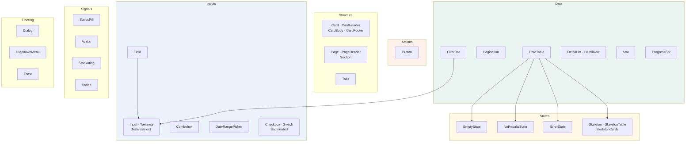

← [IV — Design system](04-design-system.md) · [Index](README.md) · Next: [VI — Data model](06-data-model.md)

---

# Volume V — Component reference

28 primitives in `src/components/ui/`, exported through one barrel:

```ts
// src/components/ui/index.ts — one import surface for the whole library
export * from "./Button";     export * from "./Input";      export * from "./Card";
export * from "./StatusPill"; export * from "./Overlays";   export * from "./States";
export * from "./DataTable";  export * from "./Toast";      export * from "./Misc";
export * from "./Combobox";   export * from "./DatePicker"; export * from "./PageHeader";
export * from "./FilterBar";
```

**Why a barrel.** A screen imports twelve primitives. Twelve import lines is noise; one is
readable. The cost — the barrel defeats per-file tree-shaking — is irrelevant here because the
entire library is used somewhere in the app and it lives in its own `ui` chunk anyway.

---

## 5.1 Library map



---

## 5.2 Button

**Source:** `src/components/ui/Button.tsx`

### Props

| Prop | Type | Default | Notes |
|---|---|---|---|
| `variant` | `primary` \| `secondary` \| `ghost` \| `danger` \| `link` | `secondary` | |
| `size` | `sm` \| `md` \| `lg` \| `icon` | `md` | |
| `loading` | `boolean` | `false` | Replaces the leading icon with a spinner and disables the button |
| `asChild` | `boolean` | `false` | Renders the child element instead of a `<button>` — used for router links |
| `leadingIcon` | `ReactNode` | — | |
| `trailingIcon` | `ReactNode` | — | Suppressed while `loading` |
| …plus all native `<button>` attributes | | | |

### Variants and their intent

| Variant | Appearance | Rule of use |
|---|---|---|
| `primary` | Solid `brand-orange`, white text | **One per view.** The single most likely next action |
| `secondary` | White, `grey-300` hairline border | The workhorse. Everything that is not the primary action |
| `ghost` | Transparent, grey text | Tertiary — Cancel in a dialog, Back in a wizard |
| `danger` | Solid `brand-red` | Destructive confirmation only. Never the trigger that opens the dialog |
| `link` | Orange text, underline on hover | Inline within prose |

⚠️ **The `danger` rule is easy to get wrong.** The button that *opens* a cancel dialog is
`secondary`; the button that *performs* the cancellation inside the dialog is `danger`. A red
button in a table row invites the mis-click it is trying to protect against.

### Size table

| Size | Height | Padding | Text | Radius |
|---|---:|---|---|---|
| `sm` | 32 px | `px-3` | `text-xs` | `rounded-sm` |
| `md` | 36 px | `px-3.5` | `text-base` | `rounded-md` |
| `lg` | 44 px | `px-5` | `text-md` | `rounded-md` |
| `icon` | 36 × 36 px | — | — | `rounded-md` |

### The `asChild` implementation — and the bug it fixed

Radix's `Slot` accepts **exactly one child**. The naïve implementation passes three:

```tsx
// ✗ WRONG — this crashed the entire application (defect D-01)
<Slot>
  {leadingIcon}
  {children}
  {trailingIcon}
</Slot>
```

The correct approach folds the icons *inside* the child element:

```tsx
// src/components/ui/Button.tsx
if (asChild) {
  const child = Children.only(children) as ReactElement<{ children?: ReactNode }>;
  const merged = isValidElement(child)
    ? cloneElement(child, undefined, leading, child.props.children, !loading && trailingIcon)
    : child;

  return (
    <Slot ref={ref} className={styles} {...props}>
      {merged}
    </Slot>
  );
}
```

Note also that `disabled` is **not** forwarded in the `asChild` branch — `disabled` is not a
valid attribute on an anchor, and React would warn. See [D-01](12-defect-log.md).

### Usage

```tsx
<Button variant="primary" leadingIcon={<Plus className="size-4" />}>
  New reservation
</Button>

<Button asChild variant="secondary">
  <Link to="/reservations">All reservations</Link>
</Button>

<Button variant="danger" loading={cancel.isPending} onClick={confirm}>
  Cancel reservation
</Button>
```

---

## 5.3 DataTable

**Source:** `src/components/ui/DataTable.tsx` · The most-used component in the product.

### The column contract

```ts
export interface Column<T> {
  key: string;
  header: ReactNode;
  cell: (row: T, index: number) => ReactNode;
  numeric?: boolean;                          // right-align + tabular figures
  sortable?: boolean;
  width?: string;                             // Tailwind width utility
  hideBelow?: "sm" | "md" | "lg" | "xl";      // responsive column dropping
  className?: string;
}
```

### It owns all four states

This is the component's most important property. A screen does not write loading, error,
empty and no-results markup — it passes flags:

```tsx
<DataTable
  columns={columns}
  rows={data?.items ?? []}
  rowKey={(r) => r.id}
  loading={isLoading}
  error={error}
  onRetry={refetch}
  hasFilters={list.hasFilters}
  onClearFilters={list.clear}
  empty={<EmptyState … />}
/>
```

Internally:

```tsx
if (error)        return <ErrorState onRetry={onRetry} />;
if (loading)      return <SkeletonTable columns={columns.length} />;
if (!rows.length) return hasFilters
                    ? <NoResultsState onClear={onClearFilters} />
                    : empty ?? <EmptyState compact title="Nothing here yet" />;
```

**Why this belongs in the component and not the screen.** Thirteen list screens use it. If
each wrote its own state handling, there would be thirteen chances to forget the no-results
case — and forgetting it produces the single most confusing empty screen in any admin tool:
a filtered table showing "no records exist" when in fact many do.

### Responsive column dropping

```ts
const HIDE_BELOW = {
  sm: "hidden sm:table-cell",
  md: "hidden md:table-cell",
  lg: "hidden lg:table-cell",
  xl: "hidden xl:table-cell",
};
```

**Why drop columns rather than scroll horizontally.** A horizontally scrolling table on a
tablet hides the fact that data exists off-screen. Dropping columns by declared priority means
the visible table is always complete-looking and always the *most important* columns. The
table still scrolls if the remaining columns overflow — but that is the fallback, not the
strategy.

The convention across the product:

| Breakpoint | Typically dropped |
|---|---|
| always visible | Identity column (name/reference), status, primary value |
| `hideBelow="md"` | Dates, secondary counts |
| `hideBelow="lg"` | Location, category, owner |
| `hideBelow="xl"` | Timestamps, computed ratios, tertiary metadata |

### Numeric columns

```tsx
<th data-numeric={col.numeric || undefined} className={col.numeric ? "text-right" : "text-left"}>
<td data-numeric={col.numeric || undefined} className={col.numeric && "text-right tabular"}>
```

The `data-numeric` attribute is picked up by the global CSS rule in `theme.css`, so tabular
figures apply even to cells whose content is rendered by a custom `cell` function that forgot
the class.

Sort indicators on numeric columns render with `flex-row-reverse`, putting the chevron on the
left of the label so the label itself stays flush against the right-aligned column edge.

### Row interaction

```tsx
<tr
  onClick={onRowClick ? () => onRowClick(row) : undefined}
  tabIndex={onRowClick ? 0 : undefined}
  onKeyDown={onRowClick ? (e) => { if (e.key === "Enter") onRowClick(row); } : undefined}
  className={onRowClick && "cursor-pointer hover:bg-grey-50 focus:bg-grey-50 outline-none"}
/>
```

Clickable rows are focusable and respond to Enter. A row that is clickable by mouse only is a
row keyboard users cannot reach.

⚠️ **Known limitation.** A clickable `<tr>` is not announced as interactive by screen readers
— there is no valid ARIA role for "clickable table row". The mitigation is that every
clickable row also contains a real link or has an equivalent action reachable elsewhere.
Recorded in Volume XIII §13.6 as an accepted Phase 1 limitation.

### Deliberately absent

| Not implemented | Why |
|---|---|
| Zebra striping | A 1 px `grey-100` divider is enough. Striping adds visual weight to no benefit and makes status tints harder to read |
| Column resizing | No screen has columns whose width users would want to change; it adds meaningful complexity |
| Row selection / bulk actions | The reservations screen advertises bulk actions in its description but Phase 1 does not implement selection. **Recorded as a gap** in Volume XIII §13.7 |
| Virtualisation | Page size is 25. Virtualisation matters past ~200 rendered rows |

---

## 5.4 Pagination

**Source:** same file.

Windowed page numbers: `1 … 4 5 [6] 7 8 … 20`

```ts
const near = (n: number) => Math.abs(n - page) <= 1;

for (let n = 1; n <= pages; n++) {
  if (n === 1 || n === pages || near(n)) push(n);
  else if (window[window.length - 1] !== "gap") push("gap");
}
```

Always shows: first page, last page, current page ± 1. Collapses everything else into a single
ellipsis, never two adjacent ones.

The range readout uses `en-IN` grouping and tabular figures: `26–50 of 1,100`.

Returns `null` when `total === 0`, so an empty table is not followed by an orphaned "0–0 of 0".

---

## 5.5 StatusPill

**Source:** `src/components/ui/StatusPill.tsx`

Six tones, each a soft tint with readable ink — never a solid block:

| Tone | Background | Text | Meaning |
|---|---|---|---|
| `success` | `success-50` | `success` | Confirmed, paid, active, reconciled |
| `warning` | `brand-yellow-50` | `#8a6300` | Pending, awaiting, partially paid |
| `danger` | `brand-red-50` | `brand-red` | Cancelled, overdue, failed |
| `info` | `info-50` | `info` | Checked in, running, in progress |
| `accent` | `brand-orange-50` | `brand-orange-700` | VIP, key account, "you" |
| `neutral` | `grey-100` | `grey-600` | Draft, inactive, categorical labels |

⚠️ **The warning text colour is `#8a6300`, not `brand-yellow`.** `#ffb600` on `#fff8e6` is
1.9:1 — illegible. The darkened amber gives 6.1:1. This is the one place where a status colour
is not simply its brand token, and it is deliberate.

### Domain tone maps

Rather than each screen deciding what colour "checked_in" should be, the mapping is declared
once per domain:

```ts
export const RESERVATION_TONES: Record<string, Tone> = { … };
export const INVOICE_TONES:     Record<string, Tone> = { … };
export const HOTEL_TONES:       Record<string, Tone> = { … };
export const CUSTOMER_TONES:    Record<string, Tone> = { … };
export const COMPANY_TONES:     Record<string, Tone> = { … };
export const AUTOMATION_TONES:  Record<string, Tone> = { … };
export const RUN_TONES:         Record<string, Tone> = { … };
export const COMMISSION_TONES:  Record<string, Tone> = { … };
export const INTEGRATION_TONES: Record<string, Tone> = { … };
```

Usage is then uniform everywhere a reservation status appears — dashboard, list, calendar
legend, detail page, customer history, company history:

```tsx
<StatusPill tone={RESERVATION_TONES[r.status] ?? "neutral"}>
  {labelFor(r.status)}
</StatusPill>
```

**Why nine maps instead of one.** The same word means different things in different domains.
`active` on a customer is `success`; `active` on an automation workflow is also `success`; but
`draft` on a reservation is `neutral` while `draft` on an invoice is also `neutral` — and if
they ever need to differ, they can, without a shared map forcing them to agree.

### The dot

A 6 px solid dot precedes the label unless `dot={false}`. It carries the signal at a glance
and — importantly — survives greyscale printing, where the tint backgrounds all collapse to
near-identical light grey.

---

## 5.6 Field, Input, Textarea, NativeSelect

**Source:** `src/components/ui/Input.tsx`

`Field` uses a render-prop, which is unusual enough to justify:

```tsx
<Field label="Email" required error={errors.email?.message} hint="Used for confirmations">
  {({ id, describedBy, invalid }) => (
    <Input id={id} aria-describedby={describedBy} invalid={invalid}
           {...form.register("email")} />
  )}
</Field>
```

**Why a render prop rather than `<Field><Input/></Field>`?** Because `Field` must generate the
`id`, wire `aria-describedby` to whichever of hint/error is present, and pass down `invalid`.
With children-as-elements it would have to clone and inject props — fragile, and it breaks the
moment a field wraps two controls. The render prop makes the contract explicit and typed.

What `Field` guarantees:

- A unique `id`, and a `<label htmlFor>` pointing at it.
- `aria-describedby` referencing the hint, the error, or both.
- `aria-invalid` when there is an error.
- The required marker, and `aria-required`.
- Error replaces hint rather than stacking — two lines of guidance under one input is noise.

### Input

| Prop | Effect |
|---|---|
| `invalid` | Red border and focus ring |
| `numeric` | Applies `.tabular` — for amounts, phone numbers, GSTINs |
| `leadingIcon` | Icon inside the field, left, with padding compensation |

---

## 5.7 Combobox

**Source:** `src/components/ui/Combobox.tsx`

A searchable single-select on a Radix Popover. Used for customer and company pickers, where a
`<select>` with 180 options is unusable.

| Prop | Notes |
|---|---|
| `options` | `{ value, label, description?, disabled? }[]` |
| `footer` | Rendered below the list — used for "Create a new customer" |
| `emptyMessage` | Shown when the filter matches nothing |

Filtering is a case-insensitive substring match on label and description, capped at 100
rendered results.

### Accessibility

The trigger is a Popover, so Radix reports `aria-haspopup="dialog"`. Without explicit roles a
screen reader would announce *a dialog containing buttons* rather than *a set of choices*.
Fixed:

```tsx
<div role="listbox" className="max-h-64 overflow-y-auto scrollbar-quiet p-1">
  {filtered.map((opt) => (
    <button role="option" aria-selected={opt.value === value} …>
```

The search input carries an `aria-label` matching its placeholder.

---

## 5.8 States — the four-state contract

**Source:** `src/components/ui/States.tsx`

| Component | When | Contains |
|---|---|---|
| `EmptyState` | Dataset genuinely empty | Icon, title, explanation of what *will* appear here, primary action |
| `NoResultsState` | Filters exclude everything | Title, "Clear filters" action |
| `ErrorState` | Query rejected | Title, "Try again" action |
| `Skeleton` | Loading | Pulsing `grey-100` block |
| `SkeletonTable` | Loading a table | 8 rows × N columns, matching real row height |
| `SkeletonCards` | Loading a card grid | N cards at real card height |

**The rule the skeletons follow:** they must occupy the *same height* as the content that
replaces them. A skeleton shorter than its content produces a layout jump at the exact moment
the user starts reading — the most irritating loading bug there is, and the reason `SkeletonTable`
hardcodes the same `py-3` row padding as `DataTable`.

### Empty-state copy convention

Every empty state answers two questions:

1. **What would be here?** — "Bookings raised by the sales team, the website or a travel agent
   all land here."
2. **What do I do now?** — a primary action, *if the role can perform it*.

Role-awareness matters. The companies empty state for a salesperson reads differently:

> **No accounts assigned to you**
> A sales manager assigns accounts. Switch role in the top bar to see the full list.

Offering "Add a company" to someone whose problem is *assignment*, not absence, would be
unhelpful.

---

## 5.9 Overlays

**Source:** `src/components/ui/Overlays.tsx` — Dialog, DropdownMenu, Tooltip, Popover, Tabs.

All thin wrappers over Radix, adding only Fidato styling and the `motion-*` classes.

### Dialog

```tsx
<Dialog>
  <DialogTrigger asChild><Button>Cancel booking</Button></DialogTrigger>
  <DialogContent
    title="Cancel FH-2026-04498?"
    description="The reservation is kept and marked cancelled."
    footer={<>
      <DialogClose asChild><Button variant="ghost">Keep it</Button></DialogClose>
      <DialogClose asChild><Button variant="danger" onClick={confirm}>Cancel reservation</Button></DialogClose>
    </>}
  >
    …body…
  </DialogContent>
</Dialog>
```

Four sizes: `sm` 420 px, `md` 560 px, `lg` 760 px, `xl` 980 px. The body scrolls; header and
footer are fixed, so the actions are always reachable in a long dialog.

⚠️ **The scroll-lock trap.** Radix sets `pointer-events: none` on `<body>` while a modal is
open. If a modal unmounts *while still open* — which happens when a route change is triggered
from inside it — the style can be stranded and **the entire application becomes unclickable
with no visible cause**. Two mitigations are in place; see [D-02](12-defect-log.md) and
§5.13.

### Tooltip

`TooltipProvider` wraps the app with `delayDuration={400}`.

**Tooltips in this product explain restrictions**, not decorate icons:

```tsx
<Tooltip content={cancelCheck.reason}>
  <span>
    <Button variant="secondary" disabled leadingIcon={<Ban className="size-4" />}>
      Cancel
    </Button>
  </span>
</Tooltip>
```

Note the wrapping `<span>`. A disabled button fires no pointer events, so the tooltip would
never trigger — the span is what receives them. This pattern appears wherever a disabled
control needs to explain itself.

---

## 5.10 Toast

**Source:** `src/components/ui/Toast.tsx`

An imperative API, deliberately:

```ts
toast.success("Reservation confirmed", "FH-2026-04498 has been created.");
toast.warning("Sent for approval", "This booking is above ₹50,000.");
toast.error("Could not save", "Nothing was changed. Try again.");
toast.info("Preview only", "Document delivery is wired up in Phase 3.");
```

**Why imperative rather than declarative state.** A toast is fired from a mutation callback,
often several components away from where it renders. Threading toast state through props or
context would touch every mutation site. A module-level store subscribed to by a single
`<Toaster/>` is the correct shape for this one case.

Convention: **title states what happened; body gives the specifics.** Never "Success!" — that
tells the user nothing they did not already assume.

Toasts appear bottom-right, auto-dismiss after 5 s (7 s for errors, which need longer to
read), and stack to a maximum of three.

---

## 5.11 Misc

**Source:** `src/components/ui/Misc.tsx`

| Component | Purpose | Detail worth knowing |
|---|---|---|
| `Avatar` | Initials in a tinted circle | Colour is passed in, not hashed from the name — so a VIP customer can be orange while others are grey |
| `StarRating` | Property star rating | Renders filled/empty stars with an `aria-label` giving the numeric value |
| `ProgressBar` | Utilisation, occupancy, relative magnitude | Four tones; used inside table cells at 4 px height |
| `Segmented` | Small view switcher | An accessible tab-like control for 2–3 mutually exclusive views |
| `Stat` | Label / value / hint triple | The KPI unit, used ~40 times |
| `DetailList` / `DetailRow` | Label-value pairs | Renders a real `<dl>` |
| `Checkbox` / `Switch` | Radix-backed | Switch is for immediate effect (pause a workflow); Checkbox is for form values |

**Checkbox vs Switch is a real distinction, not a style choice.** A Switch takes effect the
moment it is flicked and needs no save. A Checkbox is part of a form and takes effect on
submit. Using a Switch inside a form implies changes save immediately, which is a lie the user
will discover the hard way.

---

## 5.12 PageHeader and Page

**Source:** `src/components/ui/PageHeader.tsx`

```tsx
<PageHeader
  breadcrumbs={[{ label: "Reservations", to: "/reservations" }, { label: r.reference }]}
  title={r.reference}
  description={`${r.customerName} · ${r.hotelName}, ${r.hotelCity}`}
  badge={<StatusPill tone="success">Confirmed</StatusPill>}
  actions={<><Button …>Voucher</Button><Button variant="primary" …>Approve</Button></>}
>
  {/* optional filter row */}
</PageHeader>
```

`Page` wraps content in `px-5 py-6 sm:px-7 sm:py-8 max-w-[1600px] mx-auto`. Every screen uses
both, which is what makes 38 routes feel like one product rather than 38 pages.

The `actions` slot is right-aligned and wraps on narrow screens rather than overflowing.

---

## 5.13 Accessibility contract

What every component in this library guarantees:

| Guarantee | Mechanism |
|---|---|
| Keyboard reachable | Native elements throughout; Radix for anything custom |
| Visible focus | Global `:focus-visible` in `theme.css` — cannot be forgotten |
| Labelled | `Field` generates label/`id`; icon-only buttons carry `aria-label` |
| Described | `aria-describedby` wired to hint and error text |
| State announced | `aria-invalid`, `aria-selected`, `aria-current`, `aria-expanded` |
| Focus trapped in overlays | Radix `Dialog` / `DropdownMenu` |
| Escape closes | Radix default |
| Reduced motion respected | Global media query |

### The two fixes made during the accessibility pass

**Icon-only-at-narrow-widths buttons.** The global search and the role switcher both hide
their text label below the `sm` breakpoint, leaving an unnamed button:

```tsx
<button
  aria-label={`Viewing as ${ROLE_LABELS[role]} (${user.name}). Change role`}
  …
```

**Combobox listbox semantics** — §5.7.

### Known limitations, stated honestly

| Limitation | Impact | Status |
|---|---|---|
| Clickable `<tr>` has no interactive role | Screen readers do not announce rows as clickable | Accepted; every such row has an alternative path |
| Charts are not described | Recharts SVG has no text alternative | Open — the underlying table is present on every report screen, which mitigates it |
| No skip-to-content link | Keyboard users tab through the sidebar on every navigation | Open — should be added in Phase 2 |

---

Next: [Volume VI — Data model](06-data-model.md)
