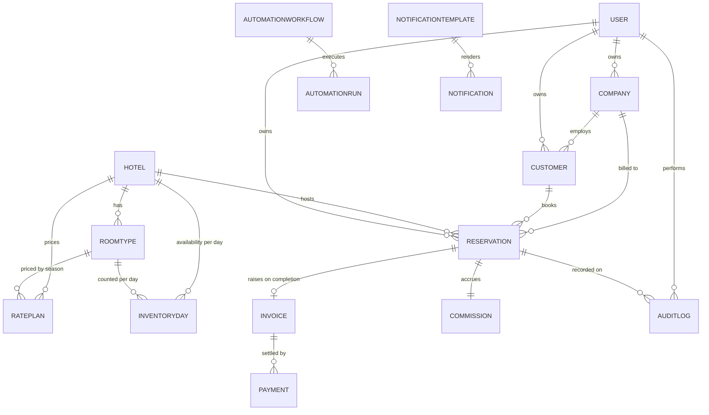
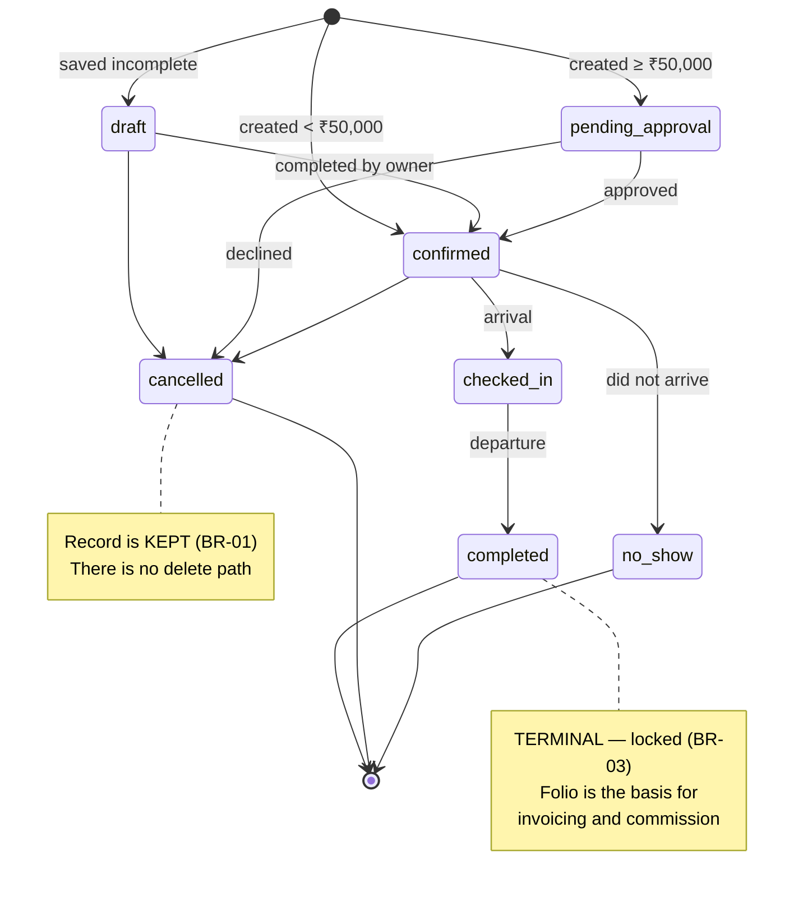
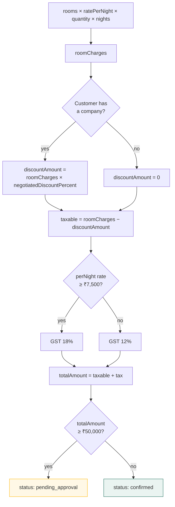
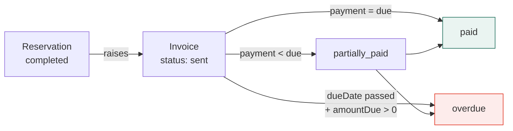

← [V — Component reference](05-component-reference.md) · [Index](README.md) · Next: [VII — Seed engine](07-seed-engine.md)

---

# Volume VI — Data model

**Source:** `src/data/types.ts` — 46 exported types, 18 collections.

Every shape here is what Phase 2 will store in Firestore. The header of the file states the
governing constraint:

```ts
/* Shaped to match the Firestore collections they will become in Phase 2.
   Denormalised display fields (e.g. hotelName on a reservation) are
   intentional — Firestore has no joins, so the read model carries what
   the list screens need. */
```

---

## 6.1 Entity relationship overview



### The two foreign keys that drive everything

| Field | Present on | Purpose |
|---|---|---|
| `ownerId` | `Customer`, `Company`, `Reservation` | Row-level scoping for salespeople. Also drives commission attribution |
| `hotelId` | `Reservation`, `RoomType`, `RatePlan`, `InventoryDay`, `Invoice`, `Commission`, `User` | Row-level scoping for hotel managers |

`scopeRecords()` in `src/lib/permissions.ts` filters on exactly these two fields and nothing
else — which is why the generic signature works across every collection:

```ts
export function scopeRecords<T extends { ownerId?: string; hotelId?: string }>(
  ctx: ScopeContext, records: T[],
): T[]
```

---

## 6.2 Shared conventions

```ts
export type IsoDate     = string;   // "2026-07-28"        — date only
export type IsoDateTime = string;   // ISO-8601 timestamp  — becomes Firestore Timestamp

export interface Auditable {
  createdAt: IsoDateTime;
  createdBy: string;      // user id
  updatedAt: IsoDateTime;
  updatedBy: string;      // user id
}
```

Fifteen of the eighteen collections extend `Auditable`. The three that do not —
`InventoryDay`, `AuditLog`, `AppNotification` — are either derived or immutable by nature.

**Why string dates rather than `Date` objects.** Three reasons:

1. They are what Firestore date-only fields will hold, and what JSON carries.
2. String comparison on `yyyy-MM-dd` is lexicographically correct, so range filters are plain
   `>=` / `<` with no parsing (`r.checkIn >= monthStart && r.checkIn < nextMonthStart`).
3. `Date` objects in React state are a common source of re-render bugs, because two `Date`s
   representing the same instant are not `===`.

⚠️ **The trap this creates:** timezone. `new Date("2026-07-28")` parses as UTC midnight; in
IST that is 05:30 on the 28th, which is fine, but in a negative-offset timezone it would be
the 27th. All formatting goes through `src/lib/format.ts`, and the app is single-timezone
(Asia/Kolkata) by declaration in `orgSettings`. 🔧 Phase 2 must revisit this if the platform
ever serves multiple timezones.

---

## 6.3 `hotels`

The anchor collection. All 32 documents are **real data** extracted from the fact-sheet PDFs
(see [ADR-09](03-decision-log.md#adr-09) and Volume VII).

| Field | Type | Notes |
|---|---|---|
| `id` | `string` | `htl-{city}-{slug}`, e.g. `htl-goa-turtle-beach-resort` |
| `name` | `string` | Full property name |
| `shortName` | `string` | For tables and chips, where the full name would wrap |
| `city` / `state` / `address` | `string` | From the fact sheet |
| `category` | `HotelCategory` | `business` · `resort` · `heritage` · `beach` · `hill_station` · `banquet` |
| `status` | `HotelStatus` | `active` · `onboarding` · `paused` |
| `starRating` | `number` | 3–5 |
| `totalRooms` | `number` | Real. Range across the portfolio: 17 → 236 |
| `description` | `string` | Marketing copy from the fact sheet |
| `roomMix` | `string[]` | Free text, e.g. `"Deluxe Room - 115 Rooms"` |
| `features` / `facilities` / `amenities` / `thingsToDo` | `string[]` | From the fact sheet |
| `distances` | `HotelDistance[]` | `{ label, km }` — real landmarks and distances |
| `contacts` | `HotelContact[]` | `{ name, designation, email, phone }` |
| `managerId` | `string?` | Links to the pinned hotel-manager user |
| `commissionPercent` | `number` | 8–18. What Fidato earns |
| `onboardedAt` | `IsoDate` | |

**Why `roomMix` is free text and not structured.** The fact sheets express it inconsistently —
some as `"Suite Room - 5 Rooms"`, some as `"5 x Suite"`. Normalising it would have meant
inventing structure the source does not have. The *structured* room data lives in `roomTypes`;
`roomMix` is preserved verbatim as the property's own description of itself, and is displayed
as-is on the property detail page.

**Why `shortName` exists.** *"Bngv THE Grandeur Hotel & Banquets"* does not fit a table
column. Deriving a short name at render time would produce inconsistent truncation across
screens; storing it makes the choice once.

---

## 6.4 `roomTypes` and `ratePlans`

```ts
export interface RoomType extends Auditable {
  id: string;
  hotelId: string;  hotelName: string;      // denormalised
  name: string;     code: string;           // e.g. "Deluxe Room", "DR"
  description: string;
  totalRooms: number;
  maxOccupancy: number;
  baseRate: number;
  extraAdultRate: number;
  amenities: string[];
  sizeSqft: number;
}
```

```ts
export type MealPlan = "EP" | "CP" | "MAP" | "AP";

export interface RatePlan extends Auditable {
  id: string;
  hotelId: string;      hotelName: string;
  roomTypeId: string;   roomTypeName: string;
  name: string;         code: string;        // "DR-AP"
  mealPlan: MealPlan;
  rate: number;
  validFrom: IsoDate;   validTo: IsoDate;    // the season window
  minNights: number;
  cancellationPolicy: string;
  isActive: boolean;
}
```

### Meal plans

| Code | Meaning | Included |
|---|---|---|
| `EP` | European Plan | Room only |
| `CP` | Continental Plan | Room + breakfast |
| `MAP` | Modified American Plan | Room + breakfast + one meal |
| `AP` | American Plan | Room + all meals |

These are the standard Indian hospitality codes, used unchanged because that is what the
industry — and the partner properties — already use. Inventing friendlier labels would make
the system harder to reconcile against a property's own paperwork. The UI shows both:
`Full Board (AP)`.

### The rate plan cardinality

```
hotel → room types (2–5) → rate plans (meal plan × season)
```

A property with 3 room types × 2 meal plans × 2 seasons = 12 rate plans. Across 32 properties
this yields ~370 rate plans.

**Why a rate plan is per-room-type rather than per-hotel.** Because a Deluxe and a Suite do
not move in lockstep — a monsoon discount might be 20% on Deluxe and 10% on Suite. Modelling
rates at hotel level would make the common case impossible to express.

---

## 6.5 `inventory` — a derived collection

```ts
export interface InventoryDay {
  id: string;              // inv-{roomTypeId}-{date}
  hotelId: string;
  roomTypeId: string;
  date: IsoDate;
  totalRooms: number;
  booked: number;
  blocked: number;
  available: number;       // totalRooms - booked - blocked
  rate: number;
}
```

⚠️ **This is the one collection not held in the store.** It is generated on demand by
`buildInventory(hotelId, days)` because materialising it would mean 32 hotels × ~4 room types
× 60 days ≈ **7,700 documents** for data that is entirely derived.

```ts
// src/data/seed/index.ts
export function buildInventory(hotelId: string, days = 60) {
  const local = createRandom(
    hotelId.split("").reduce((acc, ch) => acc + ch.charCodeAt(0), 0),
  );
  …
  const pressure = dow === 5 || dow === 6 ? 0.82 : 0.55;   // weekends run hotter
  const booked = Math.min(rt.totalRooms,
    Math.round(rt.totalRooms * pressure * (0.5 + local.next())));
  const blocked = local.bool(0.08) ? local.int(1, 2) : 0;
  …
}
```

**The per-hotel seed derived from the hotel id** is what makes this work. The same property
always produces the same inventory, so navigating away and back shows identical numbers — but
different properties differ. Without it, either every property would look identical or every
visit would show different data.

🔧 **Phase 2 replaces this entirely** with a real `inventory` collection fed by the channel
manager. The interface — `hotelsRepo.inventory(hotelId, days)` — does not change.

---

## 6.6 `companies`

| Field | Type | Notes |
|---|---|---|
| `id` | `string` | `cmp-NNN` |
| `name` / `legalName` | `string` | Trading name and registered name |
| `tier` | `CompanyTier` | `key_account` · `corporate` · `sme` · `travel_agent` |
| `status` | `CompanyStatus` | `active` · `prospect` · `dormant` |
| `industry` | `string` | |
| `gstin` | `string` | Indian tax registration — appears on invoices |
| `city` / `state` / `address` / `website` / `phone` / `email` | `string` | |
| **`ownerId` / `ownerName`** | `string` | **Assigned salesperson. Drives scoping** |
| `creditLimit` / `creditUsed` | `number` | Utilisation bar on the list and detail screens |
| `paymentTermDays` | `number` | 15 / 30 / 45 / 60 — sets invoice due dates |
| `negotiatedDiscountPercent` | `number` | **Applied automatically by the quote engine** |
| `contractStart` / `contractEnd` | `IsoDate?` | |
| `totalReservations` / `totalRevenue` | `number` | Rolled up onto the document, Firestore-style |
| `lastActivityAt` | `IsoDateTime` | |
| `notes` | `string` | |

### Rolled-up counters — the Firestore pattern

`totalReservations` and `totalRevenue` are stored on the company document rather than counted
from reservations.

**Why.** Firestore charges per document read. Counting a key account's bookings by reading
every reservation would be hundreds of reads to render one table cell — on a list screen
showing 25 companies, that is thousands of reads per page view.

**The cost:** these counters can drift if a write path forgets to update them. In Phase 2 they
should be maintained by a Cloud Function on reservation write, not by client code. 🔧 Volume
XIV §14.5.

---

## 6.7 `customers`

| Field | Type | Notes |
|---|---|---|
| `id` | `string` | `cus-NNNN` |
| `firstName` / `lastName` / `fullName` | `string` | `fullName` stored, not derived — it is the search and sort field |
| **`email`** | `string` | **Unique across the platform (BR-06)** |
| **`phone`** | `string` | **Unique across the platform (BR-06)** |
| `status` | `CustomerStatus` | `active` · `lead` · `inactive` |
| `source` | `CustomerSource` | `direct` · `referral` · `website` · `ota` · `corporate` · `walk_in` · `campaign` |
| `companyId` / `companyName` | `string?` | Absent for individual guests |
| `designation` | `string?` | Their role at the company |
| `city` / `state` | `string` | |
| **`ownerId` / `ownerName`** | `string` | Scoping |
| `preferences` | `string[]` | Surfaced in the reservation wizard and sent to the property |
| `vip` | `boolean` | Property is notified before arrival |
| `totalReservations` / `totalRevenue` | `number` | Rolled up |
| `lastStayAt` | `IsoDateTime?` | Absent until a stay completes |
| `lastActivityAt` | `IsoDateTime` | |
| `notes` | `string` | Internal only, never shown to the guest |

**Why `fullName` is stored rather than computed.** It is what gets searched, sorted and
displayed. Computing it at query time would mean `matchesSearch` could not scan it as a plain
field — and in Firestore, you cannot index a computed value.

---

## 6.8 `reservations` — the central collection

```ts
export type ReservationStatus =
  | "draft" | "pending_approval" | "confirmed"
  | "checked_in" | "completed" | "cancelled" | "no_show";

export type BookingChannel =
  | "direct_sales" | "corporate" | "travel_agent"
  | "website" | "phone" | "walk_in";
```

### The status lifecycle



Encoded in `src/lib/rules.ts`:

```ts
const TERMINAL_STATUSES: ReservationStatus[] = ["completed", "cancelled", "no_show"];

export function nextStatuses(current: ReservationStatus): ReservationStatus[] { … }
```

### Field groups

**Identity**

| Field | Notes |
|---|---|
| `id` | `res-NNNN` |
| `reference` | `FH-2026-04821` — human-readable, quoted to guests |
| `status` / `channel` | |

**Denormalised parties** — these five fields are why the reservations list renders with zero
joins:

`customerId` + `customerName` · `companyId?` + `companyName?` · `hotelId` + `hotelName` +
`hotelCity` · `ownerId` + `ownerName`

**Stay**

`checkIn` · `checkOut` · `nights` · `rooms: ReservationRoom[]` · `guests: ReservationGuest[]` ·
`totalRooms` · `totalAdults` · `totalChildren`

**Money** — every component of the quote is stored, not just the total:

`roomCharges` · `extrasCharges` · `discountAmount` · `taxAmount` · `totalAmount`

**Why store every component?** Because the folio must be reconstructible. If only
`totalAmount` were stored, then when a company's negotiated discount changes next quarter, the
historical folio would become unexplainable — you could no longer show *why* that booking cost
what it cost. Storing the breakdown makes every past reservation self-describing.

**Approval and cancellation**

`requiresApproval` · `approvedBy?` · `approvedAt?` · `approvalNote?`
`cancelledAt?` · `cancelledBy?` · `cancellationReason?`

**Notes** — two, with a real distinction:

| Field | Visibility |
|---|---|
| `specialRequests` | **Sent to the property** with the booking |
| `internalNotes` | **Never leaves the platform** |

This distinction is labelled on-screen at every point of entry and display. Conflating them is
how a note like *"client is difficult, watch the discount"* ends up in a hotel's inbox.

### `ReservationRoom` — the line item

```ts
export interface ReservationRoom {
  roomTypeId: string;   roomTypeName: string;
  ratePlanId: string;   ratePlanName: string;
  mealPlan: MealPlan;
  quantity: number;
  ratePerNight: number;    // frozen at time of booking
  adults: number;
  children: number;
}
```

⚠️ **`ratePerNight` is a snapshot, not a reference.** When the revenue team changes a rate
plan, existing reservations keep the rate they were quoted. This is stated in the rate-edit
dialog:

> Changing a rate affects new bookings only. Existing reservations keep the rate they were
> quoted, and the change is written to the audit trail.

---

## 6.9 The quote engine

`reservationsRepo.quote()` is the single pricing function. The wizard calls it live on every
change; `create()` calls the same function so the confirmed price can never differ from the
quoted one.

```ts
quote: (rooms: Reservation["rooms"], nights: number, companyId?: string) => {
  const roomCharges = rooms.reduce((s, r) => s + r.ratePerNight * r.quantity * nights, 0);
  const company = companyId ? db.companies.find((c) => c.id === companyId) : undefined;
  const discountPercent = company?.negotiatedDiscountPercent ?? 0;
  const discountAmount = Math.round((roomCharges * discountPercent) / 100);
  const totalRooms = rooms.reduce((s, r) => s + r.quantity, 0);
  const perNight = totalRooms > 0 && nights > 0 ? roomCharges / totalRooms / nights : 0;
  const taxable = roomCharges - discountAmount;
  const taxRate = perNight >= 7500 ? 0.18 : 0.12;
  const taxAmount = Math.round(taxable * taxRate);
  const totalAmount = taxable + taxAmount;
  return { roomCharges, discountPercent, discountAmount, taxRate, taxAmount, totalAmount,
           requiresApproval: totalAmount >= APPROVAL_THRESHOLD, companyName: company?.name };
}
```



### Three details that matter

**The GST band is decided by the per-night rate, not the total.** Indian GST on hotel
accommodation is banded on the *tariff per room per night*: 12% below ₹7,500, 18% at or above.
A ten-night booking of a ₹4,000 room totals ₹40,000 but is still taxed at 12%, because the
band follows the nightly rate. Using the total would over-tax long stays — a real commercial
error.

**Discount is applied before tax.** GST is charged on the amount actually payable, which is
the discounted figure. Taxing before discount would overstate the liability.

**The approval threshold tests the total *including* tax**, which is the figure the customer
is committed to and the one shown on screen. Testing the pre-tax figure would mean a booking
displaying ₹52,000 slipping through a ₹50,000 gate — indefensible when explaining the rule to
a sales manager.

---

## 6.10 `invoices`, `payments`, `commissions`

```ts
export type InvoiceStatus = "draft" | "sent" | "partially_paid" | "paid" | "overdue" | "void";
```

An invoice carries frozen `lines: InvoiceLine[]` plus `subtotal`, `taxAmount`, `totalAmount`,
`amountPaid`, `amountDue`.

**Why `amountDue` is stored rather than computed as `total − paid`.** It is the field lists
filter and sort on. In Firestore you cannot query on a computed value, so the stored field is
the only way to ask "show me everything with money outstanding" without reading every document.



Status is recalculated on payment:

```ts
// financeRepo.recordPayment (abridged)
invoice.amountPaid += amount;
invoice.amountDue = invoice.totalAmount - invoice.amountPaid;
invoice.status = invoice.amountDue <= 0 ? "paid" : "partially_paid";
```

### Commission

```ts
export interface Commission extends Auditable {
  id: string;
  reservationId: string;  reservationReference: string;
  hotelId: string;        hotelName: string;
  ownerId: string;        ownerName: string;
  bookingValue: number;
  percent: number;
  amount: number;
  status: CommissionStatus;   // accrued → approved → paid
  periodMonth: string;        // "2026-07"
}
```

`percent` is copied from the hotel at accrual time, not referenced. If a property renegotiates
its commission, historical accruals are unaffected — the same snapshot principle as
`ratePerNight`.

---

## 6.11 `users`

```ts
export interface User extends Auditable {
  id: string;
  name: string;  email: string;  phone: string;
  role: Role;
  hotelId?: string;  hotelName?: string;   // hotel managers are pinned to one property
  department: string;
  isActive: boolean;
  lastSeenAt: IsoDateTime;
  avatarColor: string;
}
```

`hotelId` on a user is what makes hotel-manager scoping work: `useScope()` reads it and passes
it into `ScopeContext`, and `scopeRecords()` filters every collection by it.

---

## 6.12 `auditLogs` — append-only

```ts
export interface AuditLog {
  id: string;
  entityType: "reservation" | "customer" | "company" | "hotel" | "invoice" | "user" | "rate";
  entityId: string;
  entityLabel: string;     // denormalised, e.g. "FH-2026-04498"
  action: AuditAction;
  summary: string;
  detail?: string;
  actorId: string;  actorName: string;  actorRole: Role;
  at: IsoDateTime;
}
```

Ten actions: `created` · `updated` · `status_changed` · `cancelled` · `approved` · `merged` ·
`exported` · `viewed` · `note_added` · `email_sent`.

Written by one helper, so no write path can forget it:

```ts
function recordAudit(entry: { … }) {
  db.auditLogs.unshift({ id: nextId("aud", 5), …entry, at: nowIso() });
}
```

**Not `Auditable`.** An audit entry that could be updated would defeat its own purpose. It has
`at` and an actor, and nothing else. `unshift` keeps newest-first, which is the order every
screen wants.

**`entityLabel` is denormalised** so the audit screen can render "FH-2026-04498" without
reading the reservation — which matters when the log holds 2,600 entries spanning seven entity
types.

---

## 6.13 Notifications and automation

```ts
export interface AppNotification {
  id: string;  title: string;  body: string;
  category: NotificationCategory;   // reservation | approval | payment | system | customer | automation
  channel: NotificationChannel;     // in_app | email | whatsapp | sms | push
  isRead: boolean;
  actorName?: string;
  link?: string;                    // deep link to the record
  at: IsoDateTime;
}
```

```ts
export interface AutomationWorkflow extends Auditable {
  id: string;  name: string;  description: string;
  trigger: string;          triggerDetail: string;
  conditions: string[];
  steps: AutomationStep[];
  status: AutomationStatus;  // active | paused | draft
  runsLast30Days: number;
  successRate: number;
  averageDurationMs: number;
  lastRunAt?: IsoDateTime;
}

export interface AutomationStep {
  id: string;  order: number;
  kind: AutomationStepKind;  // generate_pdf | send_email | send_whatsapp | update_record
                             // notify_user | webhook | wait | condition
  label: string;  detail: string;
  n8nNode?: string;          // ← the Phase 3 contract
}
```

🔧 **`n8nNode` is the seam for Phase 3.** Each step declares which n8n node will implement it.
The workflow detail screen displays it, so the definition in this system *is* the specification
n8n will be built against.

---

## 6.14 Query types

```ts
export interface ListQuery {
  search?: string;
  filters?: Record<string, string>;
  sortBy?: string;
  sortDir?: "asc" | "desc";
  page?: number;
  pageSize?: number;
}

export interface ListResult<T> {
  items: T[];
  total: number;
  page: number;
  pageSize: number;
}
```

Deliberately minimal, and deliberately Firestore-shaped: `filters` is equality-only, because
that is what Firestore `where()` does cheaply. There is no `OR`, no `LIKE`, no computed
predicate. See [ADR-06](03-decision-log.md#adr-06).

⚠️ `page` is offset-based. Firestore paginates by cursor. This is the **one honest deviation**
in the data layer, and Volume XIV §14.3 covers the migration.

---

## 6.15 Collection sizes

| Collection | Documents | Generated how |
|---|---:|---|
| `hotels` | 32 | Extracted from fact-sheet PDFs |
| `roomTypes` | ~120 | Derived from each hotel's real room mix |
| `ratePlans` | ~370 | room type × meal plan × season |
| `inventory` | *derived* | `buildInventory()` on demand |
| `companies` | 40 | Seeded |
| `customers` | 180 | Seeded |
| `reservations` | 1,100 | Seeded across −330…+150 days |
| `invoices` | ~450 | For completed and in-house stays |
| `payments` | ~380 | Against invoices |
| `commissions` | ~800 | One per non-cancelled reservation |
| `users` | 24 | Across all 8 roles |
| `auditLogs` | ~2,600 | Generated from reservation lifecycle events |
| `notifications` | 40 | Across 5 channels |
| `notificationTemplates` | 12 | Per event |
| `automationWorkflows` | 12 | Hand-written definitions |
| `automationRuns` | ~340 | Simulated history |
| `integrations` | 14 | Hand-written |
| `orgSettings` | 1 | Singleton |

Volume VII covers how each is generated.

---

Next: [Volume VII — Seed engine](07-seed-engine.md)
