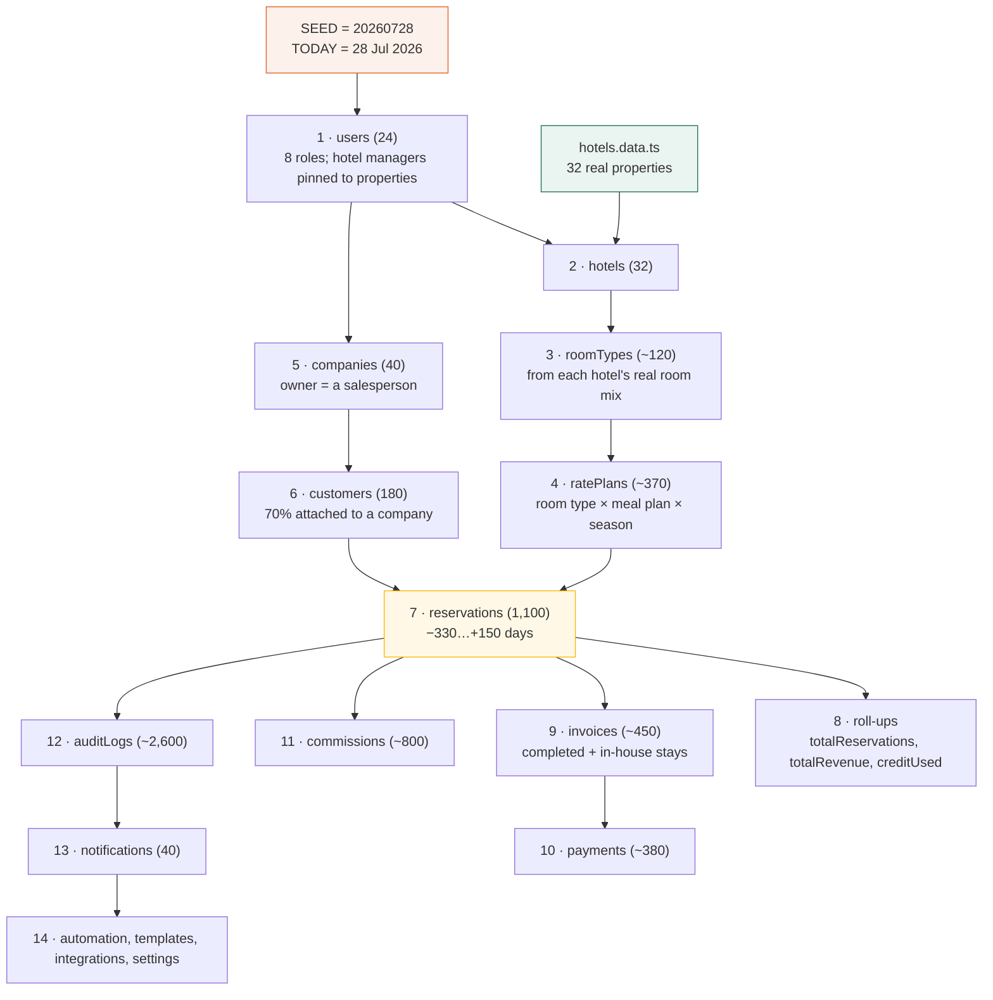

← [VI — Data model](06-data-model.md) · [Index](README.md) · Next: [VIII — Repository layer](08-repository-layer.md)

---

# Volume VII — The seed engine

**Source:** `src/data/seed/` — four files, ~1,600 lines.

This volume documents throwaway code. `src/data/seed/` is deleted in Phase 2. It is documented
in full anyway, because for the whole of Phase 1 it *is* the database, and every number anyone
reviews comes out of it. If you cannot explain where a figure came from, you cannot defend it
in a review.

```
src/data/seed/
├─ random.ts        73 lines   — deterministic PRNG
├─ names.ts        ~180 lines  — name pools, industries, preferences, copy
├─ hotels.data.ts  ~900 lines  — 32 real properties, extracted from PDFs
└─ index.ts       ~1,180 lines — the generator
```

---

## 7.1 Determinism

```ts
// src/data/seed/index.ts
const SEED = 20260728;
const rng = createRandom(SEED);
export const TODAY = new Date(2026, 6, 28);
```

One fixed integer produces the entire world. Reload the page and every one of the 1,100
reservations has the same reference, the same guest, the same price.

### Why not `Math.random()`

| With `Math.random()` | With a fixed seed |
|---|---|
| "The Peerless Inn booking looks wrong" — unreproducible | Anyone can open the same record |
| Screenshots in a document go stale immediately | This manual describes the screens you will actually see |
| A bug that appears in 1 run of 20 is untraceable | Deterministic, therefore debuggable |
| Two reviewers describe different products | Everyone reviews the same product |

### The generator

`mulberry32` — 8 lines, no dependency, good enough distribution for fixtures:

```ts
export function createRandom(seed: number) {
  let state = seed >>> 0;

  function next(): number {
    state |= 0;
    state = (state + 0x6d2b79f5) | 0;
    let t = Math.imul(state ^ (state >>> 15), 1 | state);
    t = (t + Math.imul(t ^ (t >>> 7), 61 | t)) ^ t;
    return ((t ^ (t >>> 14)) >>> 0) / 4294967296;
  }
  …
}
```

Chosen over `seedrandom` (a dependency for 8 lines), a Linear Congruential Generator (visible
patterns in low bits — clustering in weighted picks) and Mersenne Twister (600 lines of state
for fixture data).

### The helper API

| Helper | Signature | Purpose |
|---|---|---|
| `next()` | `→ number` | Float in [0, 1) |
| `int(min, max)` | `→ number` | Inclusive integer |
| `pick(items)` | `→ T` | One element |
| `sample(items, n)` | `→ T[]` | *n* distinct elements |
| `bool(p = 0.5)` | `→ boolean` | Weighted coin |
| `weighted(entries)` | `→ T` | Pick by relative weight |
| `money(min, max, step = 100)` | `→ number` | Rounded to a step |

Two of these deserve explanation.

**`weighted`** is what makes the data look real rather than uniform:

```ts
const CHANNELS: readonly (readonly [BookingChannel, number])[] = [
  ["direct_sales", 5], ["corporate", 5], ["travel_agent", 3],
  ["website", 3], ["phone", 2], ["walk_in", 1],
];
```

A uniform pick would give each channel 16.7%, which no real hospitality business has. The
weights reflect a plausible mix — direct sales and corporate dominate, walk-ins are rare. Every
distribution in the seed is weighted: room counts, night counts, statuses, tiers, sources.

**`money(min, max, step = 100)`** rounds to the nearest ₹100:

```ts
function money(min: number, max: number, step = 100): number {
  return Math.round(int(min, max) / step) * step;
}
```

Real tariffs are ₹4,600, not ₹4,637. Unrounded money is the single fastest way to make seeded
data look fake — the eye catches it immediately in a rate table.

---

## 7.2 The generation pipeline

Order matters absolutely: every stage depends on the ones before it.



⚠️ **Because there is a single shared `rng` instance, order is load-bearing.** Inserting a
generation step in the middle shifts every subsequent random draw and changes the entire
dataset. This is a feature — it keeps generation cheap and deterministic — but it means the
seed file cannot be casually reordered.

---

## 7.3 The 32 real properties

`hotels.data.ts` opens with its own provenance note:

```ts
/* REAL PROPERTY DATA — Fidato partner portfolio

   Extracted from the 32 official fact sheets in
   D:\Fidato Assets\Hotel Fact Sheets. Names, cities, room counts,
   room mixes, features, amenities and landmark distances are the
   property's actual published details. Commercial figures
   (commission, rates) are simulated for Phase 1.

   Generated — do not hand-edit. Re-run the extractor to refresh. */
```

### What is real and what is not

| Real (from the PDFs) | Simulated |
|---|---|
| Property name, short name | Commission percentage |
| City, state, full address | Base rates and rate plans |
| Star rating, category | Contact names, emails, phones |
| Total rooms | Onboarding date |
| Room mix and per-type counts | Status (active / onboarding / paused) |
| Description copy | |
| Features, facilities, amenities | |
| Things to do nearby | |
| Landmark distances in km | |

This split is deliberate and stated: **operational data is real, commercial data is
simulated.** Nobody should read a commission figure off this build and act on it.

### The shape

```ts
export interface SeedHotel {
  id: string;              // htl-goa-turtle-beach-resort
  name: string;            // "Turtle Beach Resort"
  shortName: string;
  city: string;  state: string;  address: string;
  category: string;        // resort | business | heritage | beach | hill_station | banquet
  status: string;
  starRating: number;
  totalRooms: number;
  description: string;
  roomMix: string[];       // verbatim: "Deluxe Room - 115 Rooms"
  roomTypes: SeedRoomType[];   // parsed: { name: "Deluxe Room", count: 115 }
  features: string[];
  facilities: string[];
  amenities: string[];
  thingsToDo: string[];
  distances: SeedDistance[];   // { label: "Shaniwar Wada", km: 11.4 }
}
```

Note `roomMix` **and** `roomTypes`. The first is the property's own words, preserved for
display; the second is the parsed structure the room-type generator consumes. Keeping both
means the display never has to reconstruct a sentence from parsed data, and the parser's
occasional imperfection never corrupts what is shown.

### What the real distribution exposed

| Property | Rooms |
|---|---:|
| The Crescent, Udaipur | 17 |
| Ayati Resort & Spa, Mahabaleshwar | 30 |
| Turtle Beach Resort, Goa | 111 |
| Marigold, Pune | 150 |
| Agra Hotel Taj Pearl | 236 |

A **14× spread**. This is exactly the kind of thing invented data never has, and it changed a
product decision: ranking properties by total revenue systematically flatters the large ones,
so the Property Performance report offers *revenue per available room* as an equal-status
sort. That insight came from the data, not from a requirement.

---

## 7.4 Users

```ts
const spec: { role: Role; count: number; department: string }[] = [
  { role: "super_admin",   count: 1, department: "Technology" },
  { role: "admin",         count: 2, department: "Operations" },
  { role: "sales_manager", count: 2, department: "Sales" },
  { role: "salesperson",   count: 8, department: "Sales" },
  { role: "hotel_manager", count: 5, department: "Property Operations" },
  { role: "finance",       count: 3, department: "Finance" },
  { role: "support",       count: 2, department: "Guest Support" },
  { role: "viewer",        count: 1, department: "Leadership" },
];
```

24 users, and the shape is deliberate: **8 salespeople** so that row-level scoping is
observable — a salesperson sees roughly an eighth of the customer base, which is visibly
different from the full list. With two salespeople the scoping would be much harder to
perceive.

**5 hotel managers**, each pinned to a different property via `hotelCursor++`, so switching to
the Hotel Manager role lands on a property that actually has bookings.

Names are drawn by index arithmetic rather than random pick:

```ts
const first = FIRST_NAMES[n % FIRST_NAMES.length]!;
const last  = LAST_NAMES[(n * 7 + 3) % LAST_NAMES.length]!;
```

The `* 7 + 3` stride avoids first and last names marching in lockstep, which would produce
"Aarav Agarwal, Aditi Bose, Akash Chopra…" — visibly generated.

---

## 7.5 Reservations — the heart of the seed

1,100 documents, and the most carefully tuned part of the generator.

### Date distribution

```ts
// Spread across 11 months back and 5 months forward. At ~1,100
// reservations that is roughly three arrivals a day across the
// portfolio, so any given day has something happening on it —
// which is what a 32-property book actually looks like.
const offset = rng.int(-330, 150);
const checkIn = addDays(TODAY, offset);
const nights = rng.weighted([[1, 4], [2, 5], [3, 4], [4, 2], [5, 1], [7, 1]]);
```

**Why 1,100 and not 320.** The first version generated 320. It typechecked, it built, and the
dashboard looked *dead*: 0 arrivals today, 0 in house, 1 departure. 320 bookings over 480 days
is 0.67 arrivals per day across 32 properties — statistically an empty day is normal, but it
misrepresents the business. At 1,100 the portfolio shows ~3 arrivals and ~4 in-house on a
typical day, which is what a real book of this size looks like. See [D-05](12-defect-log.md).

**Why nights are weighted toward 2–3.** Business travel dominates the channel mix, and business
stays are short. A uniform 1–7 would produce an average stay of 4 nights, which would be a
resort's profile, not this portfolio's.

### Status follows the dates

```ts
function statusForDates(checkIn: Date, checkOut: Date, total: number): ReservationStatus {
  const past = checkOut < TODAY;
  const inHouse = checkIn <= TODAY && checkOut >= TODAY;

  if (past) {
    return rng.weighted<ReservationStatus>([
      ["completed", 12], ["cancelled", 2], ["no_show", 1],
    ]);
  }
  if (inHouse) return "checked_in";
  if (total >= 50_000 && rng.bool(0.45)) return "pending_approval";
  return rng.weighted<ReservationStatus>([
    ["confirmed", 8], ["draft", 1], ["cancelled", 1],
  ]);
}
```

This is the function that makes the data *coherent*. A reservation whose checkout was three
months ago cannot be "confirmed" — it must have resolved. One whose dates straddle today must
be "checked in". Random status assignment would produce future bookings marked "completed",
and every date-sensitive screen would look broken.

The past-stay mix — 12 : 2 : 1 — yields roughly 80% completed, 13% cancelled, 7% no-show,
which lands the portfolio cancellation rate at a believable ~12%.

⚠️ **The 45% coin on `pending_approval`.** Not every large booking is still waiting; some were
approved. Without the coin, *every* future booking over ₹50,000 would sit in the approval
queue and the queue would be absurd. With it, 66 sit pending — enough to review, few enough to
be plausible.

### Lead time, and the bug it hid

```ts
// Booked some weeks before arrival — but never in the future. A
// forward booking was necessarily raised on or before today.
const leadTime = subDays(checkIn, rng.int(3, 60));
const created = leadTime > TODAY ? subDays(TODAY, rng.int(0, 21)) : leadTime;
```

The first version was just `subDays(checkIn, rng.int(3, 60))`. For a check-in in October 2026,
that produced a `createdAt` in August or September — **in the future**. The approvals queue
then displayed *"raised by Meera Bose · in about 1 month"*, which is nonsense: a booking
cannot have been created after today. See [D-06](12-defect-log.md).

The clamp is a small piece of code carrying a real domain invariant: **creation precedes
existence.**

### Money

Room selection, then the shared quote engine:

```ts
const roomCount = rng.weighted([[1, 6], [2, 4], [3, 2], [5, 1], [8, 1]]);
const chosen = rng.sample(types, Math.min(rng.int(1, 2), types.length));
```

Most bookings are 1–2 rooms; a few are group bookings of 5 or 8. Those large ones are what
push totals past ₹50,000 and populate the approval queue — the distribution is what makes the
business rule observable.

Pricing then uses the *same* `quote()` logic the wizard uses, so seeded reservations and
user-created ones are priced identically. Duplicating the pricing maths in the seed would let
the two drift, and a folio created by the seed would eventually disagree with one created by
the app.

---

## 7.6 Roll-ups

After reservations exist, aggregates are written back onto the parent documents:

```ts
for (const r of reservations) {
  if (r.status === "cancelled" || r.status === "draft") continue;
  const customer = customerById.get(r.customerId);
  if (customer) {
    customer.totalReservations += 1;
    customer.totalRevenue += r.totalAmount;
    if (r.status === "completed") customer.lastStayAt = ts(new Date(r.checkOut));
  }
  const company = r.companyId ? companyById.get(r.companyId) : undefined;
  if (company) {
    company.totalReservations += 1;
    company.totalRevenue += r.totalAmount;
  }
}
```

Cancelled and draft bookings are excluded from revenue roll-ups. A cancelled booking that
still counted toward a customer's lifetime value would corrupt every account-value figure in
the product.

This mirrors what a Firestore Cloud Function will do on reservation write in Phase 2 — the
same denormalisation, computed at a different time. 🔧 Volume XIV §14.5.

---

## 7.7 Deliberately planted data

Some data exists specifically so that a feature has something to show. This is legitimate —
a merge screen with no duplicates demonstrates nothing — but it should be *known*.

| Planted | Where | Purpose |
|---|---|---|
| 4 duplicate customer groups (8 records) | `/crm/merge` | Phone, email and name collisions so all three detection strategies are visible |
| ~66 reservations ≥ ₹50,000 pending | `/reservations/approvals` | A queue worth reviewing |
| Overdue invoices | `/finance/invoices` | Exercises the overdue state and the finance dashboard |
| Unreconciled payments | `/finance/payments` | Exercises the reconciliation column |
| 1 paused property | `/reservations/new` | The wizard disables paused properties — otherwise unprovable |
| 3 onboarding properties | `/hotels` | The status filter has something to filter |
| 1 automation workflow with elevated failures | `/automation` | The failure-rate styling has a subject |
| 2 rows in the sample CSV colliding with existing customers | `/crm/import` | Import warnings are demonstrable without the reviewer preparing a file |

That last one is called out in the UI itself:

> Two rows in the sample collide with existing records, so you can see how warnings behave.

---

## 7.8 `names.ts`

Pools sized so repetition is not conspicuous:

| Pool | Size |
|---|---:|
| `FIRST_NAMES` | 60 Indian given names |
| `LAST_NAMES` | 40 surnames |
| `COMPANY_PREFIXES` / `SUFFIXES` | 40 / 12 |
| `LEGAL_SUFFIXES` | 5 (Pvt Ltd, LLP, …) |
| `INDUSTRIES` | 18 |
| `DESIGNATIONS` | 14 |
| `GUEST_PREFERENCES` | 12 |
| `SPECIAL_REQUESTS` | 14 |
| `CANCELLATION_REASONS` | 10 |
| `INTERNAL_NOTES` | 10 |
| `AVATAR_COLORS` | 8 |

60 × 40 = 2,400 name combinations for 180 customers plus 24 users, so collisions are rare
without being impossible — which is itself realistic.

The prose pools matter more than they look. `SPECIAL_REQUESTS` contains real-sounding requests
— *"Anniversary stay — cake and room decoration requested"*, *"Guest arriving on a late flight,
please hold the room"* — because a reservation detail page whose special-requests field says
*lorem ipsum* cannot be evaluated. You cannot tell whether the field is the right length, the
right prominence, or the right tone.

---

## 7.9 Cost of the seed

| | |
|---|---|
| Lines of throwaway code | ~1,600 |
| Time to write | ~1 day |
| Generation time on load | ~40 ms |
| Memory | ~6 MB |
| Deleted in Phase 2 | All of it, except `hotels.data.ts` |

`hotels.data.ts` survives — it becomes the seeding script that populates the real Firestore
`hotels` collection. The 32 properties are genuine reference data, not fixtures.

---

## 7.10 If you need to change the seed

| Goal | Change | Watch out for |
|---|---|---|
| More/fewer reservations | `Array.from({ length: 1100 }, …)` | Below ~800, "today" starts looking empty again |
| Shift the demo date | `TODAY` | Rate plan season windows in `hotels.data.ts` are absolute dates and will need moving |
| Different data entirely | `SEED` | Every planted case in §7.7 must be re-verified — a new seed may produce zero duplicates |
| Add a collection | Append to the end of `index.ts` | Inserting mid-file shifts every subsequent random draw and changes all existing data |
| Change a distribution | The `weighted` table | Check the downstream KPI it feeds; the status weights set the cancellation rate |

⚠️ **The most common mistake** is changing `SEED` to "get different data" and not re-checking
§7.7. The merge screen can silently become an empty state, and a reviewer then concludes the
feature does not work.

---

Next: [Volume VIII — Repository layer](08-repository-layer.md)
