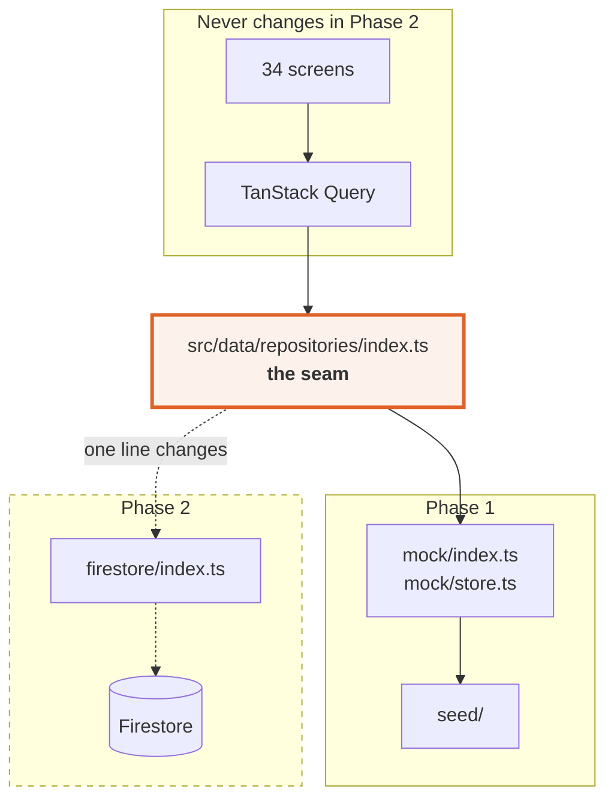
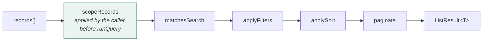

← [VII — Seed engine](07-seed-engine.md) · [Index](README.md) · Next: [IX — Permissions & rules](09-permissions-and-rules.md)

---

# Volume VIII — The repository layer

**Source:** `src/data/repositories/`

This is the most important layer in the codebase for Phase 2, because it is the **only** layer
Phase 2 replaces. Everything above it — 34 screens, 28 components, all state management —
continues unchanged.

```
src/data/repositories/
├─ index.ts              ← the ONLY import path any screen uses
└─ mock/
    ├─ store.ts          db · latency · the query pipeline · id generation
    └─ index.ts          11 repositories, ~1,060 lines
```

---

## 8.1 The contract



`index.ts` is a re-export today:

```ts
export * from "./mock";
```

In Phase 2 it becomes:

```ts
export * from "./firestore";
```

**One line.** That is the entire point of the layer, and it only holds if the discipline in
§8.2 is maintained.

---

## 8.2 The Firestore constraint

Every method obeys what Firestore can actually do ([ADR-06](03-decision-log.md#adr-06)).

| Firestore reality | Consequence here |
|---|---|
| No joins | Documents are denormalised. A reservation carries `customerName`, `companyName`, `hotelName`, `hotelCity`, `ownerName` |
| No `LIKE` / full-text | `matchesSearch()` is a client-side substring scan over named fields |
| Equality and range filters only, on indexed fields | `applyFilters()` does equality only |
| No `GROUP BY` | Reports aggregate in the client |
| No server-side computed predicates | `amountDue` is stored, not derived, so it can be filtered |
| Cursor pagination | ⚠️ `paginate()` is offset-based — the one honest deviation. Volume XIV §14.3 |
| Per-document writes | Each write touches one document plus explicit denormalisation updates |

⚠️ **This constraint is a discipline, not a mechanism.** Nothing in the type system prevents
someone adding `customersRepo.searchFullText()`. If that happens, the Phase 2 estimate in
Volume XIV becomes fiction. It should be a review checkpoint.

---

## 8.3 Simulated latency

```ts
// src/data/repositories/mock/store.ts
const MIN_LATENCY = 120;
const MAX_LATENCY = 400;

export function latency(): Promise<void> {
  const ms = MIN_LATENCY + Math.random() * (MAX_LATENCY - MIN_LATENCY);
  return new Promise((resolve) => setTimeout(resolve, ms));
}

export async function read<T>(produce: () => T): Promise<T> {
  await latency();
  return produce();
}

export async function write<T>(produce: () => T): Promise<T> {
  await latency();
  await new Promise((resolve) => setTimeout(resolve, 80));   // writes cost more
  return produce();
}
```

Every repository method is wrapped in `read()` or `write()`. There is no synchronous path —
by design, so no screen can accidentally depend on data being available on first render.

⚠️ **`latency()` uses `Math.random()`, not the seeded PRNG.** This is intentional: the *data*
must be deterministic, the *timing* must not be. Deterministic timing would mean queries always
resolve in the same order, which would hide exactly the race conditions this is meant to expose.

### What the jitter caught

The dashboard fires four independent queries — KPIs, revenue series, day sheet, approvals.
With zero latency they appeared to resolve together, and a single shared loading flag looked
correct. With jitter, they visibly landed out of order, which made it obvious that each panel
needed its own skeleton. That is now the pattern across the app.

---

## 8.4 The query pipeline

Every list repository funnels through one function:

```ts
export function runQuery<T>(
  records: T[],
  query: ListQuery | undefined,
  searchFields: (keyof T | string)[],
): ListResult<T> {
  const q = query ?? {};
  let result = records;
  if (q.search) result = result.filter((r) => matchesSearch(r, q.search!, searchFields));
  result = applyFilters(result, q.filters);
  result = applySort(result, q.sortBy, q.sortDir);
  return paginate(result, q.page ?? 1, q.pageSize ?? 25);
}
```



**Scope is applied by the caller, before `runQuery`** — not inside it. This ordering is a
security property, not an implementation detail:

```ts
list: (query?: ListQuery, ctx?: ScopeContext): Promise<ListResult<Reservation>> =>
  read(() => {
    const scoped = ctx ? scopeRecords(ctx, db.reservations) : db.reservations;
    return runQuery(scoped, query, ["reference", "customerName", "hotelName", …]);
  }),
```

If scoping ran *after* search, `total` would count records the actor cannot see, leaking their
existence through the pagination readout. Running it first means a salesperson searching for
another rep's account gets a clean "no results" — not an error, and no evidence the record
exists.

### `matchesSearch`

```ts
export function matchesSearch<T>(record: T, term: string, fields: (keyof T | string)[]): boolean {
  if (!term.trim()) return true;
  const needle = term.trim().toLowerCase();
  return fields.some((field) => {
    const value = getField(record, String(field));
    return typeof value === "string" && value.toLowerCase().includes(needle);
  });
}
```

Case-insensitive substring across explicitly named fields — never across the whole document.
Searching every field would match on ids, internal notes and audit text, producing results the
user cannot explain.

Each repository declares its own search surface:

| Repository | Searchable fields |
|---|---|
| `reservations` | reference, customerName, companyName, hotelName, hotelCity, ownerName |
| `customers` | fullName, email, phone, city, companyName |
| `companies` | name, legalName, city, industry, email, gstin |
| `hotels` | name, shortName, city, state, address |
| `invoices` | number, reservationReference, customerName, companyName, hotelName |
| `users` | name, email, department, hotelName |
| `auditLogs` | entityLabel, summary, actorName, detail |

🔧 In Phase 2 this stays client-side until the collection outgrows it, then moves to Algolia or
Typesense. The interface does not change.

### `applyFilters`

```ts
export function applyFilters<T>(records: T[], filters: ListQuery["filters"]): T[] {
  if (!filters) return records;
  const active = Object.entries(filters).filter(
    ([, value]) => value !== undefined && value !== "" && value !== "all",
  );
  if (!active.length) return records;
  return records.filter((record) =>
    active.every(([key, value]) => {
      const field = getField(record, key);
      if (Array.isArray(field)) return field.includes(value as never);
      return field === value;
    }),
  );
}
```

Two details:

- `"all"` is treated as *no filter*, so the UI can use a single `<select>` with an "All"
  option rather than special-casing an empty value.
- Array fields use `includes`, matching Firestore's `array-contains` operator exactly.

### `applySort`

Null handling is explicit, and nulls always sort last regardless of direction:

```ts
if (left == null && right == null) return 0;
if (left == null) return 1;
if (right == null) return -1;
```

A customer with no `lastStayAt` should not lead a descending sort by last stay. Missing data is
not "smallest"; it is *absent*, and absent belongs at the end.

Numbers compare numerically, everything else via `localeCompare`.

### `paginate`

```ts
export function paginate<T>(records: T[], page = 1, pageSize = 25): ListResult<T> {
  const start = (page - 1) * pageSize;
  return { items: records.slice(start, start + pageSize), total: records.length, page, pageSize };
}
```

⚠️ Offset-based. Firestore is cursor-based. Volume XIV §14.3.

---

## 8.5 The eleven repositories

| Repository | Reads | Writes |
|---|---|---|
| `hotelsRepo` | `list` `all` `get` `roomTypes` `ratePlans` `inventory` | `update` |
| `ratePlansRepo` | `list` | `update` |
| `companiesRepo` | `list` `all` `get` | `create` `update` |
| `customersRepo` | `list` `all` `get` `reservations` `duplicates` | `create` `update` `merge` `importMany` |
| `reservationsRepo` | `list` `get` `pendingApprovals` `daySheet` `inRange` `audit` `quote` | `create` `setStatus` |
| `financeRepo` | `invoices` `invoice` `payments` `paymentsForInvoice` | `recordPayment` |
| `reportsRepo` | `kpis` `revenueSeries` `hotelPerformance` `salesPerformance` `occupancyByCity` `channelMix` `forecast` | — |
| `automationRepo` | `workflows` `workflow` `runs` `runsForWorkflow` | `setStatus` |
| `notificationsRepo` | `list` `unreadCount` `templates` `template` | `markRead` `markAllRead` |
| `adminRepo` | `users` `user` `allUsers` `auditLog` `integrations` `settings` | `updateUser` `updateSettings` |
| `searchRepo` | `query` | — |

`quote()` is the one synchronous method, because the wizard calls it on every keystroke and
awaiting a promise per change would make the price flicker.

---

## 8.6 Writes and the audit trail

Every write goes through one helper, so no path can forget the audit entry:

```ts
function recordAudit(entry: {
  entityType: AuditLog["entityType"];
  entityId: string;  entityLabel: string;
  action: AuditAction;  summary: string;  detail?: string;
  actor: { id: string; name: string; role: Role };
}) {
  db.auditLogs.unshift({
    id: nextId("aud", 5),
    entityType: entry.entityType, entityId: entry.entityId, entityLabel: entry.entityLabel,
    action: entry.action, summary: entry.summary, detail: entry.detail,
    actorId: entry.actor.id, actorName: entry.actor.name, actorRole: entry.actor.role,
    at: nowIso(),
  });
}
```

Every write method takes an `Actor`:

```ts
export interface Actor { id: string; name: string; role: Role; }
```

supplied by `useActor()` from the session store. There is no ambient "current user" inside the
repository layer — identity is always passed in explicitly.

**Why.** A repository that reads global state cannot be tested, cannot be called from a Cloud
Function, and hides who did what. Passing the actor makes every write self-documenting and
keeps the layer pure.

### Worked example: `setStatus`

```ts
setStatus: (id, status, actor, extra?) =>
  write(() => {
    const index = db.reservations.findIndex((r) => r.id === id);
    if (index < 0) throw new Error("Reservation not found");
    const current = db.reservations[index]!;

    const updated: Reservation = {
      ...current, status,
      ...(status === "cancelled" && {
        cancelledAt: nowIso(),
        cancelledBy: actor.name,
        cancellationReason: extra?.reason ?? "No reason recorded",
      }),
      ...(status === "confirmed" && current.status === "pending_approval" && {
        approvedBy: actor.name, approvedAt: nowIso(), approvalNote: extra?.note,
      }),
      updatedAt: nowIso(), updatedBy: actor.id,
    };

    db.reservations[index] = updated;
    recordAudit({ entityType: "reservation", entityId: id, entityLabel: updated.reference, … });
    return updated;
  }),
```

Note the conditional spreads: cancellation metadata is written only on cancellation, approval
metadata only on the `pending_approval → confirmed` transition. A blanket assignment would
stamp an approver onto a cancelled booking.

### `merge` — the most complex write

Implements BR-07. Three phases, in order:

```ts
merge: (survivorId, absorbedIds, patch, actor) =>
  write(() => {
    // 1 · Re-point every child record
    for (const r of db.reservations) {
      if (absorbedIds.includes(r.customerId)) {
        r.customerId = survivorId;
        r.customerName = survivor.fullName;      // denormalised field must follow
      }
    }
    for (const inv of db.invoices) { /* same */ }

    // 2 · Fill gaps on the survivor from the absorbed records
    Object.assign(survivor, patch);

    // 3 · Remove the absorbed records, roll up their history
    survivor.totalReservations = …;
    survivor.totalRevenue = …;
    db.customers = db.customers.filter((c) => !absorbedIds.includes(c.id));

    recordAudit({ action: "merged", … });
    return survivor;
  }),
```

⚠️ **Order is not optional.** Re-pointing must happen before removal, or the reservations
become orphaned. And `customerName` must be updated alongside `customerId`, because the
denormalised copy is what the lists render — updating only the id would leave the old name on
screen with no way to notice.

🔧 This is the single hardest operation to port to Firestore. It must become a batched write
or a transaction across three collections, and it is the one place where Firestore's 500-write
batch limit could realistically be hit. Volume XIV §14.7.

---

## 8.7 Aggregation in `reportsRepo`

Firestore cannot `GROUP BY`, so reports aggregate in the client. This is not a limitation of
the mock — it is an accurate preview of Phase 2.

```ts
kpis: (ctx?: ScopeContext) =>
  read(() => {
    const scoped = ctx ? scopeRecords(ctx, db.reservations) : db.reservations;
    const monthStart     = isoDate(startOfMonth(TODAY));
    const lastMonthStart = isoDate(startOfMonth(subMonths(TODAY, 1)));
    // Upper bound matters: without it "this month" silently absorbs the
    // entire forward book and every growth figure becomes nonsense.
    const nextMonthStart = isoDate(startOfMonth(addMonths(TODAY, 1)));

    const thisMonth = scoped.filter((r) => r.checkIn >= monthStart && r.checkIn < nextMonthStart);
    const lastMonth = scoped.filter((r) => r.checkIn >= lastMonthStart && r.checkIn < monthStart);
    …
  }),
```

That comment marks [D-03](12-defect-log.md), which is worth understanding because it is the
kind of bug that looks like working software. The original had no upper bound:

```ts
const thisMonth = scoped.filter((r) => r.checkIn >= monthStart);   // ✗
```

Since the seed extends 150 days forward, "this month" silently meant *this month and the
entire forward book*. The dashboard reported **+757.4% growth** and 105 reservations in a month
that actually had 19. Nothing threw. The number was simply, confidently wrong.

**The lesson:** every date-range filter needs both bounds. An open-ended range over data that
extends into the future is a bug that reports success.

### The occupancy helpers

```ts
const occupancyCache = new Map<string, number>();

function occupancyForHotel(hotelId: string, days = 30): number {
  const key = `${hotelId}:${days}`;
  const cached = occupancyCache.get(key);
  if (cached !== undefined) return cached;

  const rows = buildInventory(hotelId, days);
  const capacity = rows.reduce((s, r) => s + r.totalRooms, 0);
  const booked = rows.reduce((s, r) => s + r.booked, 0);
  const value = capacity > 0 ? (booked / capacity) * 100 : 0;

  occupancyCache.set(key, value);
  return value;
}

function portfolioOccupancy(hotelIds?: string[]): number {
  const hotels = hotelIds ? db.hotels.filter((h) => hotelIds.includes(h.id)) : db.hotels;
  const totalRooms = hotels.reduce((s, h) => s + h.totalRooms, 0);
  if (totalRooms === 0) return 0;
  return hotels.reduce((s, h) => s + occupancyForHotel(h.id) * h.totalRooms, 0) / totalRooms;
}
```

Two things to note.

**The cache is necessary.** `buildInventory` generates ~120 rows per property. The Occupancy
report calls `portfolioOccupancy` per city; without memoisation, rendering it would regenerate
inventory for all 32 properties several times over.

**Portfolio occupancy is weighted by room count.** A flat average across properties would let
a 17-room retreat at 90% and a 236-room hotel at 40% average to 65% — a figure describing
nothing. Weighting by rooms gives the number an operational meaning: the proportion of the
portfolio's *beds* that are sold.

The same reasoning appears in the Occupancy report screen:

```ts
// Weighted by room count — a 236-key city hotel should not be averaged
// flat against a 17-key retreat.
const averageOccupancy = totalRooms
  ? rows.reduce((s, r) => s + r.occupancyPercent * r.rooms, 0) / totalRooms
  : 0;
```

---

## 8.8 Missing documents return `null`

```ts
get: (id: string): Promise<Hotel | null> =>
  read(() => db.hotels.find((h) => h.id === id) ?? null),
```

The `?? null` matters. Returning `undefined` makes TanStack Query throw:

> Query data cannot be undefined. Please make sure to return a value other than undefined from
> your query function.

Every detail page then logged an error and sat in an error state for what is a perfectly normal
condition — a deleted or mistyped id. With `null`, the page resolves cleanly and the standard
guard renders Not-found:

```tsx
if (hotel.isLoading) return <DetailSkeleton />;
if (!hotel.data) return <NotFound />;
```

All eight `get`-style methods were converted. See [D-08](12-defect-log.md).

---

## 8.9 Cache keys and invalidation

Query keys always include the scope, so switching role invalidates automatically:

```ts
useQuery({
  queryKey: ["reservations", list.query, scope.role, scope.userId],
  queryFn: () => reservationsRepo.list(list.query, scope),
});
```

There is **no manual cache clearing anywhere in the codebase**. Changing role changes the key;
TanStack Query does the rest.

Mutations invalidate explicitly, and the set is deliberately broad:

```ts
onSuccess: (updated) => {
  queryClient.invalidateQueries({ queryKey: ["reservation", id] });
  queryClient.invalidateQueries({ queryKey: ["reservation-audit", id] });
  queryClient.invalidateQueries({ queryKey: ["reservations"] });
  queryClient.invalidateQueries({ queryKey: ["pending-approvals"] });
  queryClient.invalidateQueries({ queryKey: ["kpis"] });
  toast.success(`Reservation ${labelFor(updated.status).toLowerCase()}`, updated.reference);
},
```

Approving a reservation changes: the reservation, its audit trail, every list containing it,
the approval queue, and the dashboard KPIs. Missing one leaves a stale count somewhere — and a
stale approval count on the dashboard is exactly the kind of thing that erodes trust in a
system.

**Convention:** invalidate by prefix (`["reservations"]`), not by exact key. Exact keys miss
the variants produced by different filters and pages.

---

## 8.10 What Phase 2 actually changes

| File | Change |
|---|---|
| `repositories/index.ts` | One line: `./mock` → `./firestore` |
| `repositories/firestore/*` | New. Same method signatures, Firestore calls inside |
| `repositories/mock/*` | Deleted |
| `data/seed/*` | Deleted, except `hotels.data.ts` which becomes a seeding script |
| `data/types.ts` | Unchanged, except `IsoDateTime` → `Timestamp` at the boundary |
| Everything above | **Unchanged** |

Signature-compatible example:

```ts
// Phase 1
list: (query?: ListQuery, ctx?: ScopeContext): Promise<ListResult<Reservation>> =>
  read(() => {
    const scoped = ctx ? scopeRecords(ctx, db.reservations) : db.reservations;
    return runQuery(scoped, query, [...]);
  }),

// Phase 2 — same signature, same return type
list: async (query?: ListQuery, ctx?: ScopeContext): Promise<ListResult<Reservation>> => {
  let q = collection(firestore, "reservations");
  if (ctx?.role === "salesperson")   q = query(q, where("ownerId", "==", ctx.userId));
  if (ctx?.role === "hotel_manager") q = query(q, where("hotelId", "==", ctx.hotelId));
  …
},
```

Volume XIV covers the migration in full, including the three places where the mapping is not
one-to-one: pagination, merge, and full-text search.

---

Next: [Volume IX — Permissions & business rules](09-permissions-and-rules.md)
