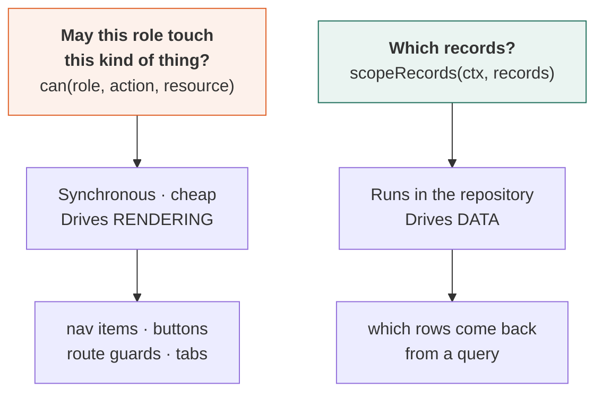
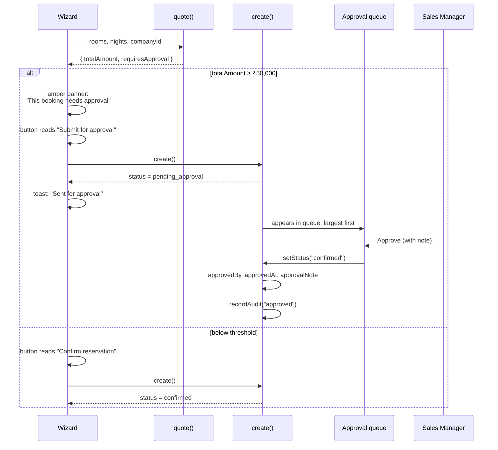

← [VIII — Repository layer](08-repository-layer.md) · [Index](README.md) · Next: [X — Screen teardown](10-screen-teardown.md)

---

# Volume IX — Permissions and business rules

**Sources:** `src/lib/permissions.ts` (296 lines) · `src/lib/rules.ts` (~210 lines)

These two files are the smallest part of the codebase and the most consequential. Every screen
consults them; nothing duplicates them.

The live view is `/admin/roles`, which is **generated from these modules** — it is not a
diagram of the permission model, it is the model rendered.

---

## 9.1 The two questions



They are kept separate ([ADR-13](03-decision-log.md#adr-13)) because they run at different
times and different granularity. `can()` must be synchronous to drive rendering; scoping must
run against a record set inside the data layer. Fusing them would mean either fetching
everything and filtering in the UI — leaky and slow — or making every permission check async,
which is unusable for deciding whether to render a button.

---

## 9.2 The three axes

```ts
export const ROLES = [
  "super_admin", "admin", "sales_manager", "salesperson",
  "hotel_manager", "finance", "support", "viewer",
] as const;

export const RESOURCES = [
  "dashboard", "customer", "company", "reservation", "reservation_approval",
  "hotel", "inventory", "rate", "invoice", "payment", "commission",
  "report", "automation", "notification", "ai",
  "user", "role", "integration", "audit_log", "setting",
] as const;

export const ACTIONS = [
  "view", "create", "edit", "cancel", "approve", "export", "merge", "import",
] as const;
```

8 roles × 20 resources = **160 cells**, each holding a set drawn from 8 actions.

### Why these particular actions

| Action | Why it is not covered by `edit` |
|---|---|
| `view` | The baseline. Absence of `view` removes the nav item entirely |
| `create` | Reading and editing an existing customer is a different privilege from creating new ones |
| `edit` | |
| `cancel` | **Reservations are never deleted (BR-01).** `cancel` replaces `delete` in this domain. Support may edit a booking without being able to cancel it |
| `approve` | Sign-off authority is orthogonal to editing. A salesperson may edit a booking they cannot approve |
| `export` | Data egress is its own concern. Viewer may read but not extract |
| `merge` | Destructive and irreversible. Deliberately not implied by `edit` |
| `import` | Bulk write. Also not implied by `create` |

There is **no `delete`**. Its absence from the action list is the strongest possible statement
of BR-01: the vocabulary of the system does not contain the concept.

### Why `reservation_approval` is a resource, not just an action

`approve` on `reservation` would conflate two things: *may you approve* and *may you see the
queue*. Finance can see the approval queue (it holds money) but cannot approve. A separate
resource expresses that cleanly.

---

## 9.3 The matrix

```ts
const ALL: readonly Action[] = ACTIONS;
const READ: readonly Action[] = ["view"];
const READ_EXPORT: readonly Action[] = ["view", "export"];

const MATRIX: Record<Role, ResourceGrants> = {
  super_admin: Object.fromEntries(RESOURCES.map((r) => [r, ALL])) as ResourceGrants,
  …
};
```

Super Admin is generated rather than enumerated, so a newly added resource is automatically
granted. The alternative — a hand-written list — would silently lock Super Admin out of every
new resource until someone remembered to update it.

### Full matrix

Legend: **●** full control · **R** read-only · **·** no access

| Resource | Super Admin | Admin | Sales Mgr | Sales | Hotel Mgr | Finance | Support | Viewer |
|---|:---:|:---:|:---:|:---:|:---:|:---:|:---:|:---:|
| Dashboard | ● | R | R | R | R | R | R | R |
| Customers | ● | ● | ● | ● | · | R | ● | R |
| Companies | ● | ● | ● | ● | · | R | R | R |
| Reservations | ● | ● | ● | ● | R | R | ● | R |
| Approvals | ● | ● | ● | · | · | · | · | · |
| Properties | ● | ● | R | R | ● | R | R | R |
| Inventory | ● | ● | R | R | ● | · | R | R |
| **Rate plans** | ● | ● | R | R | **R** | · | · | R |
| Invoices | ● | ● | R | R | · | ● | R | R |
| Payments | ● | ● | · | · | · | ● | · | · |
| Commissions | ● | R | R | R | · | ● | · | · |
| Reports | ● | R | R | R | R | R | R | R |
| Automation | ● | ● | R | · | · | · | · | · |
| Notifications | ● | ● | R | R | R | R | ● | R |
| Assistant | ● | R | R | R | R | R | R | · |
| Users | ● | ● | R | · | · | · | · | · |
| Roles | ● | · | · | · | · | · | · | · |
| Integrations | ● | · | · | · | · | · | · | · |
| Audit log | ● | R | R | · | · | R | · | · |
| Settings | ● | ● | · | · | · | · | · | · |

The bolded cell is the most instructive in the table: **hotel managers have read-only access to
rate plans.** It is the clearest demonstration of the permission model in the running product,
and BR-04 exists to enforce it.

### Observable consequence

| Role | Navigation items |
|---|---:|
| Super Admin | 16 |
| Admin | 14 |
| Sales Manager | 13 |
| Salesperson | 13 |
| Finance | 11 |
| Support | 9 |
| Viewer | 8 |
| Hotel Manager | 7 |

Verified in the browser: switching Super Admin → Hotel Manager takes the sidebar from 16 items
to 7, changes the dashboard to a property day-sheet, and turns 12 Edit buttons on the rate
screen into 12 "Locked" markers.

---

## 9.4 The API

```ts
/** Can this role perform `action` on `resource`? */
export function can(role: Role, action: Action, resource: Resource): boolean {
  return MATRIX[role]?.[resource]?.includes(action) ?? false;
}

/** Does this role have any access at all? Drives nav visibility. */
export function canAccess(role: Role, resource: Resource): boolean {
  return (MATRIX[role]?.[resource]?.length ?? 0) > 0;
}

/** Every action a role holds on a resource — used by the admin matrix screen. */
export function grantsFor(role: Role, resource: Resource): readonly Action[] {
  return MATRIX[role]?.[resource] ?? [];
}
```

Both `can` and `canAccess` **default to denying**. The `?? false` and `?? 0` mean a resource
absent from a role's grants is closed, not open. Adding a resource to `RESOURCES` without
adding it to a role's map denies it — the safe direction.

### Where each is used

| Function | Used by | Example |
|---|---|---|
| `canAccess` | Route guards, nav visibility | `if (!canAccess(role, "invoice")) return <Forbidden/>` |
| `can` | Buttons, actions, sections | `{can(role, "create", "reservation") && <Button…>}` |
| `grantsFor` | `/admin/roles` matrix cells | Renders the tooltip listing granted actions |

---

## 9.5 Row-level scoping

```ts
export interface ScopeContext {
  role: Role;
  userId: string;      // in Phase 1, from the role switcher
  hotelId?: string;    // hotel managers are pinned to one property
}

export function scopeRecords<T extends { ownerId?: string; hotelId?: string }>(
  ctx: ScopeContext, records: T[],
): T[] {
  if (ctx.role === "salesperson") {
    return records.filter((r) => !r.ownerId || r.ownerId === ctx.userId);
  }
  if (ctx.role === "hotel_manager" && ctx.hotelId) {
    return records.filter((r) => !r.hotelId || r.hotelId === ctx.hotelId);
  }
  return records;
}
```

Twelve lines. Two rules.

⚠️ **The `!r.ownerId ||` clause is deliberate and subtle.** A record with no owner is visible
to everyone. This is correct — an unassigned lead should not be invisible to the entire sales
team — but it means *ownership absence is permissive*. If a future collection uses `ownerId`
with different semantics, this default must be revisited.

### The scope flows from the session

```ts
// src/lib/session.ts
export function useScope(): ScopeContext {
  const user = useCurrentUser();
  return { role: user.role, userId: user.id, hotelId: user.hotelId };
}
```

`useCurrentUser()` resolves the seeded user for the current role, so `hotelId` is present
exactly when the role is `hotel_manager`.

### Applied before search — a security property

Covered in Volume VIII §8.4, restated because it matters: scoping runs *before* search and
pagination. `total` therefore counts only visible records, and a salesperson searching for
another rep's account gets a clean empty result rather than evidence the record exists.

---

## 9.6 The eight business rules

`src/lib/rules.ts`. Each is a function; each is also declared in `BUSINESS_RULES` with its
rationale and the name of the function enforcing it, so `/admin/roles` can render them.

```ts
export interface BusinessRule {
  id: string;
  rule: string;
  rationale: string;
  enforcedIn: string;
}
```

| # | Rule | Enforced in |
|---|---|---|
| BR-01 | A reservation is never deleted, only cancelled | `canCancelReservation()` + absence of any delete path |
| BR-02 | Bookings ≥ ₹50,000 require approval | `requiresApproval()` |
| BR-03 | Completed / cancelled / no-show reservations are locked | `canEditReservation()` |
| BR-04 | Hotel managers cannot edit rate plans | `canEditRates()` |
| BR-05 | A salesperson sees only their assigned accounts | `scopeRecords()` |
| BR-06 | Customer email and phone must be unique | `isDuplicateEmail()` / `isDuplicatePhone()` |
| BR-07 | Merging moves all reservations and invoices to the survivor | `customersRepo.merge()` |
| BR-08 | Every change is written to the append-only audit log | `recordAudit()` |

---

## 9.7 The `{ allowed, reason }` pattern

Three rule functions return a shape rather than a boolean:

```ts
export function canCancelReservation(
  role: Role, reservation: Reservation,
): { allowed: boolean; reason?: string } {
  if (!can(role, "cancel", "reservation")) {
    return { allowed: false, reason: "Your role cannot cancel reservations." };
  }
  if (reservation.status === "cancelled") {
    return { allowed: false, reason: "This reservation is already cancelled." };
  }
  if (reservation.status === "completed") {
    return { allowed: false, reason: "Completed reservations are locked." };
  }
  if (reservation.status === "checked_in") {
    return { allowed: false, reason: "Guest is in-house. Check out before cancelling." };
  }
  return { allowed: true };
}
```

**This shape is what makes [ADR-12](03-decision-log.md#adr-12) implementable.** A boolean
would let the UI hide the button; a reason obliges it to explain:

```tsx
{cancelCheck.allowed ? (
  <CancelDialog … />
) : (
  <Tooltip content={cancelCheck.reason}>
    <span>
      <Button variant="secondary" disabled leadingIcon={<Ban className="size-4" />}>
        Cancel
      </Button>
    </span>
  </Tooltip>
)}
```

Four distinct reasons are produced, and each is genuinely different information for the user.
"You can't do that" would have collapsed all four into one unhelpful message.

Note the wrapping `<span>` — a disabled button emits no pointer events, so the tooltip would
never fire without an enabled element to receive them.

---

## 9.8 BR-02 — the approval threshold

```ts
export const APPROVAL_THRESHOLD = 50_000;

export function requiresApproval(totalAmount: number): boolean {
  return totalAmount >= APPROVAL_THRESHOLD;
}
```

One constant, imported by the quote engine, the wizard, the approvals screen, the settings
screen and the rules table. Changing the threshold is a one-line change with no search-and-
replace.



The threshold is surfaced **three times** before it can surprise anyone: in the live quote
panel, in a banner on the review step, and in the button's own label — which changes from
"Confirm reservation" to "Submit for approval". A rule discovered only after submission is a
rule that generates support tickets.

---

## 9.9 BR-03 — the terminal-status lock

```ts
const TERMINAL_STATUSES: ReservationStatus[] = ["completed", "cancelled", "no_show"];

export function isTerminal(status: ReservationStatus): boolean {
  return TERMINAL_STATUSES.includes(status);
}

export function canEditReservation(role: Role, reservation: Reservation) {
  if (!can(role, "edit", "reservation")) {
    return { allowed: false, reason: "Your role has read-only access here." };
  }
  if (isTerminal(reservation.status)) {
    return { allowed: false, reason: `${labelFor(reservation.status)} reservations are locked.` };
  }
  return { allowed: true };
}
```

Surfaced on the detail page as a lock chip beside the status, a tooltip on disabled actions,
and a side-rail card carrying the reason.

**Why it exists.** Once a stay has resolved, its folio is the basis for the invoice and the
commission accrual. Editing it after the fact would silently change money already accounted
for — the invoice would no longer reconcile to the booking that produced it.

### The state machine

```ts
export function nextStatuses(current: ReservationStatus): ReservationStatus[] {
  const transitions: Record<ReservationStatus, ReservationStatus[]> = {
    draft:            ["pending_approval", "confirmed", "cancelled"],
    pending_approval: ["confirmed", "cancelled"],
    confirmed:        ["checked_in", "cancelled", "no_show"],
    checked_in:       ["completed"],
    completed:        [],
    cancelled:        [],
    no_show:          [],
  };
  return transitions[current];
}
```

The three terminal states return an empty array, which is what drives the *absence* of action
buttons on the detail page. The UI does not decide which transitions exist; it asks.

Note `checked_in → ["completed"]` only. A guest who is physically in the hotel cannot have
their booking cancelled — they must be checked out first. `canCancelReservation` states this
explicitly: *"Guest is in-house. Check out before cancelling."*

---

## 9.10 BR-04 — pricing is owned centrally

```ts
export function canEditRates(role: Role): { allowed: boolean; reason?: string } {
  if (role === "hotel_manager") {
    return { allowed: false, reason: "Rate plans are managed centrally by the revenue team." };
  }
  if (!can(role, "edit", "rate")) {
    return { allowed: false, reason: "Your role cannot edit pricing." };
  }
  return { allowed: true };
}
```

⚠️ **The explicit `hotel_manager` check appears redundant** — the matrix already grants them
only `["view"]` on `rate`. It is deliberate, for two reasons:

1. It produces a *specific* reason. The generic path says "Your role cannot edit pricing";
   this says who *does* own it, which is what the user actually needs to know.
2. It is defence in depth. If someone widened the hotel-manager grant while reasoning about
   something else, this check would still hold the rule.

### How it presents

The rate screen renders a banner, and every row's action cell becomes a lock:

```tsx
{!access.allowed && (
  <Card className="mb-6 bg-grey-50">
    <CardBody className="flex items-start gap-3">
      <Lock className="size-4 text-grey-400 shrink-0 mt-0.5" />
      <div>
        <p className="text-base font-medium text-ink-900">Read-only for your role</p>
        <p className="text-sm text-grey-600 mt-1 leading-relaxed">
          {access.reason} You can see every rate here, but changes must come from
          the revenue team. Switch role in the top bar to see the editable view.
        </p>
      </div>
    </CardBody>
  </Card>
)}
```

The last sentence is the detail worth copying elsewhere: it tells the reviewer how to *see the
other side*, which turns a restriction into a demonstration.

---

## 9.11 BR-06 — uniqueness

```ts
export function isDuplicateEmail(
  email: string, existing: { email: string; id: string }[], ignoreId?: string,
): boolean {
  const normalised = email.trim().toLowerCase();
  return existing.some((c) => c.id !== ignoreId && c.email.trim().toLowerCase() === normalised);
}

export function isDuplicatePhone(
  phoneValue: string, existing: { phone: string; id: string }[], ignoreId?: string,
): boolean {
  const digits = phoneValue.replace(/\D/g, "").slice(-10);
  if (digits.length < 10) return false;
  return existing.some(
    (c) => c.id !== ignoreId && c.phone.replace(/\D/g, "").slice(-10) === digits,
  );
}
```

### Normalisation is the whole design

**Email:** trimmed and lower-cased. `Ananya@Bose.com` and `ananya@bose.com ` are the same
address, and treating them as distinct is how duplicate customer records are born.

**Phone:** reduced to the **last 10 digits**. In India these are equivalent:

```
+91 98765 43210
09876543210
9876543210
+919876543210
```

Comparing raw strings would treat all four as different people. Taking the last 10 digits
after stripping non-digits collapses them correctly, and sidesteps the country-code and
trunk-prefix variations entirely.

`ignoreId` excludes the record being edited, so saving a customer without changing their email
does not report them as their own duplicate.

### It warns; it never blocks

Per [ADR-21](03-decision-log.md#adr-21). The form shows:

> ⚠ Another customer already has this email. You can still save, then resolve it on the
> [duplicates](/crm/merge) screen.

---

## 9.12 BR-07 — merge semantics

Detection runs three strategies, in confidence order:

| Order | Match on | Confidence | Why this order |
|---|---|---|---|
| 1 | Normalised phone | High | The strongest identity signal in this market — people change email, keep numbers |
| 2 | Lower-cased email | High | Strong, but shared family and role addresses exist |
| 3 | Exact full name | Worth checking | Two real people can share a name |

The merge itself re-points children, fills gaps on the survivor, rolls up history, then removes
the absorbed records. Order is load-bearing — Volume VIII §8.6.

The UI defaults the survivor to the record with the most history:

```ts
const [survivorId, setSurvivorId] = useState(
  // Default to the record with the most history — it has the most to lose.
  [...group.records].sort(
    (a, b) => b.totalReservations - a.totalReservations || (a.createdAt < b.createdAt ? -1 : 1),
  )[0]!.id,
);
```

Ties break toward the older record.

---

## 9.13 BR-08 — the audit trail

One helper, called by every write. Covered in Volume VIII §8.6.

What makes it trustworthy:

| Property | Mechanism |
|---|---|
| Append-only | Only `unshift`. No update or delete path exists |
| Attributed | Every write takes an `Actor`; id, name and role are all recorded |
| Complete | The helper is the only way to write; forgetting it means the write does not compile into the established pattern |
| Navigable | `entityType` + `entityId` let `/admin/audit-log` link every row to its record |

---

## 9.14 Where the rules surface

| Rule | Surfaces at |
|---|---|
| BR-01 | No delete control anywhere; cancel dialog wording; cancelled records stay in every list |
| BR-02 | Wizard quote panel · review banner · button label · approvals queue · settings · rules table |
| BR-03 | Lock chip · disabled actions with tooltips · side-rail explanation |
| BR-04 | Read-only banner · Locked markers · tooltip on the property page's rate button |
| BR-05 | Scoped lists · role-aware page descriptions · role-aware empty states |
| BR-06 | Inline warnings on the customer form · import validation |
| BR-07 | Merge screen: survivor choice, preview dialog, consequence text |
| BR-08 | Reservation timeline tab · `/admin/audit-log` |

---

## 9.15 Phase 2 — the rules become security rules

🔧 Everything in this volume currently runs **only in the browser**. That is acceptable in
Phase 1 because there is no server to protect. In Phase 2 it is not.

The matrix must be restated as Firestore security rules:

```js
// Sketch — Phase 2
match /reservations/{id} {
  allow read: if request.auth != null && (
    hasRole(['super_admin','admin','sales_manager','finance','support','viewer'])
    || (hasRole(['salesperson'])   && resource.data.ownerId == request.auth.uid)
    || (hasRole(['hotel_manager']) && resource.data.hotelId == userHotelId())
  );

  allow update: if hasPermission('reservation','edit')
                && !(resource.data.status in ['completed','cancelled','no_show']);   // BR-03

  allow delete: if false;                                                            // BR-01
}
```

`allow delete: if false` is BR-01 expressed at the only level that truly enforces it.

**The risk to manage:** two copies of the rules — TypeScript and Firestore — that can drift.
Volume XIV §14.8 proposes generating the security rules from `MATRIX` rather than hand-writing
them, which is the only reliable way to keep them in step.

---

Next: [Volume X — Screen teardown](10-screen-teardown.md)
