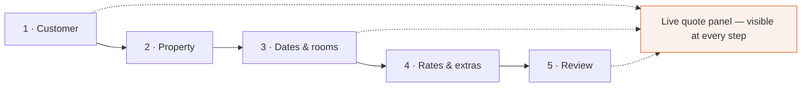
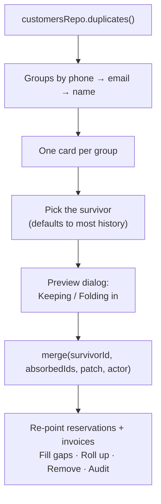

← [IX — Permissions & rules](09-permissions-and-rules.md) · [Index](README.md) · Next: [XI — Diagnostics](11-diagnostics.md)

---

# Volume X — Screen teardown

All 38 routes, one at a time. Each entry gives the route, the guard, the data it pulls, the
states it handles, the interactions it offers, and — where there was a real choice — why it is
shaped the way it is.

## Contents

| § | Screen | Route |
|---|---|---|
| [10.1](#101-app-shell) | App shell | *(frame)* |
| [10.2](#102-dashboard) | Dashboard | `/dashboard` |
| [10.3](#103-reservations-list) | Reservations list | `/reservations` |
| [10.4](#104-reservation-calendar) | Calendar | `/reservations/calendar` |
| [10.5](#105-new-reservation-wizard) | New reservation | `/reservations/new` |
| [10.6](#106-reservation-detail) | Reservation detail | `/reservations/:id` |
| [10.7](#107-approval-queue) | Approvals | `/reservations/approvals` |
| [10.8](#108-customers-list) | Customers | `/crm/customers` |
| [10.9](#109-customer-detail) | Customer detail | `/crm/customers/:id` |
| [10.10](#1010-customer-form) | Customer form | `/crm/customers/new`, `/:id/edit` |
| [10.11](#1011-companies-list) | Companies | `/crm/companies` |
| [10.12](#1012-company-detail) | Company detail | `/crm/companies/:id` |
| [10.13](#1013-company-form) | Company form | `/crm/companies/new`, `/:id/edit` |
| [10.14](#1014-duplicate-merge) | Duplicates | `/crm/merge` |
| [10.15](#1015-import-wizard) | Import | `/crm/import` |
| [10.16](#1016-properties-list) | Properties | `/hotels` |
| [10.17](#1017-property-detail) | Property detail | `/hotels/:id` |
| [10.18](#1018-inventory-grid) | Inventory | `/hotels/:id/inventory` |
| [10.19](#1019-rate-plans) | Rate plans | `/hotels/:id/rates` |
| [10.20](#1020-invoices) | Invoices | `/finance/invoices` |
| [10.21](#1021-invoice-detail) | Invoice detail | `/finance/invoices/:id` |
| [10.22](#1022-payments) | Payments | `/finance/payments` |
| [10.23](#1023-commissions) | Commissions | `/finance/commissions` |
| [10.24](#1024-reports) | Reports ×6 | `/reports/*` |
| [10.25](#1025-automation) | Automation ×3 | `/automation/*` |
| [10.26](#1026-notifications) | Notifications ×2 | `/notifications/*` |
| [10.27](#1027-assistant) | Assistant | `/ai` |
| [10.28](#1028-administration) | Admin ×5 | `/admin/*` |
| [10.29](#1029-design-system) | Design system | `/design-system` |

---

## 10.1 App shell

**Source:** `src/components/app/` — `AppShell` · `Sidebar` · `TopBar` · `RoleSwitcher` ·
`CommandPalette` · `AiPanel` · `navigation.ts`

```
┌────────────┬──────────────────────────────────────────────────────┐
│            │  [☰] [Search ⌘K]              [✨] [🔔 8] [Role ▾]   │ 56px
│  Sidebar   ├──────────────────────────────────────────────────────┤
│  240px     │                                                      │
│  (or 68px  │   <Outlet/>                                          │
│  collapsed)│   px-5 py-6 · sm:px-7 sm:py-8 · max-w-[1600px]       │
│            │                                                      │
└────────────┴──────────────────────────────────────────────────────┘
```

### Navigation is generated from permissions

`navigation.ts` declares each item with the resource it needs; the sidebar filters:

```ts
{ label: "Invoices", to: "/finance/invoices", icon: Receipt, resource: "invoice" }
```

Nothing is hardcoded per role. Adding a resource to a role's grants makes the nav item appear.

### Layout responsibilities

| Element | Behaviour |
|---|---|
| Sidebar | Fixed. Collapsible to a 68 px icon rail; preference persisted |
| Sidebar (< `lg`) | Becomes a Radix Dialog drawer |
| Top bar | Search, AI panel, notifications, role switcher |
| Main | The only scrolling region — `overflow-y-auto` |

⚠️ **The top bar carries no create action.** It did originally, which put a second orange
primary button roughly 100 px above the page header's own — visible on the dashboard and the
reservations list, and a direct breach of the one-primary-action-per-view rule in Volume V
§5.2. Create actions now live only in the page header, where they sit beside that screen's
other actions. ⌘K is the global path. See [D-10](12-defect-log.md).

Making `<main>` the scroll container rather than the document keeps the sidebar and top bar
fixed without `position: fixed`, which avoids the whole class of iOS viewport bugs.

### The scroll-lock guard

```tsx
useEffect(() => {
  if (document.querySelector("[data-radix-focus-guard]")) return;
  if (document.body.style.pointerEvents === "none") {
    document.body.style.removeProperty("pointer-events");
  }
  document.body.removeAttribute("data-scroll-locked");
}, [pathname]);
```

Defensive. Radix sets `pointer-events: none` on `<body>` while a modal is open; a modal that
unmounts while open can strand it, making the **entire app unclickable with no visible cause**.
The guard checks for a live focus guard first, so it never interferes with a legitimately open
modal. See [D-02](12-defect-log.md).

### Command palette (⌘K)

Groups: navigation · actions · records. Record search calls `searchRepo.query()` across
reservations, customers, companies, hotels and invoices, scoped to the actor.

```tsx
function choose(entry: Entry) {
  // Close before navigating. Unmounting the route while the modal is
  // still open can strand Radix's scroll lock on <body>.
  setOpen(false);
  navigate(entry.to);
}
```

---

## 10.2 Dashboard

**Route** `/dashboard` · **Guard** `dashboard` · **Source** `features/dashboard/DashboardPage.tsx`

The only screen that changes shape by role rather than merely filtering.

| Role | Title | KPI row |
|---|---|---|
| Hotel manager | *"{Property} today"* | Arrivals · Departures · In house · Occupancy |
| Salesperson | *"Your pipeline"* | Your revenue · Reservations · Awaiting approval · Cancellation rate |
| Finance | *"Financial position"* | Revenue · Overdue invoices · Average booking · Awaiting approval |
| Others | *"Portfolio overview"* | Revenue · Reservations · Awaiting approval · Cancellation rate |

### Data

```ts
const kpis     = useQuery({ queryKey: ["kpis", scope.role, scope.userId], … });
const series   = useQuery({ queryKey: ["revenue-series", …], … });
const daySheet = useQuery({ queryKey: ["day-sheet", today, …], … });
const approvals = useQuery({ queryKey: ["pending-approvals", …],
                             enabled: can(role, "view", "reservation_approval") });
const recent   = useQuery({ queryKey: ["recent-reservations", …], … });
```

Five independent queries, each with its own skeleton. `enabled` on the approvals query means
roles without the permission never issue it — no wasted call, no flash of a panel that then
disappears.

### Why four KPI variants rather than one set

A hotel manager does not care about portfolio revenue; they care who is arriving. Finance does
not care about arrivals; they care what is overdue. Showing everyone the same four numbers
would mean at least two of them are noise for every viewer.

### Sections

1. **KPI row** — 4 tiles; the first carries a 2 px `brand-gradient` top edge, the only place
   the gradient appears outside the logo.
2. **Revenue chart** (2 cols) — 12-month area chart.
3. **Today** (1 col) — arrivals / departures / in-house, plus the first four arriving guests.
4. **Waiting on you** — approval queue preview, only for roles that can approve.
5. **Recent reservations** (2 cols) + **Daily briefing** (1 col) — the AI card; for roles
   without `ai` but with `invoice`, a Receivables card takes its place.
6. **Room nights by month** — bar chart.

### Empty "today"

The day panel showing zeros is legitimate on a quiet day. It was also the symptom that exposed
the seed being too small — see [D-05](12-defect-log.md).

---

## 10.3 Reservations list

**Route** `/reservations` · **Guard** `reservation`

| Column | Notes |
|---|---|
| Reference | Sortable; reference over guest name as a two-line cell |
| Property | Two-line: name + city |
| Stay | `hideBelow="md"` — check-in and night count |
| Rooms | `hideBelow="lg"`, numeric |
| Channel | `hideBelow="xl"` |
| Status | Pill + a `≥50k` marker where approval applies |
| Owner | `hideBelow="xl"` |
| Value | Sortable, numeric |

Filters: status (7) · channel (6). Search covers reference, guest, property.

The page description changes by role — *"Bookings on your accounts"* for a salesperson,
*"Bookings at your property"* for a hotel manager, *"Every booking across the 32-property
portfolio"* otherwise. The scoping is real; the sentence explains it rather than leaving the
user to infer it.

⚠️ **Known gap.** The screen mentions bulk actions in its description but row selection is not
implemented. Volume XIII §13.7.

---

## 10.4 Reservation calendar

**Route** `/reservations/calendar` · **Source** `features/reservations/CalendarPage.tsx`

Two views over the same data.

### Month grid

A stay occupies **every night from check-in up to, but not including, check-out** — the
hospitality convention, not an inclusive date range:

```ts
for (const d of eachDayOfInterval({ start, end: addDays(end, -1) })) {
  map.set(key, [...(map.get(key) ?? []), r]);
}
```

Getting this wrong by one day is the classic hotel-software bug: a guest checking out on the
5th would appear to occupy the night of the 5th, and every occupancy figure would be inflated.

Three bookings per day are shown, then `+N more`.

### Property timeline

Rows are properties, columns are days, bookings are bars. Overlapping bars are packed into
sub-rows by a greedy interval algorithm:

```ts
function packRows(items: Reservation[], firstDay: Date, dayCount: number): PackedBar[][] {
  const bars = items.map((r) => { … }).sort((a, b) => a.offset - b.offset);

  const rows: PackedBar[][] = [];
  for (const bar of bars) {
    const row = rows.find((r) => {
      const last = r[r.length - 1]!;
      return last.offset + last.span <= bar.offset;   // fits after the last bar
    });
    if (row) row.push(bar);
    else if (rows.length < 6) rows.push([bar]);       // cap at 6 sub-rows
  }
  return rows;
}
```

Sorting by start, then placing each bar in the first row whose last bar has ended. O(n·rows),
which at this scale is nothing. The 6-row cap stops a very busy property from producing a
40-row-tall band.

Bars are positioned as percentages so the grid stays responsive:

```tsx
style={{ left: `${(offset / days.length) * 100}%`, width: `${(span / days.length) * 100}%` }}
```

---

## 10.5 New reservation wizard

**Route** `/reservations/new` · **Guard** `reservation` · 700 lines, the most complex screen.



### Step gating

```ts
const canAdvance =
  (step === "customer" && Boolean(customerId)) ||
  (step === "property" && Boolean(hotelId)) ||
  (step === "dates"    && nights > 0 && rooms.length > 0) ||
  step === "rates" || step === "review";
```

Continue is `disabled` until the step's decision is made. The stepper allows jumping *back*
but never forward — you cannot skip a decision the later steps depend on.

### The live quote

Recomputed with `useMemo` on every change:

```ts
const quote = useMemo(
  () => reservationsRepo.quote(rooms, nights, customer?.companyId),
  [rooms, nights, customer?.companyId],
);
```

The panel is `lg:sticky lg:top-6`, so on desktop the price stays visible while scrolling
through room selection. Watching the total move as rooms are added is the single most useful
feedback in the flow.

### The approval threshold, surfaced three times

1. In the quote panel, as soon as the total crosses ₹50,000.
2. As an amber banner on the review step, quoting the amount and the threshold.
3. In the submit button, which reads **"Submit for approval"** rather than "Confirm
   reservation".

### Room selection

Per room type: a stepper for quantity, then rate plan, adults and children once quantity > 0.
The increment button is capped at `roomType.totalRooms`.

Progressive disclosure is deliberate — showing rate plan, adults and children for every room
type at once would produce a wall of controls for a property with five room types, most of
them irrelevant.

### Paused properties

```tsx
<button disabled={h.status === "paused"} …>
  {disabled && <StatusPill tone="warning">Paused</StatusPill>}
```

A paused property cannot take new bookings, and the reason is on the card rather than left to
be discovered.

---

## 10.6 Reservation detail

**Route** `/reservations/:id` · **Source** `ReservationDetailPage.tsx` (~750 lines)

Header: breadcrumbs, reference, guest + property, status pill, lock chip when terminal, and
the action set.

### Actions are computed, never assumed

```ts
const cancelCheck  = canCancelReservation(role, r);
const editCheck    = canEditReservation(role, r);
const locked       = isTerminal(r.status);
const transitions  = nextStatuses(r.status);
const canApprove   = r.status === "pending_approval"
                  && can(role, "approve", "reservation_approval");
```

Every button asks the rules layer. Check-in appears only if `transitions` includes
`checked_in`; Cancel is disabled with a tooltip carrying `cancelCheck.reason`.

### Contextual banners

| Status | Banner |
|---|---|
| `pending_approval` | Amber — the amount, the threshold, who raised it and when |
| `cancelled` | Red — reason, who cancelled, when, and *"The record is kept for audit — reservations are never deleted"* |

### Four tabs

**Folio** — room lines, then a right-aligned totals block: room charges → extras → corporate
discount → GST → total. Every component of the quote is shown because the folio must be
self-explaining (Volume VI §6.8).

**Guests** — primary guest flagged.

**Timeline** — the audit trail as a vertical timeline, colour-coded by action.

**Documents** — voucher, confirmation email, invoice link. Buttons fire toasts explaining that
delivery arrives in Phase 3, rather than pretending to work.

### Side rail

Booking facts with links to customer, company and property; the AI summary card; and — when
editing is blocked — a card carrying the reason.

---

## 10.7 Approval queue

**Route** `/reservations/approvals` · **Guard** `reservation_approval`

Sorted by value **descending** — the bookings holding the most money get seen first, which is
the order a manager would choose anyway.

Each card carries reference, status, channel, guest, company, property, dates, nights, rooms,
who raised it and when, the total, the per-room-night rate, and any special request.

**The per-room-night figure is the reviewer's actual tool.** ₹6,44,280 means little in
isolation; ₹11,505 per room-night is immediately assessable against what that property should
fetch.

### Roles that can see but not act

```tsx
{!canDecide && (
  <Card className="mb-6 bg-grey-50">
    <CardBody className="flex items-start gap-3">
      <ShieldCheck className="size-4 text-grey-400 shrink-0 mt-0.5" />
      <p className="text-base text-grey-600 leading-relaxed">
        You can see this queue but not act on it. Approving is limited to sales
        managers and admins — switch role in the top bar to try it.
      </p>
    </CardBody>
  </Card>
)}
```

### Approve and decline

Both open dialogs. Approve takes an optional note recorded on the audit trail; Decline requires
a reason from the standard list and cancels the reservation — declining is not a separate
status, because a declined booking *is* a cancelled booking, and inventing a status for it
would fragment the cancellation report.

---

## 10.8 Customers list

**Route** `/crm/customers` · **Guard** `customer`

Columns: Customer (avatar, name, VIP star, email) · Company · Phone · City · Status · Stays ·
Revenue · Owner · Last activity.

Actions in the header adapt: **Duplicates** if `can(merge)`, **Import** if `can(import)`,
**New customer** if `can(create)`.

The VIP star carries a tooltip — *"VIP — notify the property before arrival"* — because a star
with no explanation is decoration.

---

## 10.9 Customer detail

**Route** `/crm/customers/:id`

Summary strip: reservations · lifetime value · last stay · source and owner.

Tabs: **Reservations** (table, click-through) · **Preferences** (chips, with a note that they
are passed to the property) · **Notes** (internal, with created/updated stamps).

Side rail: contact block with `mailto:` and formatted phone, company link, and the AI summary.

The empty state is written for the specific customer: *"{name} has not booked with Fidato so
far."* — not a generic "No records".

---

## 10.10 Customer form

**Routes** `/crm/customers/new` · `/crm/customers/:id/edit`

One component for both. `react-hook-form` + Zod:

```ts
const schema = z.object({
  firstName: z.string().min(1, "First name is required"),
  email: z.string().min(1, "Email is required").email("Enter a valid email address"),
  phone: z.string().min(1, "Phone is required")
    .refine((v) => v.replace(/\D/g, "").length >= 10, "Enter a valid 10-digit number"),
  …
});
```

### Live duplicate warning

```ts
const duplicateEmail = email && isDuplicateEmail(email, db.customers, id);
const duplicatePhone = phone && isDuplicatePhone(phone, db.customers, id);
```

Warns as you type, using the same rule functions the import wizard uses. `id` is passed so a
record is not flagged as its own duplicate.

Error messages are written as instructions — *"Enter a valid email address"* — not as
diagnoses — *"Invalid email"*.

---

## 10.11 Companies list

**Route** `/crm/companies` · **Guard** `company`

The distinguishing column is **credit used**, rendered as a percentage with a
`ProgressBar` whose tone shifts at 60% and 80%, and a tooltip giving the absolute figures.

The empty state is role-aware:

> **No accounts assigned to you**
> A sales manager assigns accounts. Switch role in the top bar to see the full list.

Offering "Add a company" to someone whose problem is *assignment* would be unhelpful.

---

## 10.12 Company detail

**Route** `/crm/companies/:id`

Tabs: Reservations · Contacts · Contract.

Side rail leads with a **Credit** card — utilisation as a large percentage, absolute figures,
a progress bar, and above 70% a line of advice:

> Utilisation is high. Worth a conversation with finance before the next large booking.

That sentence is the difference between a dashboard and a tool. The number alone requires the
reader to know the threshold; the sentence tells them what to do.

---

## 10.13 Company form

**Routes** `/crm/companies/new` · `/crm/companies/:id/edit`

Grouped: identity · classification (tier, status, industry) · contact · address · commercial
(credit limit, payment terms, negotiated discount) · notes.

The commercial group is where the fields that *change how the system behaves* live — the
negotiated discount feeds the quote engine, payment terms set invoice due dates.

---

## 10.14 Duplicate merge

**Route** `/crm/merge` · **Guard** `customer` (+ `merge` for the action)



Each record renders as a selectable card showing company, stays, revenue, created date and
source — the facts you need to decide which record is the real one.

The confirmation dialog splits **Keeping** (green) from **Folding in** (grey) and states the
consequence in plain terms:

> 3 reservations and any invoices will move onto Ananya Bose. Missing fields are filled from
> the records being folded in. The merge is written to the audit trail.

Empty state is a success, not a void: *"No duplicates found — every customer record has a
distinct phone number, email address and name."*

---

## 10.15 Import wizard

**Route** `/crm/import` · **Guard** `customer` (+ `import`)

Three steps: **Upload → Map columns → Review & import**.

### Column auto-mapping

```ts
function guessMapping(headers: string[]): Record<string, string> {
  const normalise = (s: string) => s.toLowerCase().replace(/[^a-z]/g, "");
  for (const field of TARGET_FIELDS) {
    const target = normalise(field.label);
    const alt = normalise(field.key);
    const match = headers.find((h) => {
      const n = normalise(h);
      return n === target || n === alt || n.includes(alt) || alt.includes(n);
    });
    if (match) map[field.key] = match;
  }
  return map;
}
```

`first_name`, `First Name`, `firstname` and `FIRSTNAME` all match. The common case then needs
no work at all, and the mapping step becomes a confirmation rather than a chore.

### Two classes of problem

| | Treatment | Why |
|---|---|---|
| Duplicated **inside the file** | **Error** — row skipped | A file containing the same person twice is a mistake in the file |
| Collides with an **existing** record | **Warning** — row imports | May be legitimate; resolve on the merge screen ([ADR-21](03-decision-log.md#adr-21)) |

Also errors: missing required field, malformed email, phone under 10 digits.

The review table shows every row with ✓ / ⚠ / ✗ and the specific issue. Counts summarise:
*will import* / *with warnings* / *skipped*.

### The sample file

```
Use a sample file (8 rows)
Two rows in the sample collide with existing records, so you can see how warnings behave.
```

A reviewer can exercise the whole flow, including the warning path, without preparing a CSV.

---

## 10.16 Properties list

**Route** `/hotels` · **Guard** `hotel`

Grid and table views, switchable.

Grid cards carry a 1 px `brand-gradient` top edge standing in for property photography, then
name, city, star rating, category, description, room count and commission, with room-mix chips.

🔧 The gradient band is a placeholder. Phase 2 adds real photography, and the card is laid out
to accept a 16:9 image in that position without reflowing.

---

## 10.17 Property detail

**Route** `/hotels/:id`

Tabs: **Overview** (description, features, facilities, amenities as chips) · **Rooms** (room
types with rates) · **Bookings** · **Location**.

The Location tab is the clearest payoff from using real fact-sheet data — real landmarks with
real distances:

| | |
|---|---:|
| Airport – Pune | 24 km |
| Railway Station | 17 km |
| Shaniwar Wada | 11.4 km |

The rate-plan button changes by role: primary **"Rate plans"** when editable, secondary
**"View rates"** wrapped in a tooltip carrying the restriction when not.

---

## 10.18 Inventory grid

**Route** `/hotels/:id/inventory` · **Guard** `inventory`

Room types down, days across, 30 / 45 / 60-day horizons.

### Cell shading by pressure

```ts
function pressureClass(soldPercent: number): string {
  if (soldPercent >= 100) return "bg-brand-red";
  if (soldPercent >= 88)  return "bg-brand-orange";
  if (soldPercent >= 70)  return "bg-brand-orange-100";
  if (soldPercent >= 45)  return "bg-brand-yellow-50";
  return "bg-white";
}
```

The cell shows rooms **still available**; the shade shows how sold-out the day is. A wall of
dark cells reads as "we are full" before a single number is read — which is the entire point of
a grid rather than a table.

Weekends carry a tinted background, today's column is highlighted, and every cell has a tooltip
with the full breakdown.

A footnote states plainly that the data is simulated and Phase 2 reads live PMS inventory.

---

## 10.19 Rate plans

**Route** `/hotels/:id/rates` · **Guard** `rate`

**The clearest demonstration of the permission model in the product.**

| As Super Admin | As Hotel Manager |
|---|---|
| No banner | "Read-only for your role" banner |
| 12 **Edit** buttons | 12 **Locked** markers |

Both verified in the browser (Volume XIII).

The edit dialog states the consequence:

> Changing a rate affects new bookings only. Existing reservations keep the rate they were
> quoted, and the change is written to the audit trail.

Footnote explains the GST banding — 12% below ₹7,500, 18% at or above — because a rate near the
boundary has a tax consequence the person setting it should know about.

---

## 10.20 Invoices

**Route** `/finance/invoices` · **Guard** `invoice`

Totals strip: invoices · collected · outstanding · overdue.

Overdue rows render the due date and amount in `brand-red` — the row is legible as a problem
without reading the status column.

---

## 10.21 Invoice detail

**Route** `/finance/invoices/:id`

A real document, laid out to print:

```
┌───────────────────────────────────────────────────────┐
│ Fidato Hotels            (Georgia)     Tax Invoice    │
│ Fidato Hospitality Pvt Ltd             INV-2607-0193  │
│ Registered address                     Issued 2 Jul   │
│ GSTIN 27AABCF1234M1Z5                  Due 17 Jul     │
├───────────────────────────────────────────────────────┤
│ Billed to                    │ Stay                   │
│ Meridian Logistics           │ Ayati Resort & Spa     │
│ …address, GSTIN…             │ Reservation FH-…       │
├───────────────────────────────────────────────────────┤
│ Description        Qty   Rate      Amount             │
│ …                                                     │
│                          Subtotal   ₹54,000.00        │
│                          GST        ₹ 9,720.00        │
│                          Total      ₹63,720.00        │
│                          Paid      −₹45,320.00        │
│                          Due        ₹18,400.00        │
└───────────────────────────────────────────────────────┘
```

`.print-serif` on the header is the surviving Georgia usage. The side rail carries payments and
account links and is `.no-print`.

**Record payment** updates `amountPaid`, `amountDue` and recalculates status to `paid` or
`partially_paid`.

---

## 10.22 Payments

**Route** `/finance/payments` · **Guard** `payment`

Receipts against invoices, with a **reconciled** column. Unreconciled means received but not
yet matched to a bank statement — a real finance distinction, and the reason the totals strip
separates "received" from "unreconciled".

Rows navigate to the invoice, not to a payment detail page: a payment in isolation is rarely
what you want.

---

## 10.23 Commissions

**Route** `/finance/commissions` · **Guard** `commission`

**What Fidato actually earns.** Revenue figures elsewhere are gross booking value; this screen
is the one that answers "what did we make?".

Ranked by commission earned, **not** by booking value — a high-volume property on 8% can be
worth less than a smaller one on 18%, and ranking by revenue would bury that.

Footnote records the basis: commission is calculated on gross booking value including tax,
which is how the current property agreements are written, and cancelled bookings are excluded.

---

## 10.24 Reports

Six screens sharing `ReportShell` (breadcrumbs, export, print, and a Georgia print cover).

### `/reports` — the gallery

Each card states **the question the report answers**, not just its name:

| Report | Question |
|---|---|
| Revenue | Where is the money coming from, and is it growing? |
| Sales performance | Who is selling, and how well? |
| Occupancy | How full are we, and where are the gaps? |
| Property performance | Which properties are earning their place? |
| Forecast | What does the next six months look like? |

A gallery of six nouns makes you open all six to find the one you want.

### `/reports/revenue`

Area chart, bookings bar chart, channel-mix donut, and a month table with a totals footer.

### `/reports/sales-performance`

Leaderboard with accounts, bookings, average value, cancellations, conversion and revenue.
Revenue cells carry a `ProgressBar` scaled to the top performer, so relative standing is visible
without arithmetic.

### `/reports/occupancy`

Where [ADR-19](03-decision-log.md#adr-19) is most visible. Two adjacent, deliberately distinct
metrics:

| Metric | Source | Meaning |
|---|---|---|
| **Fidato room nights** | Reservations | What this platform booked |
| **Property occupancy** | Inventory model | How full the properties are, all channels |

The footnote explains the distinction rather than leaving it to be misread.

### `/reports/hotel-performance`

Sortable three ways: by revenue, **by revenue per room**, by occupancy.

The per-room sort exists because the real portfolio spans 17 to 236 rooms. Ranking by total
revenue systematically flatters scale, and a 17-key property outperforming per room is exactly
the insight the report should surface.

### `/reports/forecast`

Six-month straight-line projection from the last six months. Solid line for booked, dashed for
projected, with a "Today" reference line.

An info banner sits above the numbers:

> This is a straight-line projection from recent trend, not a demand model. It takes no account
> of seasonality, the events calendar or properties still onboarding. Treat it as a direction,
> not a number to plan against.

A forecast presented without its limits will be quoted as if it had none.

---

## 10.25 Automation

### `/automation`

Workflow cards showing the trigger → steps chain as a readable sequence:

```
⚡ Reservation Confirmed → 📄 generate_pdf → ✉ send_email → 🔔 notify_user  +2
```

A Switch pauses/resumes for roles with `edit`; others see a status pill.

Footer states plainly that these do not execute in Phase 1 and that the run history is
simulated.

### `/automation/:id`

Trigger (with detail), conditions, then the ordered steps as a vertical timeline. Each step
names the **n8n node** it will map to — the definition here *is* the Phase 3 specification.

The side rail shows the webhook path Phase 3 will POST to:

```
POST /webhook/reservation-confirmed
```

### `/automation/runs`

Full run log with result, workflow, record, duration, steps completed and failure reason.

---

## 10.26 Notifications

### `/notifications`

Inbox, all/unread. Unread rows carry a tinted background; approval and payment categories get
a red icon treatment because those are the ones people act on.

### `/notifications/templates`

Templates per channel, in two modes:

- **Preview** — merge fields substituted from a sample booking, so you read the real wording.
- **Merge fields** — the raw template with `{{tokens}}` visible.

WhatsApp templates render in a green-tinted frame; SMS templates show a character count and
segment count, because a template that silently costs three segments is a template nobody
budgeted for.

Unknown tokens are left intact rather than blanked, so a typo is visible instead of producing
an empty sentence.

---

## 10.27 Assistant

**Route** `/ai` · **Guard** `ai`

Answers are **computed from live seed data**, not generated ([ADR-22](03-decision-log.md#adr-22)).
Verified output:

> Across the portfolio you are holding 932 live reservations worth ₹5,94,79,298.
> • Room nights sold: 6,655
> • Average booking value: ₹63,819
> • Cancellation rate: 12.3%
> • Properties live: 29 of 32

Every figure reconciles with `/reports/revenue`, because both read the same store.

Each response carries a footnote:

> *Generated from live platform data. Phase 1 uses scripted analysis, not a language model.*

Contract for Phase 2: `answerFor(question): ChatTurn` becomes async against a real completion.
`AiPage.tsx` does not change shape.

---

## 10.28 Administration

### `/admin/users`

24 users, filterable by role and status. A footnote reminds the reviewer that there is no login
in Phase 1 and points at the role switcher.

### `/admin/roles`

**Generated from `permissions.ts` and `rules.ts`.** Role cards with user counts and permission
counts, the 20 × 8 matrix, and the eight business rules with rationale and enforcing function.

Matrix cells encode three levels — ● can change, R read-only, · no access — with a tooltip
listing the exact actions granted.

### `/admin/integrations`

14 integrations grouped by category, with connected / available / error status and an `n8n`
badge on the ones Phase 3 will route through.

### `/admin/audit-log`

Append-only, newest first. Rows link to their record where one exists.

Footnote states the property that makes it worth keeping:

> Because reservations are cancelled rather than deleted, the history of any booking can always
> be reconstructed from these entries.

### `/admin/settings`

Organisation details used on invoices, vouchers and outbound messages. Read-only below Super
Admin, with inputs visibly disabled and a note explaining why.

A side card lists the platform rules that are **fixed in Phase 1** — approval threshold, GST
bands, no reservation deletion, central rate ownership — and states that they become
configurable in Phase 2 once they live in Firestore rather than in the bundle.

---

## 10.29 Design system

**Route** `/design-system`

The living style guide. Every token and component rendered from `src/components/ui` — the same
modules the product uses, so it cannot drift.

Sections: brand mark · colour (including both documented additions, with their rationale
on-screen) · typography and the scale · buttons · status pills · form controls · data display ·
overlays and feedback · tabs · empty/loading/error states · motion and spacing.

**Why ship it in the product rather than as a separate Storybook.** It uses the real modules in
the real bundle. A separate tool would need its own build, its own deployment, and would drift
the first time someone changed a component without opening it.

---

Next: [Volume XI — Diagnostics](11-diagnostics.md)
