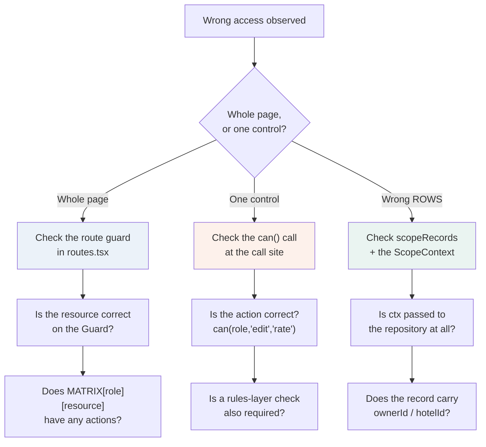

← [X — Screen teardown](10-screen-teardown.md) · [Index](README.md) · Next: [XII — Defect log](12-defect-log.md)

---

# Volume XI — Diagnostics

Organised by **symptom**, because when something is wrong you do not yet know which part it is.

Each entry gives what you observe, the likely causes in order of probability, how to confirm
each, and the fix.

---

## 11.0 First moves

Before anything else, three checks that resolve a surprising share of problems:

| # | Check | Command / action |
|---|---|---|
| 1 | Is it a stale build? | Hard reload — `Ctrl+Shift+R` |
| 2 | Does it typecheck? | `npx tsc --noEmit -p tsconfig.app.json` |
| 3 | Is the console clean? | DevTools → Console, filter to Errors |

```bash
npx tsc --noEmit -p tsconfig.app.json
```

⚠️ **Remember the reset.** Data resets on every refresh ([ADR-08](03-decision-log.md#adr-08)).
If you created a booking and it "disappeared", that is the design, not a defect.

---

## 11.1 The whole application is unclickable

**Symptom.** Nothing responds. Buttons do nothing, menus do not open, links do not navigate.
No console error. The page looks completely normal.

**This is the highest-priority entry in this volume** because it presents as total failure with
no diagnostic trace.

### Confirm

```js
// DevTools console
getComputedStyle(document.body).pointerEvents
// → "none"  ← confirmed
document.body.getAttribute("data-scroll-locked")
// → "1"
```

### Cause

Radix applies `pointer-events: none` to `<body>` while a modal is open, and removes it on
close. If a modal **unmounts while still open** — which happens when a route change is
triggered from inside one — the cleanup never runs and the style is stranded.

### Immediate recovery

```js
document.body.style.removeProperty("pointer-events");
document.body.removeAttribute("data-scroll-locked");
```

Or simply reload.

### Permanent fixes, both already in place

**1 — Close before navigating.** Any modal that navigates must close first:

```ts
function choose(entry: Entry) {
  setOpen(false);     // ← first
  navigate(entry.to);
}
```

**2 — The route-change guard** in `AppShell`:

```tsx
useEffect(() => {
  if (document.querySelector("[data-radix-focus-guard]")) return;  // a modal IS open — leave it
  if (document.body.style.pointerEvents === "none") {
    document.body.style.removeProperty("pointer-events");
  }
  document.body.removeAttribute("data-scroll-locked");
}, [pathname]);
```

### If you add a new modal

Any component that both renders a Radix overlay **and** can trigger navigation must close
before navigating. Grep for the pattern when adding one:

```bash
grep -rn "navigate(" src/components/app src/features --include=*.tsx | grep -i "dialog\|modal\|palette\|drawer"
```

See [D-02](12-defect-log.md).

---

## 11.2 A screen renders blank, with a `<Slot.Slot>` warning

**Symptom.** White page. Console shows:

> An error occurred in the `<Slot.Slot>` component.

### Cause

Radix `Slot` accepts **exactly one child**. Something passed more than one — almost always a
`Button` with `asChild` plus icons.

### Confirm

```bash
grep -rn "asChild" src --include=*.tsx | head -40
```

Look for a `Button asChild` whose implementation places `leadingIcon`, `children` and
`trailingIcon` as siblings.

### Fix

Fold the icons *inside* the single child — the pattern already in `Button.tsx`:

```tsx
const child = Children.only(children) as ReactElement<{ children?: ReactNode }>;
const merged = cloneElement(child, undefined, leading, child.props.children, trailingIcon);
return <Slot ref={ref} className={styles} {...props}>{merged}</Slot>;
```

⚠️ Also do not forward `disabled` through `Slot` onto an anchor — it is not a valid attribute
there.

See [D-01](12-defect-log.md).

---

## 11.3 A KPI shows an absurd percentage

**Symptom.** `+757.4% vs last month`, or a count far larger than the period should contain.

### Cause, in order of likelihood

**1 — A date range missing its upper bound.** The most common. An open-ended range over data
that extends into the future silently includes the entire forward book.

```ts
const thisMonth = scoped.filter((r) => r.checkIn >= monthStart);              // ✗
const thisMonth = scoped.filter((r) => r.checkIn >= monthStart
                                    && r.checkIn < nextMonthStart);           // ✓
```

**2 — A near-zero denominator.** `(this - last) / last` explodes when `last` is small. Guard:

```ts
revenueChangePercent: revenueLast > 0 ? ((revenueThis - revenueLast) / revenueLast) * 100 : 0,
```

**3 — Cancelled or draft records included.** Check whether the aggregate should exclude them.

### Confirm

```js
// In the console, on the dashboard
const rows = window.__db?.reservations ?? [];
rows.filter(r => r.checkIn >= "2026-07-01" && r.checkIn < "2026-08-01").length
```

If that count and the KPI disagree, the filter is the problem.

### Rule to apply

**Every date-range filter needs both bounds.** Search for one-sided comparisons:

```bash
grep -rn "checkIn >=\|issueDate >=\|at >=" src/data/repositories --include=*.ts
```

See [D-03](12-defect-log.md).

---

## 11.4 Occupancy looks wrong (≈1%, or ≈100%)

**Symptom.** Occupancy reads as a fraction of a percent, or pins at 100%.

### If it reads ≈1%

The metric is being computed from **reservations** rather than from the inventory model.

```ts
// ✗ Wrong metric. Fidato books a slice of each partner hotel.
occupancyPercent: (roomNights / (totalRooms * days)) * 100

// ✓
occupancyPercent: occupancyForHotel(hotelId)
```

This is not an arithmetic bug — it is the wrong denominator. See
[ADR-19](03-decision-log.md#adr-19) and [D-04](12-defect-log.md).

### If it reads ≈100%

`buildInventory`'s pressure constants have been raised, or `blocked` is being double-counted.
Expected range is **55–82%**:

```ts
const pressure = dow === 5 || dow === 6 ? 0.82 : 0.55;
const booked = Math.min(rt.totalRooms, Math.round(rt.totalRooms * pressure * (0.5 + local.next())));
```

### If a stale value persists after changing the generator

The memo cache is holding it:

```ts
const occupancyCache = new Map<string, number>();
```

It is module-level and never invalidated — correct for Phase 1 because the inventory model is
deterministic and immutable. 🔧 If Phase 2 makes inventory mutable, this cache **must** be
invalidated on write or it will serve stale occupancy indefinitely.

---

## 11.5 A detail page errors instead of showing Not-found

**Symptom.** Console:

> Query data cannot be undefined. Please make sure to return a value other than undefined from
> your query function. Affected query key: ["hotel","…"]

### Cause

A `get`-style repository method returned `undefined` for a missing document. TanStack Query
treats `undefined` as a contract violation.

### Fix

Coalesce to `null`:

```ts
get: (id: string): Promise<Hotel | null> =>
  read(() => db.hotels.find((h) => h.id === id) ?? null),
```

All eight `get`-style methods were converted. Check any new one:

```bash
grep -n "read(() => db\..*\.find(" src/data/repositories/mock/index.ts
```

Every match must end `?? null`. See [D-08](12-defect-log.md).

---

## 11.6 A role sees something it should not (or cannot see something it should)

### Decision tree



### Confirm quickly

Open `/admin/roles` — it is generated from the live matrix. If the cell there is wrong, the
matrix is wrong. If the cell is right but the screen misbehaves, the call site is wrong.

### Common causes

| Symptom | Likely cause |
|---|---|
| Nav item missing | `canAccess` false — the role has no actions on that resource |
| Page loads but is empty | Guard passed, but `scopeRecords` filtered everything out |
| Button missing | `can(role, action, resource)` false |
| Button present but should not be | Wrong action passed at the call site — e.g. `"view"` where `"edit"` was meant |
| Rows from another owner visible | `ctx` not passed to the repository call |
| Hotel manager sees all properties | `hotelId` missing on the seeded user |

⚠️ **The permissive default in scoping.** A record with **no** `ownerId` is visible to
everyone:

```ts
records.filter((r) => !r.ownerId || r.ownerId === ctx.userId);
```

Intentional — an unassigned lead should not be invisible to the whole sales team. But if a new
collection uses `ownerId` with different semantics, this default will surprise you.

---

## 11.7 Filters or sort do not survive a refresh

**Symptom.** Filtering, then reloading, returns to an unfiltered list.

### Cause

The screen is holding list state in `useState` instead of `useListState`.

### Fix

```tsx
const list = useListState({
  filterKeys: ["status", "channel"],
  defaultSortBy: "checkIn",
  defaultSortDir: "desc",
});
```

and pass `list.query` into the query key **and** the repository call:

```tsx
useQuery({
  queryKey: ["reservations", list.query, scope.role, scope.userId],
  queryFn: () => reservationsRepo.list(list.query, scope),
});
```

⚠️ **`filterKeys` must be declared.** A filter key not in the array is never read back from the
URL, so it appears to work until you reload.

---

## 11.8 A list shows "no records exist" when records do exist

**Symptom.** A filtered table shows the empty state offering "Create the first…", when the
dataset is simply filtered.

### Cause

`hasFilters` is not being passed to `DataTable`, so it cannot distinguish empty from
no-results.

### Fix

```tsx
<DataTable
  hasFilters={list.hasFilters}
  onClearFilters={list.clear}
  empty={<EmptyState … />}
/>
```

`DataTable` then chooses:

```tsx
if (!rows.length) {
  return hasFilters ? <NoResultsState onClear={onClearFilters} /> : empty;
}
```

This distinction matters — see Volume II §2.8.

---

## 11.9 Numbers jitter between rows

**Symptom.** A column of money or dates does not line up; digits appear to shift.

### Cause

Missing tabular figures.

### Fix — three ways, in order of preference

1. Mark the column `numeric: true` in the `Column` definition — this applies `data-numeric`,
   which the global CSS rule picks up.
2. Add `className="tabular"` to the cell.
3. For a `<Stat>` or custom markup, add `tabular` directly.

```bash
# Find money rendered without tabular treatment
grep -rn "money(" src/features --include=*.tsx | grep -v "tabular\|numeric" | head -20
```

---

## 11.10 A chart is blank or mis-scaled

| Symptom | Cause | Fix |
|---|---|---|
| Blank, no error | Container has no height. Recharts `ResponsiveContainer` needs a fixed parent height | Wrap in `<div className="h-[260px]">` |
| Axis labels overlap | Too many categories | Add `angle={-25} textAnchor="end" height={60} interval={0}` |
| Y-axis unreadable | Raw rupee values | `tickFormatter={(v) => moneyCompact(v)}` |
| Tooltip unstyled | Default Recharts tooltip | Use the shared `<ChartTooltip />` from `DashboardPage` |
| Line breaks at the join | `connectNulls` not set on the projected series | `connectNulls` on the forecast line only |

---

## 11.11 The dev server will not start

| Error | Cause | Fix |
|---|---|---|
| `EADDRINUSE :5173` | Port taken | `npm run dev -- --port 5174` |
| `UNABLE_TO_VERIFY_LEAF_SIGNATURE` | This machine's TLS-inspecting proxy | `win-ca-bundle.pem` + `.npmrc` are present; run `npm install` from **PowerShell**, not Git Bash |
| `ENOENT spawn cmd.exe` | npm lifecycle scripts run from Git Bash | Use PowerShell |
| `'C:\Program' is not recognized` | A launcher not quoting the Node path | Run `npm run dev` directly rather than through the launcher |
| Alias `@/…` unresolved | `vite.config.ts` or `tsconfig` alias missing | Both must declare `@` → `./src` |

---

## 11.12 The build fails but the dev server works

Vite's dev server is more forgiving than the production build.

| Cause | Detection |
|---|---|
| Unused import | `noUnusedLocals` — build only |
| Type error in a path dev never rendered | `npx tsc --noEmit` |
| Case-mismatched import | Windows is case-insensitive; the build is not |
| Circular import | Manifests as `undefined` at module init |

Always run the typecheck before the build — it gives better messages:

```bash
npx tsc --noEmit -p tsconfig.app.json
```

---

## 11.13 A mutation succeeds but the screen does not update

**Symptom.** Approve a reservation; the toast fires, but the queue still shows it.

### Cause

Missing or too-narrow query invalidation.

### Fix

Invalidate **every** key the write touches, by prefix:

```ts
onSuccess: () => {
  queryClient.invalidateQueries({ queryKey: ["reservation", id] });
  queryClient.invalidateQueries({ queryKey: ["reservation-audit", id] });
  queryClient.invalidateQueries({ queryKey: ["reservations"] });      // prefix — all filters/pages
  queryClient.invalidateQueries({ queryKey: ["pending-approvals"] });
  queryClient.invalidateQueries({ queryKey: ["kpis"] });
},
```

⚠️ Invalidate by **prefix**, not exact key. `["reservations", query, role, userId]` produces a
different key per filter combination and page; only the prefix catches them all.

### Checklist for a new mutation

| Question | |
|---|---|
| Which detail queries show this record? | |
| Which lists contain it? | |
| Does it change a dashboard KPI? | |
| Does it change a count in the nav or top bar? | |
| Does it write an audit entry a timeline shows? | |

---

## 11.14 Everything feels slow

| Cause | Confirm | Fix |
|---|---|---|
| Sequential queries | Network tab shows a staircase | Independent queries should mount together, not chain |
| Missing `useMemo` on a heavy derive | React DevTools Profiler | Memoise the grouping/packing |
| Occupancy recomputed per row | Long report render | The `occupancyCache` should be doing this |
| Too many rows | `pageSize` raised above 25 | Return to 25, or virtualise |

Remember the deliberate 120–400 ms per repository call. A screen firing six sequential calls
takes over a second **by design** — that is the simulation telling you the call graph is wrong,
which is exactly what [ADR-07](03-decision-log.md#adr-07) is for.

---

## 11.15 A date is off by one day

**Symptom.** A stay shows one night too many, or a check-out appears occupied.

### Cause A — inclusive interval

A stay occupies nights from check-in **up to but not including** check-out:

```ts
eachDayOfInterval({ start, end: addDays(end, -1) })   // ✓
eachDayOfInterval({ start, end })                     // ✗ counts the check-out night
```

### Cause B — timezone

`new Date("2026-07-28")` parses as **UTC midnight**. In a negative-offset timezone that renders
as the 27th.

All formatting goes through `src/lib/format.ts`, and the platform declares Asia/Kolkata in
`orgSettings`. 🔧 Revisit if the platform ever serves multiple timezones.

---

## 11.16 A merge loses data or orphans records

**Symptom.** After a merge, reservations show a stale customer name, or disappear.

### Cause

The merge sequence is order-dependent:

1. Re-point children (`reservations`, `invoices`)
2. Fill gaps on the survivor
3. Roll up totals
4. Remove absorbed records

Removing before re-pointing orphans the children.

⚠️ **The denormalised name must be updated alongside the id.** Updating `customerId` but not
`customerName` leaves the old name rendering in every list, with nothing to indicate it is
stale.

```ts
if (absorbedIds.includes(r.customerId)) {
  r.customerId = survivorId;
  r.customerName = survivor.fullName;   // ← must not be forgotten
}
```

---

## 11.17 Automated browser testing does not work

**Symptom.** Clicks land on the right element but nothing happens. Escape does not close
dialogs. Menus do not open.

### This is an environment limitation, not an application defect

Confirmed during verification (Volume XIII §13.4). The evidence:

```js
// React's handler IS attached
const b = [...document.querySelectorAll("button")].find(x => x.textContent.trim() === "Open dialog");
Object.keys(b).find(k => k.startsWith("__reactProps"));
// → "__reactProps$…"  — onClick present

// Invoking it directly works
b[propsKey].onClick({ type: "click", currentTarget: b, target: b,
                      preventDefault(){}, stopPropagation(){} });
// → dialog opens, aria-expanded = "true"
```

The component is correct; the harness is not delivering trusted input events to the React root.

### Diagnostic distinction

| Test | If it works | If it fails |
|---|---|---|
| Direct handler invocation | Component is fine — harness issue | Genuine component bug |
| `element.click()` on a Radix **menu** | — | Expected: menus open on `pointerdown`, not `click` |
| `element.click()` on a **plain** React button | React delegation is working | React root not receiving events |

### What to do

Verify interactive flows **in a real browser by hand**. Use the automated harness for
structure, routing, data and rendering — which it does reliably.

---

## 11.18 Quick reference

| Symptom | Section | First thing to check |
|---|---|---|
| Nothing clickable | [11.1](#111-the-whole-application-is-unclickable) | `document.body.style.pointerEvents` |
| Blank screen, Slot warning | [11.2](#112-a-screen-renders-blank-with-a-slotslot-warning) | `Button asChild` usage |
| Absurd percentage | [11.3](#113-a-kpi-shows-an-absurd-percentage) | Date range upper bound |
| Occupancy ≈1% | [11.4](#114-occupancy-looks-wrong-1-or-100) | Wrong denominator |
| Detail page errors | [11.5](#115-a-detail-page-errors-instead-of-showing-not-found) | `?? null` on `get` |
| Wrong access | [11.6](#116-a-role-sees-something-it-should-not-or-cannot-see-something-it-should) | `/admin/roles` |
| Filters lost on refresh | [11.7](#117-filters-or-sort-do-not-survive-a-refresh) | `useListState` + `filterKeys` |
| Wrong empty state | [11.8](#118-a-list-shows-no-records-exist-when-records-do-exist) | `hasFilters` prop |
| Numbers jitter | [11.9](#119-numbers-jitter-between-rows) | `numeric: true` |
| Blank chart | [11.10](#1110-a-chart-is-blank-or-mis-scaled) | Parent height |
| Stale screen after write | [11.13](#1113-a-mutation-succeeds-but-the-screen-does-not-update) | Invalidation set |
| Date off by one | [11.15](#1115-a-date-is-off-by-one-day) | Inclusive interval |

---

Next: [Volume XII — Defect log](12-defect-log.md)
