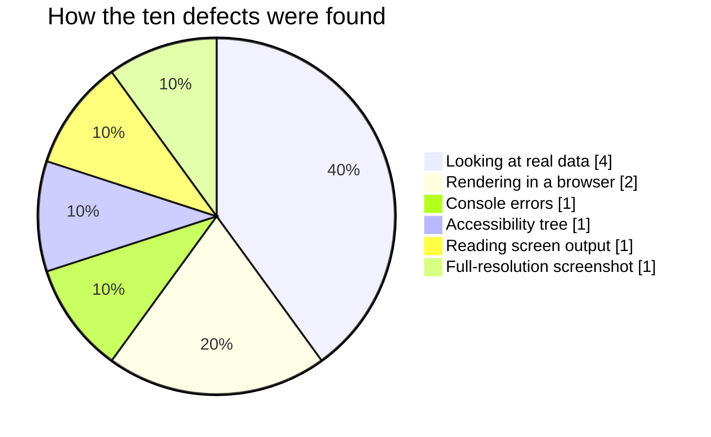

← [XI — Diagnostics](11-diagnostics.md) · [Index](README.md) · Next: [XIII — Verification record](13-verification-record.md)

---

# Volume XII — Defect log

Ten defects found and fixed during the Phase 1 build. Each is recorded with what was observed,
what caused it, why it was not caught earlier, and what changed.

This volume exists because **the defects are the most instructive part of the build.** Four of
them would have shipped looking like working software.

| # | Defect | Severity | Class |
|---|---|---|---|
| [D-01](#d-01) | Radix `Slot` crash blanked the entire app | Critical | Integration |
| [D-02](#d-02) | Stranded scroll lock made the app unclickable | Critical | Integration |
| [D-03](#d-03) | Unbounded date range reported +757% growth | High | **Silent** |
| [D-04](#d-04) | Occupancy computed from the wrong denominator | High | **Silent** |
| [D-05](#d-05) | Seed too small — "today" looked dead | Medium | **Silent** |
| [D-06](#d-06) | Reservations created in the future | Medium | **Silent** |
| [D-07](#d-07) | Two icon-only buttons had no accessible name | Medium | Accessibility |
| [D-08](#d-08) | `undefined` from missing documents broke React Query | Medium | Contract |
| [D-09](#d-09) | Unsubstituted merge token in template preview | Low | Data |
| [D-10](#d-10) | Two primary buttons on the same view | Low | Design system |

**Silent** = produced no error, no warning, no crash. The application appeared to work and
reported a wrong answer confidently. These are the dangerous ones.

---

## D-01
### Radix `Slot` crash blanked the entire application

**Severity** Critical · **Found** first browser load · **Class** Integration

### Observed

Completely white page. `#root` had zero children. Console showed only a warning:

> An error occurred in the `<Slot.Slot>` component. Consider adding an error boundary…

No stack trace pointing at application code.

### Cause

`Button` with `asChild` passed three children to Radix `Slot`, which accepts exactly one:

```tsx
// ✗
const Comp = asChild ? Slot : "button";
return (
  <Comp …>
    {loading ? <Loader2 /> : leadingIcon}
    {children}
    {!loading && trailingIcon}
  </Comp>
);
```

`Button asChild` is used in the sidebar, top bar and most page headers — so the crash occurred
during the shell's own render, taking the whole tree with it.

### Fix

Fold the icons *inside* the single child:

```tsx
if (asChild) {
  const child = Children.only(children) as ReactElement<{ children?: ReactNode }>;
  const merged = isValidElement(child)
    ? cloneElement(child, undefined, leading, child.props.children, !loading && trailingIcon)
    : child;
  return <Slot ref={ref} className={styles} {...props}>{merged}</Slot>;
}

return (
  <button ref={ref} disabled={disabled || loading} className={styles} {...props}>
    {leading}{children}{!loading && trailingIcon}
  </button>
);
```

`disabled` is deliberately not forwarded in the `asChild` branch — it is not a valid anchor
attribute.

### Why it was not caught earlier

TypeScript cannot express "exactly one child" for `Slot`. The code typechecked and built
cleanly. **Only rendering the page could reveal it** — which is the strongest argument in this
whole log for browser verification not being optional.

### Prevented in future by

Volume V §5.2 documents the pattern; Volume XI §11.2 gives the symptom-to-fix path.

---

## D-02
### Stranded scroll lock made the entire app unclickable

**Severity** Critical · **Found** during interactive verification · **Class** Integration

### Observed

Every control stopped responding. No console error. The page looked entirely normal — this is
what made it alarming.

### Diagnosis

```js
getComputedStyle(document.body).pointerEvents      // → "none"
document.body.getAttribute("data-scroll-locked")   // → "1"
```

### Cause

Radix applies `pointer-events: none` to `<body>` while a modal is open and removes it on close.
A modal that **unmounts while still open** never runs the cleanup, and the style is stranded.

The trigger in this codebase: the command palette navigated *before* closing, so the route
change unmounted the palette while `open` was still true.

### Fix — two layers

**1 — Close before navigating:**

```ts
function choose(entry: Entry) {
  // Close before navigating. Unmounting the route while the modal is
  // still open can strand Radix's scroll lock on <body>, which leaves
  // the whole app pointer-dead until a full reload.
  setOpen(false);
  navigate(entry.to);
}
```

**2 — A route-change guard in `AppShell`**, which checks for a live focus guard first so it
never interferes with a legitimately open modal:

```tsx
useEffect(() => {
  if (document.querySelector("[data-radix-focus-guard]")) return;
  if (document.body.style.pointerEvents === "none") {
    document.body.style.removeProperty("pointer-events");
  }
  document.body.removeAttribute("data-scroll-locked");
}, [pathname]);
```

### Why it was not caught earlier

It requires a specific sequence — open a modal, navigate from inside it — that no typecheck or
build can exercise. It also produces **no error of any kind**, so nothing in the console points
at it.

### The general lesson

A library that mutates global DOM state on mount must be assumed to leak that state on abnormal
unmount. Where the leaked state is invisible and catastrophic, a defensive reset is justified.

---

## D-03
### Unbounded date range reported +757% growth

**Severity** High · **Class** Silent · **The most instructive defect in this log**

### Observed

Dashboard, on first render with real data:

```
REVENUE THIS MONTH   ₹59.3L    +757.4% vs last month
RESERVATIONS         105       +400.0% vs last month
```

105 reservations in one month, from a dataset of 1,100 spread over 480 days.

### Cause

```ts
const thisMonth = scoped.filter((r) => r.checkIn >= monthStart);   // ✗ no upper bound
```

The seed extends **150 days into the future**. "This month" therefore meant *this month and the
entire forward book* — five months of bookings compared against one month.

### Fix

```ts
// Upper bound matters: without it "this month" silently absorbs the
// entire forward book and every growth figure becomes nonsense.
const nextMonthStart = isoDate(startOfMonth(addMonths(TODAY, 1)));

const thisMonth = scoped.filter(
  (r) => r.checkIn >= monthStart && r.checkIn < nextMonthStart,
);
```

After the fix: **₹5.6L, −19.1%, 19 reservations** — believable figures.

### Why it was not caught earlier

Nothing threw. Nothing warned. The types were correct. The code read naturally — `checkIn >=
monthStart` looks like "this month" to a reader.

It was caught **only because the number was implausible on sight**. A subtler version — say
+40% — would have shipped.

### The lesson

> Every date-range filter needs **both** bounds. An open-ended range over data that extends into
> the future is a bug that reports success.

This class of defect is why the dashboard was reviewed with real data before being called done.
A screen built against three fixture rows would never have exposed it.

---

## D-04
### Occupancy computed from the wrong denominator

**Severity** High · **Class** Silent · **Produced** [ADR-19](03-decision-log.md#adr-19)

### Observed

```
OCCUPANCY   1%
```

Across a 1,969-room portfolio with 1,100 reservations.

### First diagnosis — wrong

The initial reading was "the seed is too small". That would have led to inflating the dataset
until the number looked acceptable, which is data falsification dressed as a bug fix.

### Actual cause

The **metric** was wrong, not the data.

```ts
occupancyPercent: (roomNights / (totalRooms * 30)) * 100
```

Fidato books a *slice* of each partner hotel; other channels sell the rest. Dividing Fidato's
bookings by the hotel's entire inventory answers a question nobody asked.

The arithmetic to make it "look right" is instructive: 1,969 rooms × 450 days × 60% ≈ 531,000
room-nights, which at ~6 room-nights per reservation needs **~88,000 reservations**. Not
generatable client-side — and generating them would misrepresent the business.

### Fix

Occupancy now reads from the inventory model, which represents each property's true position
across all channels:

```ts
function occupancyForHotel(hotelId: string, days = 30): number {
  const rows = buildInventory(hotelId, days);
  const capacity = rows.reduce((s, r) => s + r.totalRooms, 0);
  const booked = rows.reduce((s, r) => s + r.booked, 0);
  return capacity > 0 ? (booked / capacity) * 100 : 0;
}
```

The Fidato-booked portion is surfaced separately and labelled **"Fidato room nights"**, and the
Occupancy report explains the distinction on the page.

Portfolio occupancy is weighted by room count — a flat average across a 17-key retreat and a
236-key hotel would describe nothing.

After the fix: **58–66% by city, 61% portfolio.**

### Why it was not caught earlier

The formula is the textbook definition of occupancy. It is correct *for a hotel*. It is wrong
*for a booking agent*, and nothing in the code says which one this system is.

### The lesson

> When a metric reads absurdly, check whether the **denominator** describes something you
> control before assuming the numerator is too small.

---

## D-05
### Seed too small — "today" looked dead

**Severity** Medium · **Class** Silent

### Observed

```
Arrivals    0
Departures  1
In house    0
```

on a 32-property portfolio.

### Cause

320 reservations spread across 480 days is **0.67 arrivals per day** across the whole
portfolio. An empty day was statistically normal — and a misrepresentation of the business.

### Fix

```ts
// Spread across 11 months back and 5 months forward. At ~1,100
// reservations that is roughly three arrivals a day across the
// portfolio, so any given day has something happening on it —
// which is what a 32-property book actually looks like.
const offset = rng.int(-330, 150);
…
export const reservations: Reservation[] = Array.from({ length: 1100 }, (_, i) => buildReservation(i));
```

After: **2 arrivals, 4 in house** on the demo date.

### Was this falsifying data?

No — and the distinction matters. D-04 rejected inflating the seed because it would have made a
*metric* read correctly by misrepresenting the business. Here the under-seeding was itself the
misrepresentation: a real 32-property book does not see 0.67 arrivals a day. Raising the volume
made the simulation **more** accurate, not less.

### The lesson

> Seed volume is a design parameter, not an arbitrary number. Choose it from the real-world rate
> the data represents, and check the screens that depend on daily density.

---

## D-06
### Reservations created in the future

**Severity** Medium · **Class** Silent

### Observed

On the approvals queue:

> Meera Bose · **in about 1 month**

A booking cannot have been created after today.

### Cause

```ts
const created = subDays(checkIn, rng.int(3, 60));   // ✗
```

For a check-in in October 2026, this produced a `createdAt` in August or September — beyond the
demo date of 28 July.

### Fix

```ts
// Booked some weeks before arrival — but never in the future. A
// forward booking was necessarily raised on or before today.
const leadTime = subDays(checkIn, rng.int(3, 60));
const created = leadTime > TODAY ? subDays(TODAY, rng.int(0, 21)) : leadTime;
```

Verified after the fix — every entry now reads *"14 days ago"*, *"6 days ago"*, and no future
timestamps remain.

### Why it was not caught earlier

`relative()` rendered the value perfectly correctly. The formatting was right; the data
violated a domain invariant nothing was checking.

### The lesson

> Derived dates need clamping against the invariants of the domain. **Creation precedes
> existence** is one that no type system will enforce for you.

---

## D-07
### Two icon-only buttons had no accessible name

**Severity** Medium · **Class** Accessibility

### Observed

In the accessibility tree:

```
button [ref_15] type="button"     ← no name
button [ref_19] type="button"     ← no name
```

### Cause

Both the global search and the role switcher hide their text label below the `sm` breakpoint:

```tsx
<span className="hidden sm:block text-base truncate">Search or jump to…</span>
```

Below `sm` they became unnamed buttons. Above `sm` the accessible name came from visible text
that a narrow viewport removes.

### Fix

```tsx
// Collapses to an icon below `sm`, so it needs its own name.
aria-label="Search or jump to a record"
```

```tsx
// The name and role are hidden below `sm`, so the button would
// otherwise be an unlabelled avatar to a screen reader.
aria-label={`Viewing as ${ROLE_LABELS[role]} (${user.name}). Change role`}
```

Verified: both now report full names in the accessibility tree.

### The lesson

> A control whose label is **responsive** needs an explicit `aria-label`. Checking accessibility
> at desktop width alone misses this entire class of defect.

---

## D-08
### `undefined` from missing documents broke React Query

**Severity** Medium · **Class** Contract

### Observed

```
[error] Query data cannot be undefined. Please make sure to return a value other than
        undefined from your query function. Affected query key: ["hotel","htl-agra-taj-pearl"]
```

### Cause

```ts
get: (id: string): Promise<Hotel | undefined> =>
  read(() => db.hotels.find((h) => h.id === id)),   // ✗ undefined when not found
```

TanStack Query treats `undefined` as a contract violation, so a perfectly normal condition —
a mistyped or deleted id — put the query into an error state and logged an error.

The pages still rendered Not-found (because `!data` is true either way), so the user-visible
behaviour was *nearly* correct — which is precisely why it could have been ignored.

### Fix

All eight `get`-style methods converted to return `null`:

```ts
get: (id: string): Promise<Hotel | null> =>
  read(() => db.hotels.find((h) => h.id === id) ?? null),
```

Verified: `/hotels/does-not-exist` now renders Not-found cleanly with no console error.

### The lesson

> `null` means *"looked, found nothing"*. `undefined` means *"did not look"*. Data layers should
> return the first. The distinction is not pedantry — one library's contract depends on it.

---

## D-09
### Unsubstituted merge token in template preview

**Severity** Low · **Class** Data

### Observed

On `/notifications/templates` in Preview mode, `{{number}}` rendered literally instead of being
substituted.

### Cause

The sample map covered `{{invoice_number}}` but not `{{number}}`, which the seeded invoice
templates use.

### Fix

```ts
"{{invoice_number}}": "INV-2607-0193",
"{{number}}": "INV-2607-0193",
```

### Note

The design *intends* unknown tokens to render literally rather than blank, so a typo is visible
rather than producing an empty sentence. This was a gap in the sample map, not a failure of that
behaviour — but a token showing raw in the default Preview mode reads as a defect to a reviewer,
which is reason enough to fix it.

---

## D-10
### Two primary buttons on the same view

**Severity** Low · **Class** Design system · **Found** on the first full-resolution screenshot

### Observed

On `/dashboard` and `/reservations`, two identical orange **New reservation** buttons appeared
roughly 100 px apart vertically — one in the top bar, one in the page header.

### Cause

`TopBar` rendered a global create action, and every screen where creating a reservation is the
natural next step *also* offered it in its page header, which is the conventional place for
page actions.

Each was individually reasonable. Together they broke the rule the design system states about
itself:

> `primary` — **One per view.** The single most likely next action.
> — Volume V §5.2

### Fix

The top-bar button was removed entirely. The page header keeps it, sitting beside that screen's
other actions (Calendar, Export), and ⌘K covers the global path.

An intermediate fix — hiding the top-bar button above the `sm` breakpoint so it only appeared on
mobile — was tried and rejected: the page header's action row stays visible at mobile width, so
the duplication simply moved rather than disappearing. Verified in the accessibility tree at
375 px before and after.

### Why it was not caught earlier

Every prior verification pass read the **accessibility tree and page text**, where the two
buttons appear as two ordinary list entries. Nothing about that output looks wrong. The defect
is purely visual — it needs a rendered screenshot at real resolution, which is what finally
exposed it.

### The lesson

> Structural verification cannot see visual duplication. A tree containing two "New reservation"
> links reads as completely normal; a screenshot of two identical primary buttons does not.

---

## Analysis

### By class

| Class | Count | Caught by |
|---|---:|---|
| Silent (wrong, but no error) | **4** | Looking at real data and finding it implausible |
| Integration (library contract) | 2 | Rendering the page |
| Accessibility | 1 | Reading the accessibility tree |
| Contract (API expectation) | 1 | Console error |
| Data | 1 | Reading the screen |
| Design system | 1 | **A full-resolution screenshot** |

### What caught what



**Zero** were caught by TypeScript or by the production build. Both ran clean throughout.

### The uncomfortable conclusion

The four silent defects — D-03, D-04, D-05, D-06 — all produced software that *worked*. It
rendered, it did not throw, it typechecked, it built. It simply reported wrong answers with
complete confidence.

None would have been found by unit tests written against the same wrong assumptions. All four
were found by **generating realistic data and looking at the result critically**:

- +757% is not a growth rate.
- 1% is not an occupancy.
- 0 arrivals is not a portfolio.
- "in about 1 month" is not a creation date.

This is the strongest available argument for [ADR-08](03-decision-log.md#adr-08) (realistic
seeded data) and [ADR-09](03-decision-log.md#adr-09) (real property data). A build reviewed
against three fixture rows would have shipped all four.

### What would have caught them earlier

| Defect | Would have been caught by |
|---|---|
| D-01, D-02 | Any browser render — i.e. rendering earlier and more often |
| D-03 | A unit test asserting `thisMonth.length ≤ 31 days of bookings` |
| D-04 | Stating the metric's definition in writing before implementing it |
| D-05 | Deriving seed volume from a stated arrivals-per-day target |
| D-06 | An invariant check: `createdAt <= TODAY` for all seeded records |
| D-07 | An accessibility audit at mobile width |
| D-08 | Reading the TanStack Query contract |
| D-10 | Looking at a rendered screenshot of any screen |

🔧 **Recommendation for Phase 2.** Six of the nine would have been caught by a small set of
invariant assertions over the seed and the aggregates. That is the highest-value testing
available in this codebase and should precede any Firebase work — see
[ADR-24](03-decision-log.md#adr-24).

---

Next: [Volume XIII — Verification record](13-verification-record.md)
