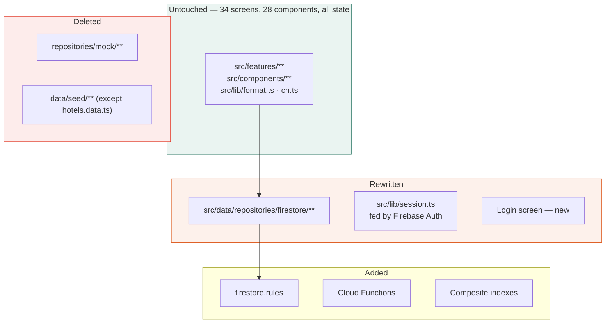
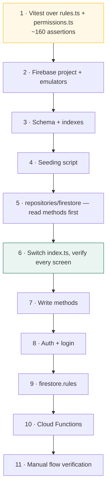

← [XIII — Verification record](13-verification-record.md) · [Index](README.md) · Next: [XV — Glossary](15-glossary.md)

---

# Volume XIV — Phase 2 handover

Everything needed to take this build to Firebase. Written for whoever picks it up, including
the parts that will not be pleasant.

---

## 14.1 The shape of the work



### Estimate

| Task | Estimate |
|---|---:|
| Firebase project, config, emulators | 0.5 d |
| Firestore schema + composite indexes | 1 d |
| Seeding script from `hotels.data.ts` + generated data | 1 d |
| `repositories/firestore/**` — 11 repositories | 4–5 d |
| Auth + login + session wiring | 1.5 d |
| `firestore.rules` from the matrix | 2 d |
| Cloud Functions (roll-ups, invoices, commissions) | 2 d |
| Vitest over `rules.ts` + `permissions.ts` | 1 d |
| Migration of the three hard cases (§14.3, §14.7, §14.9) | 2 d |
| Manual verification of the 12 unverified flows | 1 d |
| **Total** | **~16–17 days** |

⚠️ This assumes [ADR-06](03-decision-log.md#adr-06) held — that no repository method acquired
capabilities Firestore lacks. Verify before committing to the estimate:

```bash
grep -rn "\.filter(\|\.sort(\|\.reduce(" src/data/repositories/mock/index.ts | wc -l
```

Client-side array operations inside a repository are fine where they mirror what the client
will do post-fetch, and a problem where they assume the server did the work.

---

## 14.2 Order of work



**Step 1 first, before any Firebase work.** The rules layer is now stable, it is the highest-
value code in the project, and tests written against it will not churn. It is also the safety
net for everything that follows. [ADR-24](03-decision-log.md#adr-24) explains why it was not
done in Phase 1 and why it should be done now.

**Step 6 is the checkpoint.** Reads only, everything else untouched. If all 34 screens render
correctly against Firestore, the interface held and the rest is mechanical. If they do not,
stop and fix the interface rather than patching screens.

---

## 14.3 Hard case 1 — pagination

**The problem.** `paginate()` is offset-based; Firestore is cursor-based.

```ts
// Phase 1
export function paginate<T>(records: T[], page = 1, pageSize = 25): ListResult<T> {
  const start = (page - 1) * pageSize;
  return { items: records.slice(start, start + pageSize), total: records.length, page, pageSize };
}
```

Firestore cannot skip to page 6 without reading pages 1–5, and cannot cheaply produce `total`.

### Options

| Option | For | Against |
|---|---|---|
| **Cursor pagination, Prev/Next only** | Native, cheap, scales | Loses numbered pages. `Pagination` component and the `page` URL parameter both change |
| Keep offsets, read-and-discard | No UI change | Reads N×pageSize documents to reach page N. Costs real money |
| Distributed counter for `total`, cursors for movement | Keeps the "of 1,100" readout | A counter document per collection, maintained by a Function |
| Move list queries to Algolia/Typesense | Full-text **and** offset pagination | Another service, another sync |

**Recommendation:** cursor pagination with Prev/Next, plus distributed counters for `total`
where the readout is worth keeping (reservations, customers, invoices).

**UI impact:** `Pagination` loses its numbered window; `useListState` swaps `page` for a cursor
token. Both are single-file changes — the component is used through one interface everywhere.

---

## 14.4 Hard case 2 — direct `db` reads in screens

Eleven places read `db` synchronously for derived counts, bypassing the repository layer. Each
must become a real aggregate.

| Screen | Reads | Becomes |
|---|---|---|
| `InvoicesPage` | `db.invoices` for outstanding/overdue totals | `financeRepo.invoiceTotals()` |
| `PaymentsPage` | `db.payments` for received/unreconciled | `financeRepo.paymentTotals()` |
| `RunsPage` | `db.automationRuns` for success rate | `automationRepo.runStats()` |
| `AuditLogPage` | `db.auditLogs` for counts | `adminRepo.auditStats()` |
| `UsersPage` | `db.users` for role counts | `adminRepo.userStats()` |
| `RolesPage` | `db.users` for per-role counts | same |
| `CompanyDetailPage` | `db.customers`, `db.reservations` | `companiesRepo.contacts()`, `.reservations()` |
| `HotelDetailPage` | `db.reservations` for property bookings | `hotelsRepo.reservations()` |
| `CustomerFormPage` | `db.customers` for duplicate check | `customersRepo.checkDuplicate()` |
| `ImportPage` | `db.customers` for duplicate check | same |
| `TemplatesPage` | `db.automationWorkflows` | `automationRepo.workflowForEvent()` |

Find them all:

```bash
grep -rn "from \"@/data/repositories\"" src/features --include=*.tsx | grep "db"
```

⚠️ The duplicate checks are the interesting ones. Scanning every customer client-side does not
scale. In Firestore this becomes an indexed equality query on a normalised field — which means
**adding `emailNormalised` and `phoneNormalised` to the customer document**, written on save,
because you cannot index a computed value:

```ts
emailNormalised: email.trim().toLowerCase(),
phoneNormalised: phone.replace(/\D/g, "").slice(-10),
```

This is a schema change driven by the migration and should be made in the seeding script from
the start.

---

## 14.5 Hard case 3 — roll-up counters

`customer.totalReservations`, `customer.totalRevenue`, `company.totalReservations`,
`company.totalRevenue`, `company.creditUsed` are maintained by the seed today.

🔧 In Phase 2 they must be maintained by a Cloud Function on reservation write, **not** by
client code. Client-maintained counters drift the moment two writes race, and the drift is
silent.

```ts
// functions/src/onReservationWrite.ts — sketch
export const onReservationWrite = onDocumentWritten("reservations/{id}", async (event) => {
  const before = event.data?.before.data() as Reservation | undefined;
  const after  = event.data?.after.data()  as Reservation | undefined;

  const counts = (r: Reservation | undefined) =>
    !r || r.status === "cancelled" || r.status === "draft" ? 0 : 1;

  const deltaCount = counts(after) - counts(before);
  const deltaValue = (counts(after) ? after!.totalAmount : 0)
                   - (counts(before) ? before!.totalAmount : 0);

  if (deltaCount === 0 && deltaValue === 0) return;

  const customerId = after?.customerId ?? before?.customerId;
  if (customerId) {
    await db.doc(`customers/${customerId}`).update({
      totalReservations: FieldValue.increment(deltaCount),
      totalRevenue: FieldValue.increment(deltaValue),
    });
  }
  // …same for company
});
```

`FieldValue.increment` is atomic, which is the whole reason this belongs server-side.

Note the exclusion rule matches the seed exactly: cancelled and draft reservations do not count
toward revenue. Volume VII §7.6.

---

## 14.6 The `TODAY` constant

43 references across the codebase. All must become `new Date()`.

```bash
grep -rn "TODAY" src --include=*.ts --include=*.tsx | wc -l
```

| Location | Change |
|---|---|
| `data/seed/index.ts` | Deleted with the file |
| `repositories/mock/index.ts` | Deleted with the file |
| `features/**` (dashboard, calendar, inventory, reports) | Import from a `lib/clock.ts` returning `new Date()` |

🔧 **Recommendation:** introduce `src/lib/clock.ts` now, exporting `now()`. It makes the demo
date injectable, which is useful for testing date-dependent logic in Phase 2 — and the seed can
keep a fixed clock for the test suite.

---

## 14.7 Hard case 4 — the merge operation

The single hardest operation to port. It currently touches three collections in one synchronous
pass:

```ts
merge: (survivorId, absorbedIds, patch, actor) =>
  write(() => {
    for (const r of db.reservations) { /* re-point */ }
    for (const inv of db.invoices)   { /* re-point */ }
    Object.assign(survivor, patch);
    survivor.totalReservations = …; survivor.totalRevenue = …;
    db.customers = db.customers.filter((c) => !absorbedIds.includes(c.id));
    recordAudit({ action: "merged", … });
  }),
```

### In Firestore

It must become a **Cloud Function** using batched writes, because:

- It spans three collections and must be atomic.
- A customer with many reservations can exceed Firestore's **500-write batch limit**, so it
  needs chunking.
- Doing it client-side would leave partially-merged data if the tab closes mid-operation.

```ts
// Sketch
export const mergeCustomers = onCall(async ({ data, auth }) => {
  assertPermission(auth, "merge", "customer");
  const { survivorId, absorbedIds, patch } = data;

  const survivor = await db.doc(`customers/${survivorId}`).get();

  for (const collection of ["reservations", "invoices"]) {
    for (const absorbedId of absorbedIds) {
      let last: QueryDocumentSnapshot | undefined;
      while (true) {
        let q = db.collection(collection)
                  .where("customerId", "==", absorbedId)
                  .limit(400);                      // under the 500 batch limit
        if (last) q = q.startAfter(last);
        const snap = await q.get();
        if (snap.empty) break;

        const batch = db.batch();
        snap.docs.forEach((d) => batch.update(d.ref, {
          customerId: survivorId,
          customerName: survivor.data()!.fullName,   // denormalised copy must follow
        }));
        await batch.commit();
        last = snap.docs[snap.docs.length - 1];
      }
    }
  }
  // …patch survivor, recompute roll-ups, delete absorbed, write audit
});
```

⚠️ Order remains load-bearing: re-point before delete, and update the denormalised
`customerName` alongside `customerId`. Volume VIII §8.6.

---

## 14.8 `firestore.rules` — generate, do not hand-write

The permission matrix must be restated as security rules. Hand-writing them creates two sources
of truth that will drift.

🔧 **Recommendation:** generate `firestore.rules` from `MATRIX` at build time.

```ts
// scripts/generate-rules.ts — sketch
import { ROLES, RESOURCES, grantsFor } from "../src/lib/permissions";

const RESOURCE_COLLECTIONS: Partial<Record<Resource, string>> = {
  customer: "customers", company: "companies", reservation: "reservations",
  hotel: "hotels", invoice: "invoices", payment: "payments", /* … */
};

function rolesWith(resource: Resource, action: Action): Role[] {
  return ROLES.filter((role) => grantsFor(role, resource).includes(action));
}

// emits:
//   allow read: if hasAnyRole(['super_admin','admin', …]);
```

Then the hand-written part is only the scoping and the business rules, which are few:

```js
match /reservations/{id} {
  allow read: if isSignedIn() && (
       hasAnyRole(['super_admin','admin','sales_manager','finance','support','viewer'])
    || (hasRole('salesperson')   && resource.data.ownerId == request.auth.uid)   // BR-05
    || (hasRole('hotel_manager') && resource.data.hotelId == userHotelId())      // BR-05
  );

  allow create: if hasPermission('reservation','create');

  allow update: if hasPermission('reservation','edit')
                && !(resource.data.status in ['completed','cancelled','no_show']);  // BR-03

  allow delete: if false;                                                          // BR-01
}

match /rate_plans/{id} {
  allow read:   if isSignedIn();
  allow write:  if hasPermission('rate','edit') && !hasRole('hotel_manager');       // BR-04
}

match /audit_logs/{id} {
  allow read:   if hasPermission('audit_log','view');
  allow create: if isSignedIn();
  allow update, delete: if false;                                                   // BR-08
}
```

`allow delete: if false` on reservations, and `update, delete: if false` on audit logs, are the
only places BR-01 and BR-08 are *truly* enforced. Everything in the client is a courtesy.

---

## 14.9 Hard case 5 — search

`matchesSearch()` scans named fields client-side. Firestore has no substring search.

| Option | For | Against |
|---|---|---|
| Prefix search via `>=` / `<=` on a normalised field | Free, native | Prefix only — searching "peerless" would not match "The Peerless Inn" |
| Array of search tokens + `array-contains` | Native, word-level | Document bloat; no partial-word matching |
| **Algolia / Typesense** | Real search, typo tolerance, ranking | Another service, another sync path, cost |
| Keep client-side over a fetched page | Zero work | Only searches what is already loaded — misleading |

**Recommendation:** prefix search on normalised fields for the smaller collections (hotels,
users, companies), and Typesense for reservations and customers once they pass ~10,000
documents.

The interface does not change either way — `ListQuery.search` stays as it is.

---

## 14.10 Composite indexes

Firestore requires a composite index for any query combining a filter with a sort. From the
current screens:

| Collection | Index |
|---|---|
| `reservations` | `ownerId ASC, checkIn DESC` |
| `reservations` | `hotelId ASC, checkIn DESC` |
| `reservations` | `status ASC, totalAmount DESC` |
| `reservations` | `status ASC, checkIn ASC` |
| `reservations` | `channel ASC, checkIn DESC` |
| `customers` | `ownerId ASC, lastActivityAt DESC` |
| `customers` | `status ASC, lastActivityAt DESC` |
| `companies` | `ownerId ASC, totalRevenue DESC` |
| `companies` | `tier ASC, totalRevenue DESC` |
| `invoices` | `status ASC, dueDate ASC` |
| `invoices` | `companyId ASC, issueDate DESC` |
| `auditLogs` | `entityType ASC, at DESC` |
| `auditLogs` | `entityId ASC, at DESC` |

Derive the full set from the `FILTER_KEYS` and `defaultSortBy` of each list screen — every
combination the UI can produce needs one, and Firestore will tell you at runtime with a
console link.

---

## 14.11 Data types at the boundary

| Phase 1 | Firestore |
|---|---|
| `IsoDateTime` (string) | `Timestamp` |
| `IsoDate` (string) | **Keep as string** |
| `number` | `number` |
| `string[]` | `array` |
| Nested objects (`rooms`, `lines`) | `map[]` |

⚠️ **Keep `IsoDate` as a string.** Date-only values (`checkIn`, `checkOut`, `issueDate`) must
not become `Timestamp`, or timezone conversion will shift them by a day. `yyyy-MM-dd` also
sorts and range-filters correctly as a string, which is exactly what the queries rely on.

Convert `IsoDateTime` at the repository boundary:

```ts
function fromDoc<T>(snap: QueryDocumentSnapshot): T {
  const data = snap.data();
  return {
    ...data,
    id: snap.id,
    createdAt: (data.createdAt as Timestamp).toDate().toISOString(),
    updatedAt: (data.updatedAt as Timestamp).toDate().toISOString(),
  } as T;
}
```

Doing it at the boundary means **nothing above the repository changes**. `src/lib/format.ts`
keeps taking strings.

---

## 14.12 Auth and the role switcher

```ts
// Phase 1
export const useSession = create<SessionState>()(
  persist((set) => ({ role: "sales_manager", setRole: (role) => set({ role }) }),
          { name: "fidato.session" }),
);
```

Phase 2 feeds the same store from Firebase Auth custom claims:

```ts
onAuthStateChanged(auth, async (fbUser) => {
  if (!fbUser) return useSession.setState({ user: null, role: null });
  const token = await fbUser.getIdTokenResult();
  useSession.setState({
    user: { id: fbUser.uid, name: fbUser.displayName ?? "", email: fbUser.email ?? "" },
    role: token.claims.role as Role,
    hotelId: token.claims.hotelId as string | undefined,
  });
});
```

🔧 **Keep the role switcher, gated to development.** It remains the fastest way to review the
permission model:

```tsx
{import.meta.env.DEV && <RoleSwitcher />}
```

`useScope()`, `useActor()` and `useCurrentUser()` keep their signatures, so no screen changes.

---

## 14.13 What must not change

If any of these change, the migration has gone wrong:

| Must not change | Why |
|---|---|
| `src/data/types.ts` shapes | The screens are written against them |
| Repository **method signatures** | The seam depends on them |
| `ListQuery` / `ListResult` | Every list screen consumes them |
| `src/lib/permissions.ts` | Becomes the source for security rules |
| `src/lib/rules.ts` | The business rules do not change with the backend |
| `src/lib/format.ts` | Pure formatting |
| Any component in `src/components/` | — |
| Any screen in `src/features/` | Except where §14.4 replaces a `db` read |

---

## 14.14 Phase 2 definition of done

| # | Criterion |
|---|---|
| 1 | All 38 routes render against Firestore |
| 2 | Login works; the role switcher is dev-only |
| 3 | `firestore.rules` generated from the matrix, with rule tests |
| 4 | Vitest covers `rules.ts` and `permissions.ts` |
| 5 | Roll-ups maintained by Cloud Functions |
| 6 | Merge runs as a Cloud Function with chunked batches |
| 7 | Composite indexes deployed |
| 8 | **The 12 flows in Volume XIII §13.4 verified by hand** |
| 9 | Seeding script populates a fresh project from `hotels.data.ts` |
| 10 | Emulator suite runs the whole app offline |

---

## 14.15 What Phase 1 left for Phase 3 and 4

**Phase 3 — n8n.** Every workflow is already defined with trigger, conditions, ordered steps and
the target n8n node per step. The webhook path is displayed on each workflow's detail page. The
definitions in this system *are* the specification.

**Phase 4 — final testing.** Load, security review, accessibility audit with a real screen
reader, acceptance testing against the business rules.

---

Next: [Volume XV — Glossary and index](15-glossary.md)
