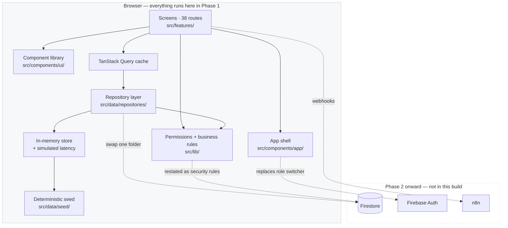

# Fidato Hospitality Platform — Service Manual

**Build:** Phase 2.5 — deployed and in production use
**Date of record:** 14 August 2026
**Scope of this manual:** every part of the system — what it is, how it works, why it was
built this way rather than another way, how it was taken live, and how to diagnose it when
it misbehaves.

⚠️ **Volumes I–XV describe Phase 1** and were written when that was the whole system. They
remain accurate about the frontend, the design system and the reasoning, and they are the
record of how the product was decided. Where they describe *state* — what is deployed, what
is tested, what exists — **Volume 0 and Volumes XVI–XIX supersede them**, and
[`../HANDOVER.md`](../HANDOVER.md) supersedes everything.

**Start with [Volume 0](00-roadmap.md)** if you want the programme: where this began, what
was built when, and where it stands.

---

## How to use this manual

This is written the way a service manual for an engine is written, not the way a feature
tour is written. That means:

- **Every component is described in isolation** — its inputs, its outputs, its failure
  modes — before it is described in context.
- **Every decision carries its rejected alternatives.** A decision without the roads not
  taken is just an assertion. Volume III is nothing but decisions and the reasoning behind
  them.
- **Diagnostics are symptom-first.** Volume XI is organised by *what you observed*, not by
  what the underlying part is called, because when something is wrong you do not yet know
  which part it is.
- **Code in this manual is quoted from the running source.** Where a listing appears, it is
  the real implementation at the path given above it, not pseudocode.

Diagrams are Mermaid. They render in GitHub, in VS Code with the Markdown Preview, and in
most Markdown viewers. Where a diagram would be less clear than a table, a table is used.

### Reading paths

| If you are… | Read, in order |
|---|---|
| New to the project | **0** → I → II → XVI → X (skim) |
| Taking it live, or operating it | **0** → XIX → XVI → XVII |
| Reviewing the design | IV → V → III |
| Working on the backend | XVI → VI → VIII → IX |
| Working on automation | XVII → XVIII |
| Debugging something | XI first, then the relevant volume |
| Auditing the rules | IX → XVI → XII |
| Understanding a decision | III (Phase 1) → [`../DECISIONS.md`](../DECISIONS.md) (since) |

---

## Volumes

| # | Volume | Contents |
|---|---|---|
| **0** | [Programme roadmap](00-roadmap.md) | Where this started, what was built when, where it stands, what is left. The whole programme in one volume |
| **I** | [System overview](01-system-overview.md) | What the platform is, who uses it, the phase plan, what Phase 1 does and does not include |
| **II** | [Architecture](02-architecture.md) | Layer model, module graph, request lifecycle, rendering pipeline, build output |
| **III** | [Decision log](03-decision-log.md) | 24 architectural decision records — each with alternatives considered and why they lost |
| **IV** | [Design system](04-design-system.md) | Every token, the type scale, spacing, motion, the two brand-guide departures |
| **V** | [Component reference](05-component-reference.md) | Every UI primitive: props, variants, states, accessibility contract, source |
| **VI** | [Data model](06-data-model.md) | Full data dictionary — every collection, every field, every relationship |
| **VII** | [Seed engine](07-seed-engine.md) | How the 1,100 reservations and 32 real properties are generated, deterministically |
| **VIII** | [Repository layer](08-repository-layer.md) | The query pipeline, latency simulation, and the exact Phase 2 swap point |
| **IX** | [Permissions & business rules](09-permissions-and-rules.md) | The matrix, row-level scoping, the 8 business rules and where each is enforced |
| **X** | [Screen teardown](10-screen-teardown.md) | All 38 routes, one by one: data in, states, interactions, design reasoning |
| **XI** | [Diagnostics](11-diagnostics.md) | Symptom → cause → fix. The repair section |
| **XII** | [Defect log](12-defect-log.md) | The 9 defects found during the build, with root cause analysis |
| **XIII** | [Verification record](13-verification-record.md) | What was tested, how, what passed, and what could not be tested |
| **XIV** | [Phase 2 handover](14-phase-2-handover.md) | The migration *plan*. ⚠️ Superseded by XVI where the two disagree — Spark has no Cloud Functions |
| **XVI** | [Phase 2 as built](16-phase-2-as-built.md) | What was actually constructed: auth, rules, the Spark constraints, and where the build departed from the plan |
| **XVII** | [Automation and n8n](17-automation-and-n8n.md) | The queue, the webhook, the voucher and PDF, email, Drive, WhatsApp, and how failure is made visible |
| **XVIII** | [The booking register](18-booking-register.md) | The 6,626-row historical record: its own database, its own access model, and what its data is actually like |
| **XIX** | [Launch and operations](19-launch-and-operations.md) | The launch sequence, day-two operations, what cannot be undone, and the known issues at launch |
| **XV** | [Glossary & index](15-glossary.md) | Domain terms, technical terms, file index |

### Appendices — reference tables

| # | Appendix | Contents |
|---|---|---|
| **A** | [Data dictionary](A1-data-dictionary.md) | Every field of every collection: type, required, denormalised, immutable, notes |
| **B** | [Component props](A2-component-props.md) | Every component and hook: every prop, type, default |

---

## The system at a glance

**One sentence:** a React application that behaves exactly like the finished product, backed
by a deterministic simulation of the database rather than the database, so that the shape of
the product can be settled before any backend work is committed to.

---

## Counting the system

| Measure | Value |
|---|---:|
| Routes | 38 |
| Feature screens | 34 |
| UI primitives | 28 |
| Firestore-shaped collections | 18 |
| Domain types | 46 |
| Roles | 8 |
| Permission resources | 20 |
| Permission actions | 8 |
| Cells in the permission matrix | 160 |
| Encoded business rules | 8 |
| Seeded reservations | 1,100 |
| Real properties | 32 |
| Modules in production bundle | 2,959 |
| Largest route chunk (gzipped) | 11.3 kB |

---

## Conventions used throughout

| Notation | Meaning |
|---|---|
| `src/path/file.ts` | A real file in the repository |
| **BR-01** | A numbered business rule — see Volume IX |
| **ADR-01** | A numbered architectural decision — see Volume III |
| **D-01** | A numbered defect — see Volume XII |
| ⚠️ | A trap: something that looks correct and is not |
| 🔧 | A maintenance note: something you will need to change in Phase 2 |
