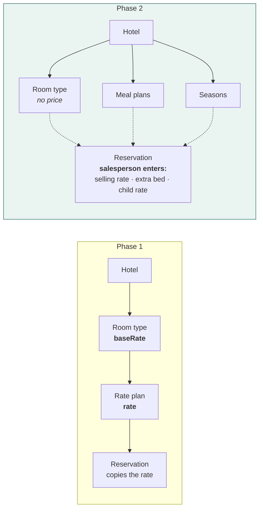

← [Index](README.md) · Next: [02 — Architecture and Spark](02-architecture-and-spark.md)

---

# 01 — Scope and breaking changes

Seven changes were requested. Each is specified here with what it breaks in the Phase 1 build,
because several are not additive.

---

## C-1 · GST becomes 5% / 18%

**Requested.** Below ₹7,500 → **5%**. At or above ₹7,500 → **18%**.

**Current.** Phase 1 uses 12% / 18% (`reservationsRepo.quote()`).

This matches the revised Indian hotel GST structure — 5% without input tax credit for tariffs
up to ₹7,500, 18% above. The band still follows the **per-room per-night rate**, not the booking
total, which Phase 1 already gets right.

```ts
// src/lib/tax.ts — new, extracted from the repository
export const GST_THRESHOLD = 7_500;
export const GST_LOW = 0.05;   // was 0.12
export const GST_HIGH = 0.18;

export function gstRateFor(perNightRate: number): number {
  return perNightRate >= GST_THRESHOLD ? GST_HIGH : GST_LOW;
}
```

### ⚠️ Decision needed — historical reservations

Existing reservations store `taxAmount` computed at 12%. Three options:

| Option | Consequence |
|---|---|
| **Grandfather** (recommended) | Stored `taxAmount` is never recomputed. A booking made under the old rate keeps its original folio, which is what an auditor expects. New bookings use the new rate |
| Recompute all | Historical folios change retroactively. Invoices already issued would no longer reconcile |
| Recompute only unconfirmed | Middle path; more code, and the cut-off is arbitrary |

The plan assumes **grandfather**. A `gstVersion` field is added to reservations so the rate a
folio was computed under is recoverable. Confirm before building.

---

## C-2 · Pricing moves from the hotel to the reservation

**Requested.** Remove room prices from hotel configuration. The salesperson enters the rate when
creating a reservation. Room types, meal plans and seasons stay pre-configured.

This is the largest change in Phase 2. It inverts where price lives.



### What is removed

| Removed | Where |
|---|---|
| `RoomType.baseRate` | `src/data/types.ts` |
| `RoomType.extraAdultRate` | same |
| `RatePlan.rate` | same |
| The whole `ratePlans` **pricing** role | `RatesPage`, `ratePlansRepo.update` |

### What replaces it

`ReservationRoom` gains operator-entered pricing:

```ts
export interface ReservationRoom {
  roomTypeId: string;   roomTypeName: string;
  mealPlan: MealPlan;                    // EP | AP | MAP | ALL_INCLUSIVE
  seasonId?: string;    seasonName?: string;
  quantity: number;
  adults: number;       children: number;
  extraBeds: number;

  /* Entered by the salesperson at booking time. Frozen thereafter. */
  sellingRate: number;      // per room per night, before tax
  extraBedRate: number;     // per extra bed per night
  childRate: number;        // per child per night
}
```

### ⚠️ What this breaks

| Breaks | Fix |
|---|---|
| `/hotels/:id/rates` — the whole screen | Becomes **Room configuration**: room types, meal plans, seasons. No money |
| BR-04 "hotel managers cannot edit rate plans" | The rule loses its subject. Rewritten — see [04 §4.7](04-rbac-and-security-rules.md) |
| `reservationsRepo.quote()` | Takes operator-entered rates instead of looking them up |
| The reservation wizard's step 4 | Becomes a rate-entry form, not a rate-plan picker |
| Seed data | `hotels.data.ts` keeps room types; generated rate plans lose their prices |
| Manual Volume VI §6.4, X §10.19 | Rewrite |

### ⚠️ Consequence worth stating plainly

With no reference price, **nothing constrains what a salesperson charges.** Phase 1 had an
implicit floor because rates came from a configured plan. That protection is gone.

The ₹50,000 approval threshold is now the *only* commercial control. Two mitigations, both
cheap, are specified in [05 §5.6](05-module-specs.md):

- Show the **last three rates** charged for that room type at that property, inline.
- Flag rates more than 40% below the trailing median for that room type as *unusual*, without
  blocking.

Neither is a hard limit. Both make an outlier visible to the approver.

---

## C-3 · Meal plans become EP / AP / MAP / All Inclusive

**Requested.** Replace the existing options with those four. Each hotel configures its own
combinations.

**Current.** `MealPlan = "EP" | "CP" | "MAP" | "AP"`.

**Change:** `CP` is removed, `ALL_INCLUSIVE` is added.

```ts
export type MealPlan = "EP" | "AP" | "MAP" | "ALL_INCLUSIVE";

export const MEAL_PLAN_LABELS: Record<MealPlan, string> = {
  EP: "Room only",
  AP: "Room with all meals",
  MAP: "Room with breakfast and one meal",
  ALL_INCLUSIVE: "All inclusive",
};
```

⚠️ **Data migration.** Existing records carry `CP`. The seeding script maps `CP → EP` and this
is recorded in the migration log. Nothing else references `CP`.

Meal plans become a **per-hotel configuration** — a hotel offering only EP and MAP shows only
those two in the wizard.

---

## C-4 · Seasons carry the meal-plan combinations

**Requested.** Rate plans checked "for that season", with the four meal options.

Since price has left this layer (C-2), a season now defines **availability and applicability**,
not money:

```ts
export interface Season {
  id: string;
  hotelId: string;
  name: string;              // "Peak", "Shoulder", "Monsoon Saver"
  validFrom: IsoDate;
  validTo: IsoDate;
  mealPlans: MealPlan[];     // which of the four apply in this season
  minNights: number;
  cancellationPolicy: string;
  isActive: boolean;
}
```

The wizard resolves the season from the check-in date and offers only that season's meal plans.
If no season matches, all four are offered and the reservation records `seasonId: undefined`.

⚠️ **Overlapping seasons** are possible and the plan does not forbid them. Resolution is
*first match by `validFrom` descending*, so a specific short season overrides a broad one. This
needs confirming — the alternative is to reject overlaps at configuration time.

---

## C-5 · Reservations gain confirmation and payment fields

**Requested.**

```ts
// added to Reservation
hotelConfirmationNumber?: string;   // the property's own reference
hotelRepName?: string;              // who at the hotel confirmed it
confirmedAt?: IsoDateTime;          // when the hotel confirmed
paymentMethod: PaymentMethod;
```

```ts
export type PaymentMethod = "DP" | "RA" | "BTC";

export const PAYMENT_METHOD_LABELS: Record<PaymentMethod, string> = {
  DP: "Direct payment",
  RA: "Room advance",
  BTC: "Bill to company",
};
```

⚠️ **Naming collision.** Phase 1 already has a `PaymentMethod` type on the `payments`
collection — `bank_transfer | upi | card | cash | cheque`. That is *how money physically
arrived*; this new one is *the commercial arrangement*. They are different concepts and must not
share a name.

**Resolution:** the new type is `PaymentTerm` on the reservation; the existing `PaymentMethod`
stays on payments unchanged. Requirement met, collision avoided.

**BTC implies a company.** A reservation set to BTC without a `companyId` is invalid — validated
in the wizard and in the repository.

---

## C-6 · Creation flows for hotels, salespersons and companies

**Requested.** Add the ability to create a new hotel, a new salesperson and a new company.

| Entity | Phase 1 | Phase 2 |
|---|---|---|
| Company | ✅ Create/edit exist | Keep; add CSV import |
| Customer | ✅ Create/edit exist | Keep |
| **Hotel** | ❌ Read-only | **New** — full CRUD + room config |
| **User (incl. salesperson)** | ❌ Read-only list | **New** — full CRUD + Auth account |

⚠️ **Creating a user is two writes that must agree.** A Firebase Auth account *and* a
`users/{uid}` document. On Spark there is no Admin SDK, so the client cannot create an Auth user
for someone else without signing in as them.

Three options, in [05 §5.2](05-module-specs.md). The plan uses **invitation**: an admin creates
the `users` document with `status: "invited"`; the person completes sign-up themselves via a
sign-up screen that claims the pending record by email. No Admin SDK needed.

---

## C-7 · Bulk CSV / Excel import for customers, companies and properties

**Requested.** Bulk import for customer, company or property data.

Phase 1 has a working CSV import wizard for customers — upload → map → validate → review →
commit, with duplicate detection. It is a strong foundation.

**Phase 2 generalises it** into `features/import/` parameterised by an entity descriptor, then
mounts it three times.

| Entity | Required | Duplicate key |
|---|---|---|
| Customers | first name, last name, email, phone | email · phone (last 10 digits) |
| Companies | name, GSTIN | GSTIN · name |
| Hotels | name, city, state | name + city |

⚠️ **Excel (.xlsx) is not CSV.** Supporting it means a parser — `sheetjs` is ~400 kB. Options
in [05 §5.9](05-module-specs.md). Recommendation: **CSV only in Phase 2**, with a clear message
telling the user to "Save as CSV" from Excel. Revisit if the team pushes back.

---

## C-8 · Commission visible only to Owner and Admin

**Requested.** Hotel compensation is set by, and visible only to, the owner and admin.

⚠️ **This cannot be done by hiding a field in the UI.**

Firestore security rules are **document-level**. If `commissionPercent` is a field on
`hotels/{id}`, then anyone who can read that hotel can read the commission — through the SDK,
the REST API, or the browser console. The interface is irrelevant.

**Solution:** move it to a subcollection with its own rule.

```
hotels/{hotelId}                          ← readable by all signed-in users
hotels/{hotelId}/private/commercial       ← Owner and Admin only
    { commissionPercent, contractNotes, negotiatedBy, effectiveFrom }
```

Full design in [04 §4.6](04-rbac-and-security-rules.md).

---

## C-9 · Invoice module restricted to Owner, Admin and Manager

Document-level, so plain rules handle it:

```js
match /invoices/{id} {
  allow read: if hasAnyRole(['owner', 'admin', 'manager']);
}
```

Phase 1 built the invoice screens; Phase 2 makes them real and restricts them.

---

## C-10 · The role model changes — 8 roles become 6

The sprint document names: **Owner · Admin · Manager · Salesperson · Finance · Viewer**.

Phase 1 has: super_admin · admin · sales_manager · salesperson · hotel_manager · finance ·
support · viewer.

### Proposed mapping

| Phase 1 | Phase 2 | Note |
|---|---|---|
| `super_admin` | `owner` | Rename |
| `admin` | `admin` | — |
| `sales_manager` | `manager` | Rename; gains invoice access |
| `salesperson` | `salesperson` | — |
| `finance` | `finance` | — |
| `viewer` | `viewer` | — |
| `hotel_manager` | **removed** | Its purpose was inventory, which is now hidden |
| `support` | **removed** | Not in the target model |

### ⚠️ Two questions this raises

**Is `hotel_manager` gone permanently, or only dormant?** Property staff logging in to see their
own arrivals is a plausible future requirement, and the row-level scoping that supports it is
already built and working. Deleting it discards working code.

**Recommendation:** keep both roles defined in `permissions.ts` with all grants removed, and
exclude them from the role picker. The scoping logic stays, costs nothing, and can be
re-enabled by restoring grants. This mirrors the instruction to hide inventory rather than
delete it.

Confirm before building — if they are genuinely never coming back, deleting is cleaner.

---

## C-11 · Inventory hidden, code preserved

**Requested.** Hide inventory, its routes, its sidebar entry and its dashboard cards. Keep the
code.

| Action | File |
|---|---|
| Remove nav entry | `components/app/navigation.ts` |
| Remove route | `routes.tsx` — comment with a pointer, do not delete the lazy import |
| Remove the property page's Inventory button | `HotelDetailPage.tsx` |
| Remove occupancy KPI from the hotel-manager dashboard | moot — that role is dormant |
| Keep | `features/hotels/InventoryPage.tsx`, `buildInventory()`, `InventoryDay` |

⚠️ **Occupancy depends on the inventory model.** Volume VI §6.9 and ADR-19 explain why
occupancy is derived from `buildInventory()` and not from reservations. Hiding the *screen* is
fine. If the underlying model is also removed, the Occupancy report loses its denominator and
the 1% bug returns.

**Therefore:** hide `/hotels/:id/inventory`. Keep `buildInventory()`. Occupancy reporting
continues to work, now clearly labelled as an estimate until a real feed arrives in a later
phase.

---

## Change summary

| # | Change | Size | Breaks |
|---|---|---|---|
| C-1 | GST 5% / 18% | S | Historical folios — decision needed |
| C-2 | Pricing moves to the reservation | **L** | Rate plans, wizard, BR-04, seed, docs |
| C-3 | Meal plans EP/AP/MAP/All Inclusive | S | `CP` data migration |
| C-4 | Seasons carry meal plans | M | Rate plan model |
| C-5 | Confirmation + payment term fields | S | Naming collision — resolved |
| C-6 | Create hotel / user / company | **L** | Needs an invitation flow on Spark |
| C-7 | CSV import ×3 | M | — |
| C-8 | Commission Owner/Admin only | M | **Needs a subcollection, not a hidden field** |
| C-9 | Invoices Owner/Admin/Manager | S | — |
| C-10 | 8 roles → 6 | M | Two roles dormant — confirm |
| C-11 | Inventory hidden | S | Keep the model or occupancy breaks |

---

## Open decisions

These need answers before the affected module is built. None blocks the start of the sprint.

| # | Question | Blocks | Recommendation |
|---|---|---|---|
| 1 | Grandfather historical GST, or recompute? | Invoice module | Grandfather |
| 2 | Are `hotel_manager` and `support` dormant or deleted? | RBAC | Dormant |
| 3 | May seasons overlap? | Room config | Allow, resolve newest-first |
| 4 | Excel import in Phase 2, or CSV only? | Import | CSV only |
| 5 | Should an unusually low rate warn, block, or neither? | Reservation wizard | Warn |
| 6 | Who assigns roles — Owner only, or Owner + Admin? | User module | Owner only |

---

Next: [02 — Architecture and the Spark constraint](02-architecture-and-spark.md)
