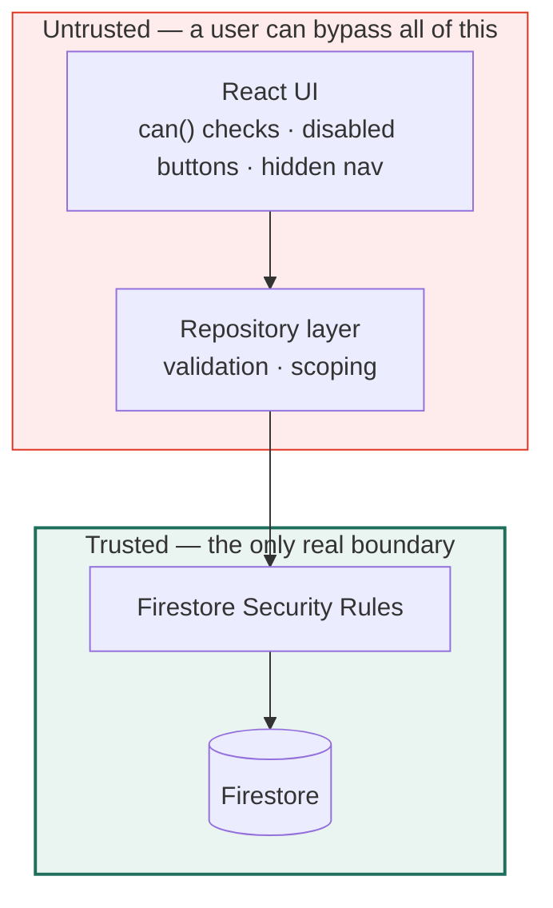
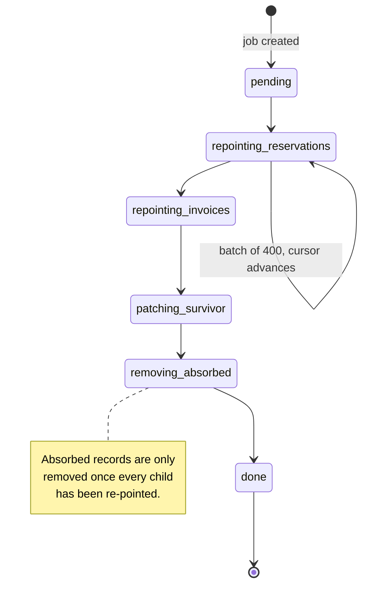

← [01 — Scope](01-scope-and-changes.md) · [Index](README.md) · Next: [03 — Data model](03-data-model.md)

---

# 02 — Architecture and the Spark constraint

**Read this before designing anything.** Four recommendations in the Phase 1 handover
(manual Volume XIV) assumed Cloud Functions. Spark has none. Each needs a different design, and
each replacement carries a risk that must be accepted deliberately rather than discovered later.

---

## 2.1 What Spark gives and withholds

| Available | Not available |
|---|---|
| Firebase Authentication | Cloud Functions |
| Firestore | Admin SDK (server-side) |
| Firebase Storage | Custom auth claims |
| Security Rules | Eventarc, Pub/Sub, Scheduler |
| Hosting | Server-side triggers of any kind |
| Client SDKs | Firestore triggers |

**The single consequence that shapes everything:** there is no trusted server. Every write comes
from a browser the user controls. Therefore **security rules are the only real enforcement** —
anything the client does is a convenience, not a control.



⚠️ Every rule in `src/lib/permissions.ts` and `src/lib/rules.ts` **must be restated in
`firestore.rules`.** The TypeScript copy exists for the interface; the rules copy exists for
security. [04](04-rbac-and-security-rules.md) covers keeping them in step.

---

## 2.2 Roles cannot use custom claims

**The problem.** `setCustomUserClaims()` is Admin SDK only. On Spark there is no way to run it.

**The design.** The role lives in a Firestore document, and rules read it:

```
users/{uid}
  { name, email, phone, role, status, branch, hotelId? }
```

```js
// firestore.rules
function userDoc() {
  return get(/databases/$(database)/documents/users/$(request.auth.uid)).data;
}
function role()          { return userDoc().role; }
function isActive()      { return userDoc().status == 'active'; }
function hasRole(r)      { return isActive() && role() == r; }
function hasAnyRole(rs)  { return isActive() && role() in rs; }
```

### What this costs

| Cost | Detail | Mitigation |
|---|---|---|
| A document read per rule evaluation | Each `get()` in rules is billed as a read | Rules `get()` results are cached for the duration of a single request, so one read covers a whole batch. Spark's 50k daily reads is ample at this team size |
| Latency | Negligible — same-region cached lookup | — |
| **A user can read their own role document** | Necessary, and harmless | Role changes are write-protected to Owner |
| **Privilege escalation risk** | If a user could write their own `role` field, they could make themselves Owner | ⚠️ **Critical.** The rule must forbid self-modification of `role` and `status` — see below |

### The rule that must not be got wrong

```js
match /users/{uid} {
  allow read: if isSignedIn();

  // A user may edit their own profile, but never their own role or status.
  allow update: if request.auth.uid == uid
                && request.resource.data.role   == resource.data.role
                && request.resource.data.status == resource.data.status
                && request.resource.data.diff(resource.data)
                     .affectedKeys().hasOnly(['name','phone','avatarColor','updatedAt']);

  // Only the Owner may set roles.
  allow update: if hasRole('owner');
  allow create: if hasRole('owner');
  allow delete: if false;                     // deactivate, never delete
}
```

⚠️ Without the `affectedKeys().hasOnly(...)` clause, any signed-in user can promote themselves
to Owner with one line in the browser console. **This rule needs a test.**

---

## 2.3 Four Phase 1 recommendations that do not survive

### ① Roll-up counters

**Volume XIV §14.5 said:** maintain `totalReservations`, `totalRevenue` and `creditUsed` with a
Cloud Function using `FieldValue.increment`, because client-maintained counters drift when two
writes race.

**On Spark:** there is no Function. The counters must be updated by the client.

**Design — a transaction, not a plain write:**

```ts
await runTransaction(db, async (tx) => {
  const customerRef = doc(db, "customers", input.customerId);
  const snap = await tx.get(customerRef);

  tx.set(doc(collection(db, "reservations")), reservation);
  tx.update(customerRef, {
    totalReservations: (snap.data()!.totalReservations ?? 0) + 1,
    totalRevenue:      (snap.data()!.totalRevenue ?? 0) + reservation.totalAmount,
    lastActivityAt: serverTimestamp(),
  });
});
```

Firestore transactions are optimistic with automatic retry, so concurrent writes do not
silently overwrite each other.

| Risk | Accepted? |
|---|---|
| A client that goes offline mid-transaction leaves nothing partially written — transactions are atomic | ✅ Safe |
| A malicious client could write an arbitrary `totalRevenue` | ⚠️ **Real.** Rules cannot cheaply verify an aggregate |
| Counters drift over time through bugs | ⚠️ Real |

**Mitigation:** an Owner-only **Recompute totals** action in Administration that recounts from
source and reports differences. Not automatic — a visible, auditable, manual reconciliation.
Specified in [05 §5.11](05-module-specs.md).

**Accepted risk, stated plainly:** on Spark, aggregate fields are advisory. Anything financially
binding must be computed from source at the moment it matters, not read from a counter. The
invoice module therefore computes its own totals from the reservation, never from a roll-up.

---

### ② The merge operation

**Volume XIV §14.7 said:** a Cloud Function with chunked batched writes, because a merge spans
three collections and can exceed the 500-write batch limit.

**On Spark:** it runs in the browser, where the tab can close mid-operation.

**Design — a resumable job document:**

```
mergeJobs/{jobId}
  { survivorId, absorbedIds[], status, phase, cursor, processed, total, startedAt, actorId }
```



Each batch commits and advances `cursor`. If the tab closes, the job sits at its last phase and
the Duplicates screen shows **"Merge in progress — resume"**.

| Risk | Handling |
|---|---|
| Tab closes mid-merge | Job is resumable; partial state is visible, not silent |
| Two operators merge the same group | Job creation checks for an existing `pending`/`running` job on those ids |
| Absorbed record deleted before children re-pointed | Impossible — phase order enforces it |

---

### ③ Invoice numbering

**The problem.** `INV-2607-0193` must be unique and gapless. Two salespeople invoicing at the
same instant must not get the same number. A Cloud Function would hold a counter.

**On Spark — a counter document plus a transaction:**

```
counters/invoices
  { period: "2026-07", next: 194 }
```

```ts
const number = await runTransaction(db, async (tx) => {
  const ref = doc(db, "counters", "invoices");
  const snap = await tx.get(ref);
  const period = format(new Date(), "yyyy-MM");
  const next = snap.data()?.period === period ? snap.data()!.next + 1 : 1;
  tx.set(ref, { period, next });
  return `INV-${format(new Date(), "yyMM")}-${String(next).padStart(4, "0")}`;
});
```

⚠️ **Rules must allow writing `counters/invoices` only as part of creating an invoice**, and
only to roles that may create invoices. Otherwise anyone can reset the sequence.

**Accepted limit:** ~1 invoice per second sustained. Far beyond what this business needs.

---

### ④ Audit log immutability

**Volume XIV §14.8 said:** `allow update, delete: if false`, written by a Function.

**On Spark:** the client writes audit entries directly. Rules can still make them immutable:

```js
match /auditLogs/{id} {
  allow read:   if hasPermission('audit_log', 'view');
  allow create: if isSignedIn()
                && request.resource.data.actorId == request.auth.uid    // cannot impersonate
                && request.resource.data.at == request.time;            // cannot backdate
  allow update, delete: if false;
}
```

| Guaranteed | Not guaranteed |
|---|---|
| Entries cannot be edited or deleted | That an entry was written at all |
| The actor cannot be forged | |
| The timestamp cannot be backdated | |

⚠️ **The honest limitation:** a client can simply not write the audit entry. On Spark the audit
trail is *tamper-evident*, not *tamper-proof*. Guaranteeing it needs a trusted server, which is
a Blaze decision. State this to whoever relies on the log.

---

## 2.4 The `automationQueue` contract

Business events are written but not processed. Phase 2.5 consumes them.

```ts
export interface AutomationEvent {
  id: string;
  type: AutomationEventType;      // "reservation.created" | …
  entityType: "reservation" | "invoice" | "customer" | "company" | "hotel" | "user";
  entityId: string;
  entityLabel: string;            // denormalised, e.g. "FH-2026-04821"
  payload: Record<string, unknown>;   // minimal — n8n re-reads the document
  status: "pending" | "processing" | "done" | "failed";
  attempts: number;
  lastError?: string;
  createdAt: IsoDateTime;
  createdBy: string;
  processedAt?: IsoDateTime;
}
```

### Events written in Phase 2

| Event | Written when |
|---|---|
| `reservation.created` | A reservation is created |
| `reservation.confirmed` | Status → confirmed |
| `reservation.approved` | An approval is granted |
| `reservation.cancelled` | Status → cancelled |
| `reservation.checked_in` / `.checked_out` | Status transitions |
| `invoice.created` | An invoice is raised |
| `payment.recorded` | A payment is recorded |
| `customer.created` | A customer is created |
| `company.created` | A company is created |
| `hotel.created` | A hotel is onboarded |
| `user.invited` | A user is invited |

**Written in the same transaction as the entity**, so an event can never describe something that
does not exist.

⚠️ **Payload stays minimal.** n8n re-reads the document when it processes the event. A fat
payload goes stale the moment the record is edited.

### How n8n will read it — no push on Spark

There are no Firestore triggers. n8n must **poll** the Firestore REST API on a schedule:

```
GET /v1/projects/{project}/databases/(default)/documents:runQuery
    where status == "pending"  orderBy createdAt  limit 20
```

Trade-offs and the full design are in [07](07-phase-2.5-n8n.md). **Phase 2's only job is to
write correct events** — but knowing polling is the mechanism explains why `status` and
`attempts` exist from day one.

---

## 2.5 Firestore collections

```
users/{uid}                              ← role lives here; rules read it
hotels/{hotelId}
  └─ private/commercial                  ← commission. Owner + Admin only
roomTypes/{id}
seasons/{id}                             ← replaces ratePlans
companies/{id}
customers/{id}
reservations/{id}
invoices/{id}
payments/{id}
commissions/{id}                         ← Owner + Admin only
auditLogs/{id}                           ← append-only
notifications/{id}
automationQueue/{id}                     ← written, not processed
counters/{name}                          ← invoice numbering
mergeJobs/{id}                           ← resumable merges
importJobs/{id}                          ← resumable imports
settings/org                             ← singleton
```

`inventory` is **not created.** The model stays client-side (`buildInventory()`) until a real
feed exists.

---

## 2.6 Composite indexes

Every filter-plus-sort combination the UI can produce needs one. Firestore reports the missing
index at runtime with a console link, but declaring them up front avoids discovering them in
front of a user.

| Collection | Index |
|---|---|
| `reservations` | `ownerId ASC, checkIn DESC` |
| `reservations` | `hotelId ASC, checkIn DESC` |
| `reservations` | `status ASC, totalAmount DESC` |
| `reservations` | `status ASC, checkIn ASC` |
| `reservations` | `paymentTerm ASC, checkIn DESC` |
| `customers` | `ownerId ASC, lastActivityAt DESC` |
| `customers` | `status ASC, lastActivityAt DESC` |
| `companies` | `ownerId ASC, totalRevenue DESC` |
| `invoices` | `status ASC, dueDate ASC` |
| `invoices` | `companyId ASC, issueDate DESC` |
| `auditLogs` | `entityType ASC, at DESC` |
| `auditLogs` | `entityId ASC, at DESC` |
| `automationQueue` | `status ASC, createdAt ASC` |

Committed as `firestore.indexes.json`.

---

## 2.7 Pagination changes shape

Phase 1 uses offset pagination (`page`, `total`). Firestore is cursor-based and cannot cheaply
produce a total.

| | Phase 1 | Phase 2 |
|---|---|---|
| Movement | Jump to any page | **Previous / Next only** |
| Readout | `26–50 of 1,100` | `26–50` |
| State | `page` in the URL | cursor token in the URL |

⚠️ **This is a visible product change.** Numbered pages disappear.

If the numbered readout matters, a distributed counter per collection can restore `total` — one
extra document write per create/delete. Recommendation: **ship Prev/Next**, add counters later
only if the team asks.

---

## 2.8 Spark quotas — headroom check

| Quota | Daily limit | Estimated use | Headroom |
|---|---:|---:|---|
| Document reads | 50,000 | ~8,000 | ✅ 6× |
| Document writes | 20,000 | ~1,500 | ✅ 13× |
| Deletes | 20,000 | ~50 | ✅ |
| Storage | 1 GiB | < 100 MB | ✅ |
| Stored data | 1 GiB | < 50 MB | ✅ |

Assumes ~20 users, ~150 reservations a day, and the dashboard's five queries per load.

⚠️ **The read quota is the one to watch.** Two habits protect it:

- **Never fetch a collection to count it.** Use stored counters or a bounded query.
- **Keep `staleTime` at 30 s** so tab-switching does not refetch. Phase 1 already does.

A reporting screen that reads all 1,100 reservations to aggregate client-side costs 1,100 reads
*per view*. Ten views is a fifth of the daily quota. Reports must query a bounded window and
say so on screen.

---

## 2.9 What does not change

| Unchanged | Why |
|---|---|
| `src/components/**` | Presentation only |
| `src/features/**` | Except where a field moved — [01](01-scope-and-changes.md) |
| `src/lib/format.ts` | Pure formatting |
| `ListQuery` / `ListResult` | The interface holds; only `page` becomes a cursor |
| Repository **method signatures** | The whole point of the seam |
| The design system | — |

If a screen needs changing for a reason not listed in [01](01-scope-and-changes.md), the
repository interface has probably been broken. Stop and check.

---

Next: [03 — Data model changes](03-data-model.md)
