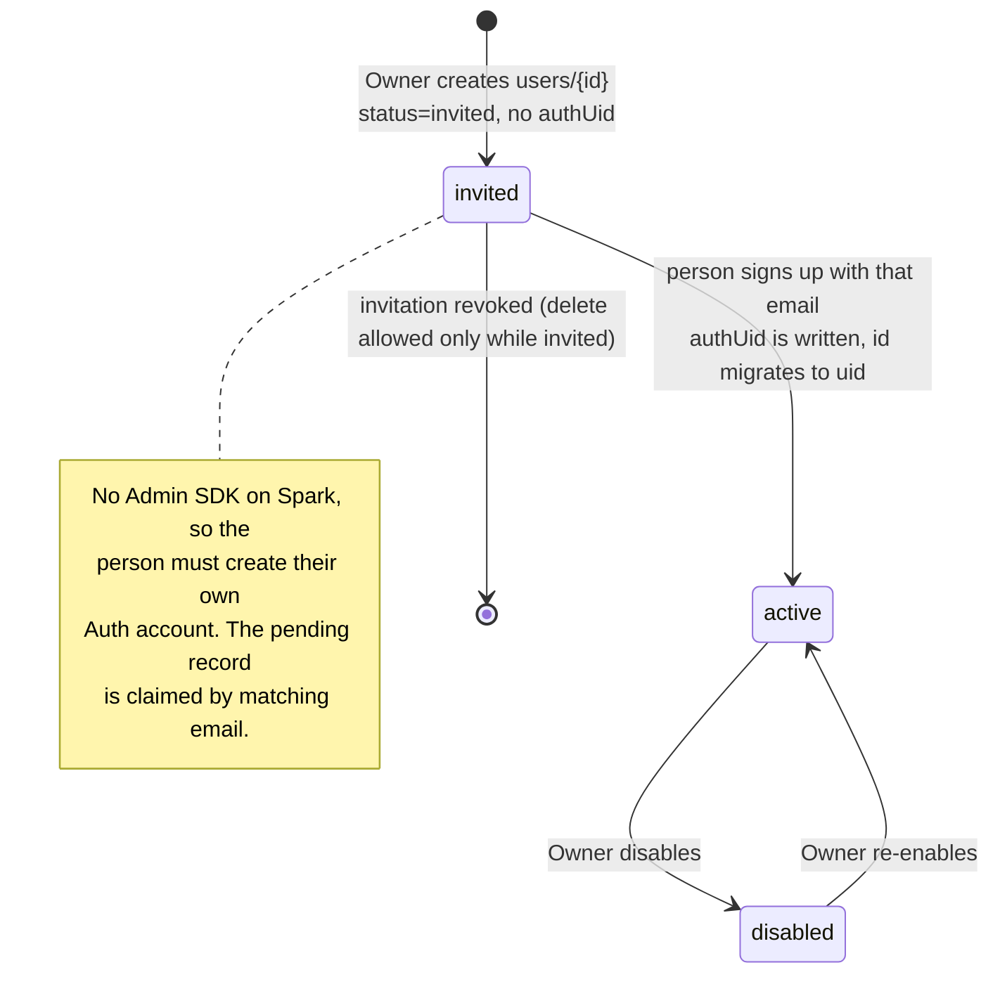
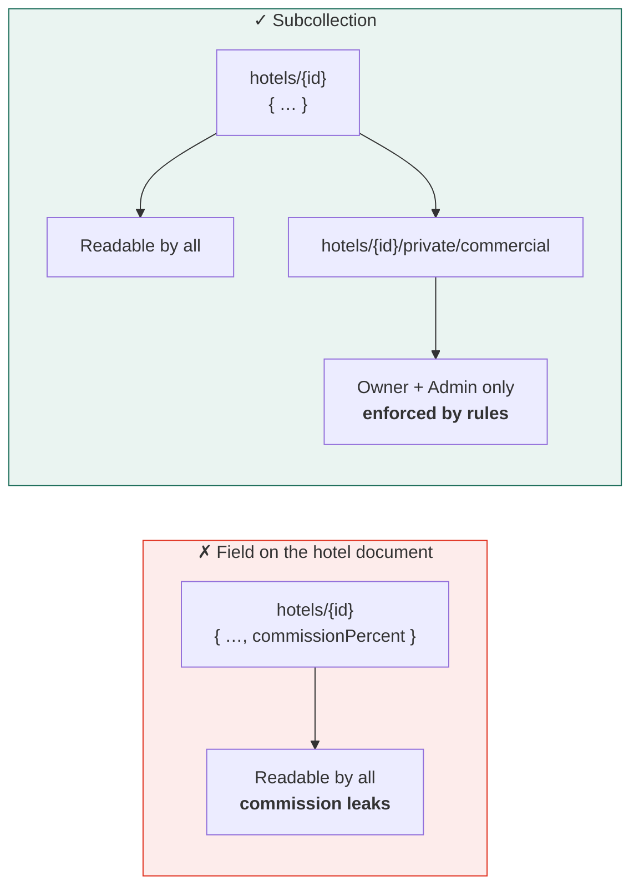
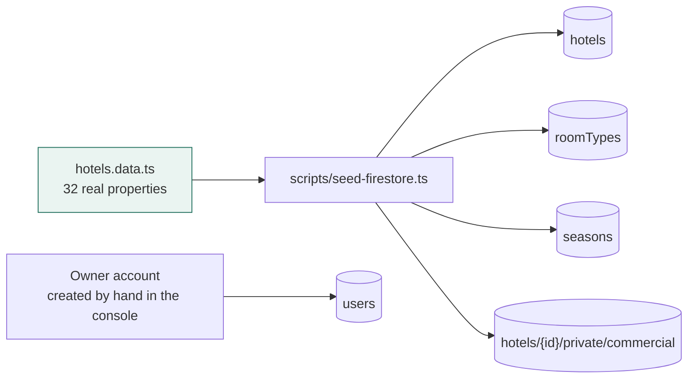

← [02 — Architecture](02-architecture-and-spark.md) · [Index](README.md) · Next: [04 — RBAC](04-rbac-and-security-rules.md)

---

# 03 — Data model changes

Deltas from Phase 1 only. Anything not listed here is unchanged — see manual Appendix A for the
full dictionary.

---

## 3.1 Summary of changes

| Collection | Change |
|---|---|
| `users` | **Gains** `status`, `branch`, `invitedAt`, `authUid`. Role becomes security-relevant |
| `hotels` | **Loses** `commissionPercent` → moves to a subcollection |
| `hotels/{id}/private/commercial` | **New** — Owner and Admin only |
| `roomTypes` | **Loses** `baseRate`, `extraAdultRate` |
| `ratePlans` | **Replaced** by `seasons` |
| `seasons` | **New** — dates, meal plans, policy. No money |
| `reservations` | **Gains** 5 fields; `rooms[]` restructured |
| `invoices` | **Gains** `gstVersion`, `createdFrom` |
| `automationQueue` | **New** |
| `counters` | **New** |
| `mergeJobs`, `importJobs` | **New** |
| `inventory` | **Not created** — model stays client-side |

---

## 3.2 `users` — now security-critical

```ts
export type UserStatus = "invited" | "active" | "disabled";

export interface User extends Auditable {
  id: string;              // === Firebase Auth uid once claimed
  authUid?: string;        // absent until the invitation is accepted
  name: string;
  email: string;           // the invitation key — immutable after claiming
  phone: string;
  role: Role;              // ⚠️ writable only by Owner
  status: UserStatus;      // ⚠️ writable only by Owner
  branch: string;          // NEW — office or region
  hotelId?: string;        // dormant, kept for the hotel_manager role
  hotelName?: string;
  department: string;
  invitedAt?: IsoDateTime; // NEW
  lastSeenAt: IsoDateTime;
  avatarColor: string;
}
```

⚠️ **`role` and `status` are the two most dangerous fields in the system.** A user able to write
either can promote themselves to Owner. The rule in [02 §2.2](02-architecture-and-spark.md)
forbids it and **must have a test**.

### The invitation lifecycle



⚠️ **The claim step needs care.** When someone signs up, the app looks for a `users` document
with `status: "invited"` and a matching email, then writes `authUid` and flips to `active`.
Rules must allow **only** that transition, and only when the email matches the authenticated
token:

```js
allow update: if resource.data.status == 'invited'
              && request.resource.data.status == 'active'
              && request.resource.data.email == request.auth.token.email
              && request.resource.data.authUid == request.auth.uid
              && request.resource.data.role == resource.data.role;   // role unchanged
```

Without the last clause, an invited user could set their own role while claiming.

---

## 3.3 `hotels` and the commercial subcollection

```ts
export interface Hotel extends Auditable {
  id: string;
  name: string;  shortName: string;
  address: string;  city: string;  state: string;
  country: string;                    // NEW — was implicit
  contactPerson: string;              // NEW — promoted from contacts[]
  email: string;                      // NEW
  phone: string;                      // NEW
  category: HotelCategory;
  status: HotelStatus;
  starRating: number;
  totalRooms: number;
  description: string;
  roomMix: string[];
  features: string[];  facilities: string[];  amenities: string[];  thingsToDo: string[];
  distances: HotelDistance[];
  contacts: HotelContact[];
  managerId?: string;
  onboardedAt: IsoDate;

  // ⚠️ commissionPercent REMOVED — see below
}
```

```ts
// hotels/{hotelId}/private/commercial  — a single document
export interface HotelCommercial {
  commissionPercent: number;
  contractNotes: string;
  negotiatedBy: string;
  effectiveFrom: IsoDate;
  updatedAt: IsoDateTime;
  updatedBy: string;
}
```

### Why a subcollection and not a field

Firestore rules are **document-level**. A field cannot be hidden from a reader who is allowed
the document. Putting commission on `hotels/{id}` means anyone who can read a hotel — which is
everyone — can read the commission through the SDK, the REST API or the console, no matter what
the UI renders.



⚠️ **Consequence for reports.** The Commissions report reads commission for all 32 properties —
32 subcollection reads instead of one query. Acceptable because only two roles can open it and
the data changes rarely; cache it with a long `staleTime`.

---

## 3.4 `roomTypes` — price removed

```ts
export interface RoomType extends Auditable {
  id: string;
  hotelId: string;  hotelName: string;
  name: string;     code: string;
  description: string;
  totalRooms: number;
  maxOccupancy: number;
  maxExtraBeds: number;        // NEW — caps the wizard's extra-bed input
  amenities: string[];
  sizeSqft: number;

  // baseRate       REMOVED — C-2
  // extraAdultRate REMOVED — C-2
}
```

---

## 3.5 `seasons` — replaces `ratePlans`

```ts
export type MealPlan = "EP" | "AP" | "MAP" | "ALL_INCLUSIVE";

export interface Season extends Auditable {
  id: string;
  hotelId: string;  hotelName: string;
  name: string;                  // "Peak", "Monsoon Saver"
  validFrom: IsoDate;
  validTo: IsoDate;
  mealPlans: MealPlan[];         // which apply in this season
  minNights: number;
  cancellationPolicy: string;
  isActive: boolean;
}
```

**Resolution at booking time:** the active season whose window contains the check-in date, newest
`validFrom` first. No match → all four meal plans offered, `seasonId` undefined.

Migration: each Phase 1 rate plan collapses into a season, dropping `rate`, `roomTypeId` and
`mealPlan` (now an array). Roughly 370 rate plans become ~90 seasons.

---

## 3.6 `reservations` — the largest change

```ts
export type PaymentTerm = "DP" | "RA" | "BTC";

export interface ReservationRoom {
  roomTypeId: string;   roomTypeName: string;
  mealPlan: MealPlan;
  seasonId?: string;    seasonName?: string;
  quantity: number;
  adults: number;       children: number;   extraBeds: number;

  /* Operator-entered. Frozen once the reservation is created. */
  sellingRate: number;
  extraBedRate: number;
  childRate: number;
}

export interface Reservation extends Auditable {
  /* …all Phase 1 fields except the removed rate-plan links… */

  // ── NEW: hotel confirmation (C-5) ──
  hotelConfirmationNumber?: string;
  hotelRepName?: string;
  confirmedAt?: IsoDateTime;

  // ── NEW: commercial terms (C-5) ──
  paymentTerm: PaymentTerm;

  // ── NEW: tax provenance (C-1) ──
  gstVersion: "2025-09";       // which band table produced taxAmount
  gstRate: number;             // 0.05 | 0.18 — the rate actually applied
}
```

### Line total

```
lineTotal = ((sellingRate × quantity)
           + (extraBedRate × extraBeds)
           + (childRate × children)) × nights
```

⚠️ **Extra beds and children are per room-line, not per room.** A line of 3 rooms with
`extraBeds: 2` means two extra beds across that line. Label it in the UI — this is a real source
of quoting errors.

### GST band

Decided by the **per-room per-night selling rate**, not the line total:

```ts
const gstRate = gstRateFor(room.sellingRate);   // 0.05 below 7,500, else 0.18
```

⚠️ **Mixed bands in one reservation are possible** — a Deluxe at ₹6,000 and a Suite at ₹9,000
attract different rates. Tax must be computed **per line and summed**, never on the reservation
total. Getting this wrong is a real tax error, not a rounding one.

```ts
const taxAmount = rooms.reduce(
  (sum, r) => sum + Math.round(lineTotal(r) * gstRateFor(r.sellingRate)),
  0,
);
```

`Reservation.gstRate` then records the **effective blended rate** for display, while the true
computation is per line.

### Validation rules

| Rule | Enforced |
|---|---|
| `paymentTerm === "BTC"` requires `companyId` | Wizard + repository + rules |
| `sellingRate > 0` | Wizard + rules |
| `extraBeds <= roomType.maxExtraBeds × quantity` | Wizard |
| `confirmedAt` requires `hotelConfirmationNumber` | Repository |
| `checkOut > checkIn` | Wizard + rules |

---

## 3.7 `invoices`

```ts
export interface Invoice extends Auditable {
  /* …Phase 1 fields… */
  gstVersion: string;          // NEW — which band table applied
  createdFrom: "reservation" | "manual";   // NEW
  lines: InvoiceLine[];        // now carries per-line taxPercent (5 or 18)
}
```

⚠️ **The invoice computes its own totals from the reservation** at the moment of creation. It
never reads a roll-up counter — see [02 §2.3](02-architecture-and-spark.md) on why aggregates
are advisory on Spark.

---

## 3.8 New collections

```ts
// counters/{name} — one document per sequence
{ period: "2026-07", next: 194 }

// mergeJobs/{id}
{ survivorId, absorbedIds: string[], status, phase, cursor, processed, total,
  startedAt, actorId, error? }

// importJobs/{id}
{ entity: "customers" | "companies" | "hotels", status, phase, cursor,
  total, created, skipped, warnings, errors: ImportError[], startedAt, actorId }

// automationQueue/{id} — see 02 §2.4
```

Merge and import become jobs because they can exceed a single batch and the tab can close
mid-run. Both are resumable and both surface progress.

---

## 3.9 Migration and seeding

`src/data/seed/hotels.data.ts` survives — it becomes the seeding script for real Firestore.



### Field mappings

| From | To | Rule |
|---|---|---|
| `roomType.baseRate` | — | Dropped |
| `ratePlan.rate` | — | Dropped |
| `ratePlan.mealPlan === "CP"` | `"EP"` | ⚠️ CP retired |
| `ratePlan.{validFrom,validTo,minNights,cancellationPolicy}` | `season.*` | Deduplicated per hotel |
| `hotel.commissionPercent` | `hotels/{id}/private/commercial` | Moved |
| `reservation.rooms[].ratePerNight` | `rooms[].sellingRate` | Renamed |
| — | `reservation.paymentTerm` | Default `DP` for migrated records |
| — | `reservation.gstVersion` | `"2025-09"` for new, `"legacy"` for migrated |

⚠️ **The first Owner account is created by hand** in the Firebase console — email/password Auth
user, then a `users/{uid}` document with `role: "owner"`, `status: "active"`. There is no
bootstrap path on Spark, and the seeding script cannot create Auth users. Document this in the
runbook; getting it wrong locks everyone out of the project.

---

## 3.10 What is deliberately not modelled

| Not built | Why | When |
|---|---|---|
| `inventory` collection | Needs a real PMS feed. `buildInventory()` stays client-side | Later |
| Voucher / PDF documents | Phase 2.5 generates them | 2.5 |
| Email delivery records | n8n owns this | 2.5 |
| Distributed counters for `total` | Only if numbered pagination is wanted back | If asked |
| `contracts` collection | Company contract fields still live on the company | If it grows |

---

Next: [04 — RBAC and security rules](04-rbac-and-security-rules.md)
