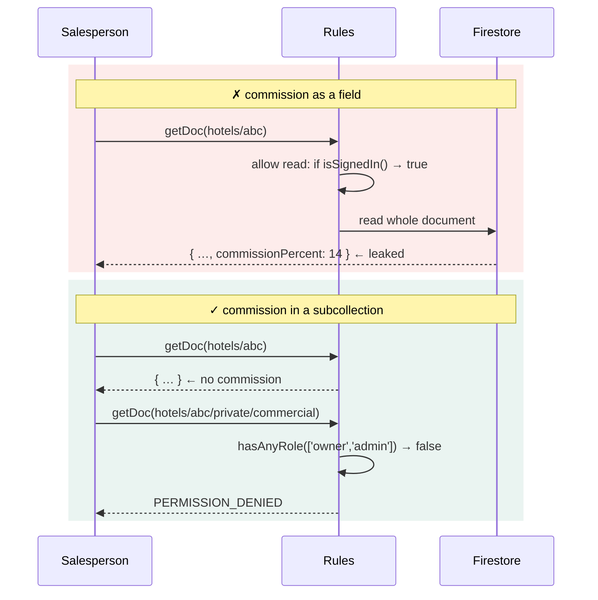

← [03 — Data model](03-data-model.md) · [Index](README.md) · Next: [05 — Module specs](05-module-specs.md)

---

# 04 — RBAC and security rules

**The governing principle:** on Spark there is no trusted server, so `firestore.rules` is the
only real enforcement. Everything in `src/lib/permissions.ts` is a convenience for the
interface. A rule that exists only in TypeScript does not exist.

---

## 4.1 The six roles

| Role | Purpose |
|---|---|
| `owner` | Unrestricted. Sole authority over roles, commission and settings |
| `admin` | Runs the platform. Everything except assigning roles |
| `manager` | Sales leadership. Approvals and invoices |
| `salesperson` | Sells. Own accounts only |
| `finance` | Invoices, payments, commissions |
| `viewer` | Read-only |

Dormant, retained in code with no grants: `hotel_manager`, `support` — see
[01 C-10](01-scope-and-changes.md).

---

## 4.2 The permission matrix

**●** full · **R** read-only · **·** none

| Resource | Owner | Admin | Manager | Salesperson | Finance | Viewer |
|---|:---:|:---:|:---:|:---:|:---:|:---:|
| Dashboard | ● | R | R | R | R | R |
| Customers | ● | ● | ● | ● | R | R |
| Companies | ● | ● | ● | ● | R | R |
| Reservations | ● | ● | ● | ● | R | R |
| Approvals | ● | ● | ● | · | · | · |
| Properties | ● | ● | R | R | R | R |
| Room config | ● | ● | R | · | · | · |
| **Commission** | **●** | **●** | **·** | **·** | **·** | **·** |
| **Invoices** | **●** | **●** | **●** | **·** | **●** | **·** |
| Payments | ● | ● | · | · | ● | · |
| Reports | ● | R | R | R | R | R |
| Automation queue | ● | R | · | · | · | · |
| Notifications | ● | ● | R | R | R | R |
| Users | ● | ● | R | · | · | · |
| **Roles** | **●** | **·** | **·** | **·** | **·** | **·** |
| Audit log | ● | R | R | · | R | · |
| Settings | ● | R | · | · | · | · |
| Import | ● | ● | ● | · | · | · |

Two cells decide the sensitive requirements:

- **Commission — Owner and Admin only.** Finance cannot see it, which is deliberate: commission
  is a negotiated commercial term, not an accounting figure.
- **Roles — Owner only.** Admin can create users but cannot set roles. Without this, an admin
  can make themselves owner.

⚠️ **Finance holds invoices but not commission.** Confirm this is intended — it is the one cell
most likely to be wrong.

---

## 4.3 Row-level scoping

Unchanged from Phase 1, now enforced in rules as well as in queries:

| Role | Sees |
|---|---|
| `salesperson` | Records where `ownerId == their uid`, or unowned |
| everyone else | Everything their role permits |

```js
function ownsRecord()  { return resource.data.ownerId == request.auth.uid; }
function unowned()     { return !('ownerId' in resource.data) || resource.data.ownerId == null; }
function inScope()     { return !hasRole('salesperson') || ownsRecord() || unowned(); }
```

⚠️ **Rules filter reads one document at a time; they do not filter queries.** A query that could
return a document the rules would reject **fails entirely** rather than returning a subset. So
the client must *also* constrain the query:

```ts
if (ctx.role === "salesperson") q = query(q, where("ownerId", "==", ctx.userId));
```

This is the single most common Firestore rules mistake. The rule and the query must agree, or
salespeople see a permission error instead of their list.

---

## 4.4 Rule helpers

```js
rules_version = '2';
service cloud.firestore {
  match /databases/{database}/documents {

    function isSignedIn() { return request.auth != null; }

    function userDoc() {
      return get(/databases/$(database)/documents/users/$(request.auth.uid)).data;
    }
    function role()     { return userDoc().role; }
    function isActive() { return userDoc().status == 'active'; }

    function hasRole(r)     { return isSignedIn() && isActive() && role() == r; }
    function hasAnyRole(rs) { return isSignedIn() && isActive() && role() in rs; }

    function ADMINS()  { return ['owner', 'admin']; }
    function MGMT()    { return ['owner', 'admin', 'manager']; }
    function SALES()   { return ['owner', 'admin', 'manager', 'salesperson']; }
    function ALL()     { return ['owner','admin','manager','salesperson','finance','viewer']; }

    function unchanged(field) {
      return request.resource.data[field] == resource.data[field];
    }
    function onlyChanged(fields) {
      return request.resource.data.diff(resource.data).affectedKeys().hasOnly(fields);
    }
```

⚠️ **A disabled user is denied everywhere**, because `isActive()` gates every helper. This is
how "Disable" actually revokes access on Spark — the Auth account still exists, but every rule
fails.

---

## 4.5 Rules per collection

### `users` — the highest-risk rules in the system

```js
match /users/{uid} {
  allow read: if isSignedIn();

  // Owner assigns roles. Nobody else.
  allow create: if hasRole('owner');
  allow update: if hasRole('owner');

  // Admin may create an invitation, but may not set a privileged role.
  allow create: if hasRole('admin')
                && request.resource.data.status == 'invited'
                && request.resource.data.role in ['salesperson', 'viewer', 'finance'];

  // Anyone may edit their own profile — never their own role or status.
  allow update: if request.auth.uid == uid
                && unchanged('role') && unchanged('status')
                && onlyChanged(['name', 'phone', 'avatarColor', 'updatedAt', 'lastSeenAt']);

  // Claiming an invitation.
  allow update: if resource.data.status == 'invited'
                && request.resource.data.status == 'active'
                && request.resource.data.email == request.auth.token.email
                && request.resource.data.authUid == request.auth.uid
                && unchanged('role');

  allow delete: if hasRole('owner') && resource.data.status == 'invited';
}
```

Four separate `allow update` clauses — Firestore ORs them, so each expresses one legitimate
path. **Every one needs a test.** Section 4.9 lists them.

### `hotels` and the commercial subcollection

```js
match /hotels/{hotelId} {
  allow read:   if isSignedIn() && isActive();
  allow create: if hasAnyRole(ADMINS());
  allow update: if hasAnyRole(ADMINS());
  allow delete: if false;                      // deactivate, never delete

  // ⚠️ The commission requirement lives here, not in the UI.
  match /private/{docId} {
    allow read, write: if hasAnyRole(ADMINS());
  }
}
```

### `reservations`

```js
match /reservations/{id} {
  allow read: if isSignedIn() && isActive() && (
       hasAnyRole(['owner','admin','manager','finance','viewer'])
    || (hasRole('salesperson') && resource.data.ownerId == request.auth.uid)
  );

  allow create: if hasAnyRole(SALES())
                && request.resource.data.ownerId == request.auth.uid
                && request.resource.data.totalAmount > 0
                && (request.resource.data.paymentTerm != 'BTC'
                    || request.resource.data.companyId != null);          // C-5

  allow update: if hasAnyRole(SALES())
                && !(resource.data.status in ['completed','cancelled','no_show'])   // BR-03
                && unchanged('reference')
                && unchanged('createdAt');

  // Approval is a narrower right than editing.
  allow update: if hasAnyRole(MGMT())
                && resource.data.status == 'pending_approval'
                && request.resource.data.status in ['confirmed', 'cancelled'];

  allow delete: if false;                                                  // BR-01
}
```

⚠️ `allow delete: if false` is the **only** place BR-01 is truly enforced. Everything in the UI
is a courtesy.

### `invoices`, `payments`, `commissions`

```js
match /invoices/{id} {
  allow read:   if hasAnyRole(['owner','admin','manager','finance']);      // C-9
  allow create: if hasAnyRole(['owner','admin','finance']);
  allow update: if hasAnyRole(['owner','admin','finance'])
                && resource.data.status != 'paid';
  allow delete: if false;
}

match /payments/{id} {
  allow read, create: if hasAnyRole(['owner','admin','finance']);
  allow update: if hasAnyRole(['owner','admin','finance']);
  allow delete: if false;
}

match /commissions/{id} {
  allow read:  if hasAnyRole(ADMINS());                                     // C-8
  allow write: if hasAnyRole(ADMINS());
}
```

### `auditLogs` — append-only

```js
match /auditLogs/{id} {
  allow read:   if hasAnyRole(['owner','admin','manager','finance']);
  allow create: if isSignedIn() && isActive()
                && request.resource.data.actorId == request.auth.uid   // no impersonation
                && request.resource.data.at == request.time;           // no backdating
  allow update, delete: if false;
}
```

### `automationQueue`

```js
match /automationQueue/{id} {
  allow read:   if hasAnyRole(ADMINS());
  allow create: if isSignedIn() && isActive()
                && request.resource.data.status == 'pending'
                && request.resource.data.attempts == 0;
  // Only the n8n service account marks events processed — Phase 2.5.
  allow update: if hasRole('owner');
  allow delete: if false;
}
```

### `counters` — invoice numbering

```js
match /counters/{name} {
  allow read:  if isSignedIn() && isActive();
  allow write: if hasAnyRole(['owner','admin','finance'])
               && request.resource.data.next == resource.data.next + 1;   // monotonic
}
```

⚠️ The monotonic check stops anyone resetting the sequence and reissuing an existing invoice
number. Note it also means the very first write needs the document to exist — the seeding script
creates `counters/invoices` with `next: 0`.

---

## 4.6 Why commission needs a subcollection

Stated once more because it is the requirement most likely to be implemented wrongly.

**Firestore has no field-level read security.** These are equivalent to Firestore:

```ts
getDoc(doc(db, "hotels", id))                      // the app
fetch(`https://firestore.googleapis.com/v1/…`)     // curl, with the same token
```

If `commissionPercent` is on that document, both return it. Hiding the column in a table changes
nothing.



**Implementation note.** `hotelsRepo.get()` returns the hotel; a separate
`hotelsRepo.commercial(hotelId)` returns commission and is called only where the role allows.
A denied read is expected for most roles — treat it as "not available", not as an error, or
every non-admin will see an error toast.

---

## 4.7 The business rules, restated for Phase 2

| # | Rule | Change | Enforced in rules |
|---|---|---|---|
| BR-01 | Reservations are cancelled, never deleted | — | `allow delete: if false` |
| BR-02 | ≥ ₹50,000 requires approval | — | Status transition rule |
| BR-03 | Terminal reservations are locked | — | `!(status in [...])` on update |
| BR-04 | Hotel managers cannot edit rates | **Rewritten** — see below | Room-config rules |
| BR-05 | Salespeople see only their accounts | — | `ownerId == uid` |
| BR-06 | Customer email and phone unique | — | ⚠️ Not enforceable in rules — see below |
| BR-07 | Merge moves all children | — | Job document |
| BR-08 | Every change is audited | — | Append-only rules |
| **BR-09** | **Commission is Owner/Admin only** | **New** | Subcollection rules |
| **BR-10** | **BTC requires a company** | **New** | Create/update rule |
| **BR-11** | **Roles are set by the Owner alone** | **New** | `users` rules |

### BR-04 is rewritten

Its original subject — rate plans with prices — no longer exists. The new statement:

> **BR-04.** Room configuration — room types, meal plans and seasons — is set centrally.
> Salespeople and viewers cannot change it. Selling rates are entered per reservation by the
> salesperson and frozen at creation.

### ⚠️ BR-06 cannot be enforced by rules

Firestore rules cannot query a collection, so uniqueness across `customers.email` is not
expressible. Three options:

| Option | Cost |
|---|---|
| **Client check only** (Phase 1 behaviour) | A determined client can bypass it. Duplicates are recoverable via merge |
| Uniqueness index collection — `customerEmails/{emailHash}` with `allow create: if !exists(...)` | One extra document per customer; the create becomes a two-write transaction |
| Cloud Function | Not available on Spark |

**Recommendation: client check plus the merge tool**, i.e. Phase 1 behaviour, consistent with
ADR-21 (warn, never block). Duplicates are an operational nuisance, not a security hole, and the
merge screen exists precisely for them. Revisit if duplicates become frequent.

---

## 4.8 Keeping TypeScript and rules in step

Two copies of the matrix will drift. 🔧 **Generate the rules from `permissions.ts`:**

```ts
// scripts/generate-rules.ts
import { ROLES, RESOURCES, grantsFor } from "../src/lib/permissions";

const RESOURCE_COLLECTIONS: Partial<Record<Resource, string>> = {
  customer: "customers", company: "companies", reservation: "reservations", /* … */
};

function rolesWith(resource: Resource, action: Action): Role[] {
  return ROLES.filter((r) => grantsFor(r, resource).includes(action));
}
// emits the hasAnyRole([...]) lists into firestore.rules between marker comments
```

Hand-written parts — scoping, status transitions, field-level immutability — sit outside the
generated block. `npm run rules:check` fails the build if the generated section is stale.

---

## 4.9 Security rule tests — mandatory

`@firebase/rules-unit-testing` against the emulator. **This is the one place Phase 2 must have
tests**, because rules are the only real enforcement.

### Minimum suite

| # | Assertion |
|---|---|
| 1 | A salesperson **cannot** read another salesperson's reservation |
| 2 | A salesperson **can** read their own |
| 3 | A salesperson **cannot** read `hotels/{id}/private/commercial` |
| 4 | An owner **can** |
| 5 | An admin **can** |
| 6 | A finance user **cannot** — confirms the deliberate gap in 4.2 |
| 7 | **A user cannot change their own `role`** ← the critical one |
| 8 | A user cannot change their own `status` |
| 9 | An admin cannot create a user with `role: 'owner'` |
| 10 | An invited user can claim their record but cannot change the role while claiming |
| 11 | Nobody can delete a reservation |
| 12 | Nobody can update or delete an audit log |
| 13 | A completed reservation cannot be updated |
| 14 | A BTC reservation without `companyId` is rejected |
| 15 | A disabled user is denied every read |
| 16 | An invoice cannot be read by a salesperson |
| 17 | An audit entry cannot be written with someone else's `actorId` |
| 18 | The invoice counter cannot decrease |

Tests 7, 8 and 9 are the ones that matter most. A failure there is a full compromise of the
permission model.

```bash
firebase emulators:exec --only firestore "npm run test:rules"
```

---

## 4.10 What RBAC cannot do on Spark

Stated so nobody assumes otherwise.

| Cannot | Consequence | Mitigation |
|---|---|---|
| Guarantee an audit entry is written | The trail is tamper-evident, not tamper-proof | Accept, or move to Blaze |
| Verify aggregate counters | A client could write a false `totalRevenue` | Invoices compute from source; manual reconciliation tool |
| Enforce cross-document uniqueness | Duplicate customers possible | Merge tool |
| Rate-limit a client | A user could hammer the quota | Monitor the Firebase console |
| Hide a field from a permitted document | — | Subcollections, as with commission |

None blocks Phase 2. All should be understood before anyone describes the system as "secure".

---

Next: [05 — Module specifications](05-module-specs.md)
