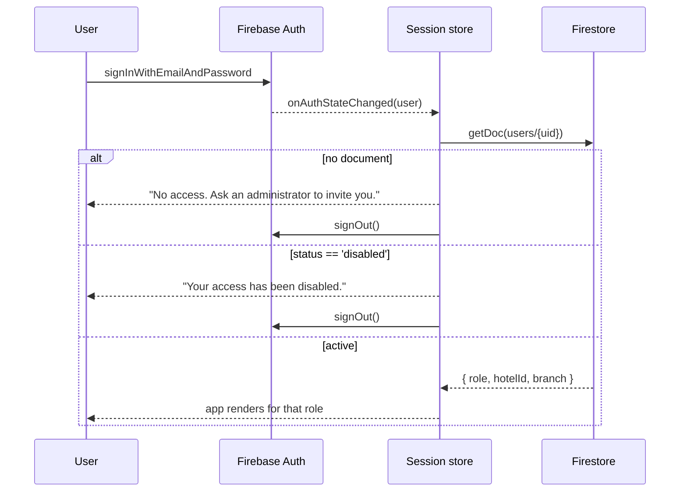

← [04 — RBAC](04-rbac-and-security-rules.md) · [Index](README.md) · Next: [06 — Sprint](06-sprint-and-commits.md)

---

# 05 — Module specifications

One section per module. Each gives what to build, the acceptance criteria, and the traps.

---

## 5.1 Authentication

**New.** Phase 1 has none.

| Screen | Route | Notes |
|---|---|---|
| Sign in | `/login` | Email + password |
| Sign up | `/signup` | Claims a pending invitation |
| Forgot password | `/forgot-password` | `sendPasswordResetEmail` |
| Profile | `/profile` | Name, phone, avatar. **Not** role or status |



⚠️ **An Auth account without a `users` document must be signed out immediately** with a clear
message. Otherwise the app renders with an undefined role and every rule fails, which looks like
a broken product rather than a permissions problem.

### Acceptance

- [ ] Sign in, sign out, session survives a refresh
- [ ] Password reset email sends
- [ ] Auth user with no `users` doc → signed out with a message
- [ ] Disabled user → signed out with a message
- [ ] Role switcher hidden unless `import.meta.env.DEV`
- [ ] `useScope()`, `useActor()`, `useCurrentUser()` keep their signatures

🔧 **Keep the role switcher in development.** It is still the fastest way to review the
permission model.

---

## 5.2 Users

**New CRUD.** Fields: name, email, phone, role, status, branch.

### The invitation flow — why not direct creation

Creating another person's Auth account needs the Admin SDK. Not available on Spark.

| Option | Verdict |
|---|---|
| `createUserWithEmailAndPassword` from the admin's browser | ✗ Signs the admin out and in as the new user |
| A second Firebase app instance to create the user | ⚠️ Works, but the admin must set the password and transmit it |
| **Invitation** | ✓ No Admin SDK, no password handling |

**The flow:** Owner or Admin creates `users/{tempId}` with `status: "invited"`. The person goes
to `/signup`, enters that email, creates their own password. The app finds the invited record by
email and writes `authUid`, flipping it to `active`.

⚠️ **The invitation record's id is not the uid** until it is claimed. Either migrate the document
to a new id keyed by uid, or keep `authUid` as the lookup field. **Recommendation: key `users`
documents by uid from the start** — on invite, generate a placeholder id, then on claim create
`users/{uid}` and delete the placeholder in a transaction. Rules for this are in
[04 §4.5](04-rbac-and-security-rules.md).

### Acceptance

- [ ] Owner creates an invitation with any role
- [ ] Admin creates an invitation, but **cannot** select owner/admin/manager
- [ ] The invited person completes sign-up and lands with the right role
- [ ] Disable revokes access on the next request
- [ ] A user can edit their own name and phone, never their role
- [ ] Rule tests 7, 8, 9 pass

---

## 5.3 Hotels

**New CRUD** plus room configuration. Fields per [03 §3.3](03-data-model.md).

| Screen | Route | Access |
|---|---|---|
| List | `/hotels` | All |
| Detail | `/hotels/:id` | All |
| Create / edit | `/hotels/new`, `/hotels/:id/edit` | Owner, Admin |
| **Room configuration** | `/hotels/:id/config` | Owner, Admin (others read-only) |
| **Commercial** | `/hotels/:id/commercial` | **Owner, Admin only** |

`/hotels/:id/rates` is **replaced** by `/hotels/:id/config` — room types, meal plans, seasons.
No money anywhere on it.

⚠️ **The Commercial tab must not render at all for other roles** — not disabled, absent. A
disabled tab advertises that commission exists and invites a console attempt. This is the one
place the product deviates from ADR-12 ("show blocked actions"), and deliberately: ADR-12 is
about *teaching the permission model*, not about advertising commercially sensitive data.

### Acceptance

- [ ] Create a hotel with room types, meal plans and seasons
- [ ] No price field anywhere in hotel configuration
- [ ] Commission is on a separate screen, Owner/Admin only
- [ ] A salesperson reading `hotels/{id}/private/commercial` gets denied — and the UI treats
      that as "not available", not an error
- [ ] Inventory route and nav entry removed; the code still compiles

---

## 5.4 Room configuration

```
Hotel
 ├─ Room types      name · code · totalRooms · maxOccupancy · maxExtraBeds · amenities · sizeSqft
 ├─ Meal plans      any of EP · AP · MAP · ALL_INCLUSIVE
 └─ Seasons         name · validFrom · validTo · mealPlans[] · minNights · policy
```

⚠️ **No prices.** If a price field appears here, C-2 has been misread.

**Season overlap** is permitted; resolution is newest `validFrom` first. Show a warning at
configuration time listing which dates overlap — visible, not blocking. See open decision 3.

---

## 5.5 Customers and Companies

Largely unchanged. Both gain CSV import ([5.9](#59-csv-import)).

Companies gain nothing new — GST number, billing address, contact person and credit terms all
exist in Phase 1 as `gstin`, `address`, `contacts`, `paymentTermDays`.

### Acceptance

- [ ] Full CRUD against Firestore
- [ ] Duplicate warning still fires on email and phone
- [ ] Merge works as a resumable job
- [ ] Salespeople see only their own accounts, and the **query** is constrained (not just the
      rule) — see [04 §4.3](04-rbac-and-security-rules.md)

---

## 5.6 Reservations

The largest module. New fields per [03 §3.6](03-data-model.md).

### The wizard, revised

| Step | Phase 1 | Phase 2 |
|---|---|---|
| 1 Customer | unchanged | + payment term (DP / RA / BTC) |
| 2 Property | unchanged | — |
| 3 Dates & rooms | pick quantity | + extra beds, + season resolved from dates |
| 4 **Rates** | pick a rate plan | **enter selling rate, extra bed rate, child rate** |
| 5 Review | unchanged | + hotel confirmation fields |

### Step 4 — the rate entry screen

Per room line:

```
Deluxe Room  ×2                    Meal plan: [MAP ▾]      Season: Monsoon Saver
Selling rate      ₹ [        ]  per room per night
Extra bed rate    ₹ [        ]  × 1 extra bed
Child rate        ₹ [        ]  × 2 children

Last 3 rates here:  ₹4,600 (12 Jul) · ₹4,400 (28 Jun) · ₹4,800 (03 Jun)
Line total  ₹28,800    GST 5%  ₹1,440    →  ₹30,240
```

⚠️ **Show the last three rates charged** for that room type at that property. Without a
configured price there is no anchor, and an operator quoting from memory will drift. This is the
cheapest possible guard and it is specified in [01 C-2](01-scope-and-changes.md).

⚠️ **Flag unusual rates, do not block.** More than 40% below the trailing median for that room
type shows an inline warning. The approver sees the same flag on the approval card. Open
decision 5.

### GST per line, not per reservation

```ts
const taxAmount = rooms.reduce(
  (sum, r) => sum + Math.round(lineTotal(r) * gstRateFor(r.sellingRate)),
  0,
);
```

⚠️ A reservation can legitimately contain both bands. Computing tax on the reservation total is
a **tax error**, not a rounding difference.

### Hotel confirmation

Recorded after the property confirms — usually minutes to hours after creation:

| Field | Notes |
|---|---|
| `hotelConfirmationNumber` | The property's own reference |
| `hotelRepName` | Who confirmed |
| `confirmedAt` | Defaults to now, editable |

Surfaced as a **"Record hotel confirmation"** action on the detail page, not in the wizard —
the information does not exist yet at creation time.

### Acceptance

- [ ] Operator-entered rates flow through to the folio unchanged
- [ ] GST computed per line; a mixed-band reservation is correct
- [ ] BTC without a company is rejected in the wizard **and** by the rules
- [ ] Last-three-rates hint appears
- [ ] Hotel confirmation recordable after creation
- [ ] ≥ ₹50,000 still routes to approval
- [ ] `automationQueue` receives `reservation.created`
- [ ] A completed reservation cannot be edited

---

## 5.7 Invoices

Visible to Owner, Admin, Manager, Finance.

| Function | Notes |
|---|---|
| Create from a reservation | Lines copied; totals **recomputed from source**, never from a roll-up |
| View | Printable, Georgia header (Phase 1 layout) |
| History | Per customer, per company |
| GST breakdown | Per line, showing 5% and 18% separately |

⚠️ **Numbering is a transaction against `counters/invoices`** — [02 §2.3](02-architecture-and-spark.md).

⚠️ **No PDF generation.** Phase 2.5 does that. The Print button uses the browser.

### Acceptance

- [ ] Invoice numbers are unique and monotonic under concurrent creation
- [ ] GST breakdown shows both bands where applicable
- [ ] Salesperson gets `PERMISSION_DENIED`, and the nav entry is absent
- [ ] `invoice.created` queued

---

## 5.8 Payments

Unchanged from Phase 1 except Firestore backing. `PaymentMethod` (`bank_transfer` | `upi` |
`card` | `cash` | `cheque`) stays — it is distinct from the reservation's `PaymentTerm`
([01 C-5](01-scope-and-changes.md)).

Recording a payment updates `amountPaid`, `amountDue` and status **in one transaction** with the
invoice.

---

## 5.9 CSV import

Generalise the Phase 1 wizard into `features/import/` driven by a descriptor:

```ts
export interface ImportDescriptor<T> {
  entity: "customers" | "companies" | "hotels";
  label: string;
  fields: ImportField[];
  duplicateKeys: (keyof T)[];
  validate: (row: Record<string, string>) => ImportIssue[];
  toDocument: (row: Record<string, string>, actor: Actor) => Partial<T>;
}
```

Mounted three times: `/crm/import`, `/crm/companies/import`, `/hotels/import`.

| Entity | Required | Duplicate key |
|---|---|---|
| Customers | first name, last name, email, phone | email · phone (last 10) |
| Companies | name, GSTIN | GSTIN · name |
| Hotels | name, city, state | name + city |

**Two classes of problem, as in Phase 1:**

- Duplicated **inside the file** → error, row skipped.
- Collides with an **existing** record → warning, row imports.

⚠️ **Import must be a resumable job.** 500 rows exceeds a single batch, and the tab can close.
`importJobs/{id}` tracks phase and cursor; the screen shows progress and can resume.

### ⚠️ Excel is out of scope

`.xlsx` needs a parser — `sheetjs` adds ~400 kB. **Recommendation: CSV only**, with the empty
state saying *"Exporting from Excel? Use File → Save As → CSV."* Open decision 4.

### Acceptance

- [ ] One import engine, three entities
- [ ] Auto-mapping still guesses headers
- [ ] Errors and warnings behave as in Phase 1
- [ ] 500-row file imports without exceeding a batch
- [ ] Closing the tab mid-import leaves a resumable job

---

## 5.10 Dashboard

Replace mock data with live Firestore. Show: reservations, customers, hotels, companies, revenue,
pending reservations, today's check-ins, today's check-outs.

⚠️ **Do not fetch collections to count them.** Eight counts done naïvely is thousands of reads
per dashboard load and will exhaust the Spark quota. Use:

| Metric | Source |
|---|---|
| Total counts | Stored counters, or `getCountFromServer()` (one read per query) |
| Today's check-ins / check-outs | Bounded query on `checkIn == today` |
| Revenue this month | Bounded query on the month window — **both bounds**, per [D-03](../manual/12-defect-log.md) |
| Pending reservations | Bounded query on `status == 'pending_approval'` |

`getCountFromServer()` is available on Spark and bills a single read regardless of the match
count. Prefer it over stored counters where a live number matters.

---

## 5.11 Administration

New in Phase 2:

| Tool | Access | Purpose |
|---|---|---|
| **Recompute totals** | Owner | Recount roll-ups from source, report differences before applying |
| **Automation queue** | Owner, Admin | Inspect pending and failed events |
| **Import jobs** | Owner, Admin | Resume or abandon a stalled import |
| **Merge jobs** | Owner, Admin | Resume or abandon a stalled merge |

The recompute tool is the accepted mitigation for client-maintained counters
([02 §2.3](02-architecture-and-spark.md)). It must **show the differences and require
confirmation** before writing — silently correcting figures is how a discrepancy stops being
investigated.

---

## 5.12 Audit and notifications

Audit entries written on: reservation created/updated/status-changed, hotel updated, customer
updated, user created, invoice created, permissions updated, merge completed, import completed.

Notifications are **in-app only**. Email belongs to Phase 2.5.

---

## 5.13 Reports

Unchanged in shape. Two constraints:

⚠️ **Bounded queries only.** A report reading all 1,100 reservations costs 1,100 reads per view.
Every report queries a window and states it on screen.

⚠️ **Occupancy still comes from the inventory model**, not from reservations
([ADR-19](../manual/03-decision-log.md)). Hiding the inventory *screen* does not change this.
Label it as an estimate until a real feed exists.

---

## 5.14 What each module writes to `automationQueue`

| Module | Events |
|---|---|
| Reservations | `created` · `confirmed` · `approved` · `cancelled` · `checked_in` · `checked_out` |
| Invoices | `invoice.created` |
| Payments | `payment.recorded` |
| Customers | `customer.created` |
| Companies | `company.created` |
| Hotels | `hotel.created` |
| Users | `user.invited` |

Written **in the same transaction as the entity**. An event that describes a document which was
never written is worse than no event.

---

Next: [06 — Sprint sequence and commits](06-sprint-and-commits.md)
