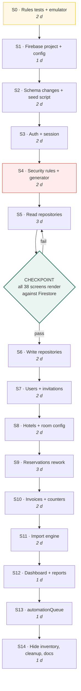

← [05 — Module specs](05-module-specs.md) · [Index](README.md) · Next: [07 — Phase 2.5 n8n](07-phase-2.5-n8n.md)

---

# 06 — Sprint sequence and commits

One commit per completed module. No large commits.

---

## 6.1 The order, and why



**Total: 26 days.** Assumes one engineer, no parallelism.

### Three sequencing decisions worth understanding

**S0 comes first — tests before Firebase.** The rules layer is stable and is the highest-value
code in the project. Writing Vitest over `permissions.ts` and `rules.ts` now gives a safety net
for everything that follows, and it is what ADR-24 in the Phase 1 manual already flags as the
first thing Phase 2 should do.

**S5 is reads only, and S5→S6 is a checkpoint.** Making every screen render against real
Firestore before writing a single mutation proves the repository interface held. If screens need
changing here for reasons not in [01](01-scope-and-changes.md), the seam is broken — stop and
fix the interface rather than patching screens.

**S4 (rules) precedes S5 (repositories).** Writing repositories first means developing against
open rules, then discovering at lockdown that half the queries violate them. Rules first means
every repository is written against the real constraint.

---

## 6.2 Sprint detail

### S0 · Rules tests and emulator — 2 days

```bash
npm i -D vitest @firebase/rules-unit-testing firebase-tools
firebase init emulators        # firestore + auth only
```

- Vitest over `src/lib/permissions.ts` — the full 6 × 20 matrix
- Vitest over `src/lib/rules.ts` — all 11 business rules
- Emulator running, `npm run test:rules` wired

```
test(rules): Vitest over permissions matrix and business rules
chore(firebase): emulator suite for firestore and auth
```

### S1 · Firebase project and config — 1 day

- Project created, **Spark plan confirmed**
- `.env.example` committed; `.env` gitignored
- `src/lib/firebase.ts` — app, auth, firestore, storage
- Emulator connection in dev

```
feat(firebase): project configuration and SDK initialisation
```

### S2 · Schema changes and seed script — 2 days

- `src/data/types.ts` per [03](03-data-model.md)
- `MealPlan`: `CP` → `ALL_INCLUSIVE`
- `RoomType`: drop `baseRate`, `extraAdultRate`
- `ratePlans` → `seasons`
- `Reservation`: 5 new fields, `rooms[]` restructured
- `src/lib/tax.ts` — GST 5% / 18%
- `scripts/seed-firestore.ts` from `hotels.data.ts`

⚠️ This breaks compilation across many files. Expected — fix forward, do not stub.

```
feat(gst): GST at 5 percent below 7500 and 18 percent at or above
refactor(types): move pricing from room configuration to reservations
feat(seasons): replace rate plans with seasons carrying meal plans
feat(seed): Firestore seeding script from the 32 partner properties
```

### S3 · Auth and session — 2 days

Login, signup, forgot password, profile. `useSession` fed by `onAuthStateChanged`. Role switcher
gated to `import.meta.env.DEV`.

```
feat(auth): Firebase Authentication with login, reset and profile
feat(auth): invitation claim flow for new users
```

### S4 · Security rules — 2 days

`firestore.rules`, `firestore.indexes.json`, `scripts/generate-rules.ts`, and the 18 rule tests
from [04 §4.9](04-rbac-and-security-rules.md).

⚠️ **Do not proceed past this sprint until tests 7, 8 and 9 pass** — self-role-change, self-status-change,
and admin-cannot-create-owner. A failure there is a full compromise.

```
feat(rbac): Firestore security rules generated from the permission matrix
test(rbac): security rule tests covering escalation and scoping
feat(rbac): commission moved to a protected subcollection
```

### S5 · Read repositories — 3 days · **CHECKPOINT**

`src/data/repositories/firestore/` — read methods only. Switch `index.ts`. Mock still present as
a fallback.

**Exit criteria:** all 38 screens render against Firestore. Every list paginates. No screen
changed for a reason not in [01](01-scope-and-changes.md).

```
refactor(firebase): read repositories for all collections
refactor(firebase): cursor pagination replacing offset
```

### S6 · Write repositories — 2 days

Creates, updates, transactions, roll-ups, audit writes. Delete `repositories/mock/` and
`src/data/seed/` (keep `hotels.data.ts`).

```
refactor(firebase): write repositories with transactional roll-ups
chore(cleanup): remove the mock repository and seed generator
```

### S7 · Users and invitations — 2 days

```
feat(users): user management with invitation-based onboarding
```

### S8 · Hotels and room configuration — 2 days

```
feat(hotels): hotel CRUD with contact and address fields
feat(hotels): room type, meal plan and season configuration
feat(hotels): commercial terms screen restricted to owner and admin
```

### S9 · Reservations rework — 3 days

Operator-entered rates, per-line GST, payment term, hotel confirmation, last-three-rates hint.

```
feat(reservations): operator-entered selling, extra bed and child rates
feat(reservations): payment terms DP, RA and BTC
feat(reservations): hotel confirmation number, representative and time
```

### S10 · Invoices and counters — 2 days

```
feat(invoice): invoice module with transactional numbering
feat(invoice): GST breakdown across both bands
```

### S11 · Import engine — 2 days

```
feat(import): generalised CSV import for customers, companies and hotels
feat(import): resumable import jobs
```

### S12 · Dashboard and reports — 1 day

⚠️ Bounded queries and `getCountFromServer()` only.

```
feat(dashboard): live Firestore metrics with bounded queries
```

### S13 · automationQueue — 1 day

```
feat(automation): business event queue for Phase 2.5 consumption
```

### S14 · Hide inventory, cleanup, docs — 1 day

```
chore(inventory): hide inventory routes and navigation, preserve the code
docs(phase2): update the service manual for Phase 2
```

---

## 6.3 Branching

```
main                     ← protected, always deployable
 └─ phase-2/s03-auth     ← one branch per sprint
```

```bash
git switch -c phase-2/s03-auth
# … work, commit as above …
git push -u origin phase-2/s03-auth
# open a PR, self-review the diff, merge to main
```

⚠️ **Self-review the diff before merging.** With no reviewer, reading your own diff in the PR
view is the only quality gate — and it catches things the editor does not.

### Commit message format

```
<type>(<scope>): <imperative summary>

<why, if not obvious from the summary>
```

Types: `feat` · `fix` · `refactor` · `chore` · `test` · `docs`

---

## 6.4 Definition of done, per sprint

Every sprint ends with all of:

- [ ] `npx tsc --noEmit` clean
- [ ] `npm run build` clean
- [ ] `npm run test` passing
- [ ] `npm run test:rules` passing
- [ ] The affected screens exercised **by hand in a real browser**
- [ ] Committed and pushed
- [ ] Manual updated if behaviour changed

⚠️ **Exercise by hand.** Phase 1 shipped with twelve flows never click-tested
([manual §13.4](../manual/13-verification-record.md)) because the automated browser could not
deliver real input events. That gap is not to be repeated — and D-10, the duplicate primary
button, was invisible to every structural check and only appeared in a rendered screenshot.

---

## 6.5 Risk register

| # | Risk | Likelihood | Impact | Mitigation |
|---|---|---|---|---|
| R1 | Repository interface breaks; screens need rewriting | Low | **High** | The S5 checkpoint catches it before any writes exist |
| R2 | Rules and TypeScript matrix drift | Medium | **High** | Generate rules; `rules:check` fails the build |
| R3 | Privilege escalation via self-role-write | Low | **Critical** | Rule tests 7–9, mandatory before S5 |
| R4 | Commission leaks through a document read | Medium | **High** | Subcollection + rule test 3 |
| R5 | Spark read quota exhausted | Medium | Medium | Bounded queries, `getCountFromServer`, 30 s staleTime |
| R6 | Roll-up counters drift | **High** | Low | Accepted. Recompute tool; invoices compute from source |
| R7 | Merge or import interrupted | Medium | Medium | Resumable job documents |
| R8 | GST band applied to the total instead of per line | Medium | **High** | Explicit in [03 §3.6](03-data-model.md); needs a unit test |
| R9 | Salesperson query fails because rule and query disagree | **High** | Medium | [04 §4.3](04-rbac-and-security-rules.md); test with a real salesperson account |
| R10 | Unbounded rates lead to underquoting | Medium | Medium | Last-three-rates hint; outlier flag |

R3 and R8 are the two that would do real damage. R9 is the one most likely to actually happen.

---

## 6.6 What is deliberately not in this sprint

Voucher generation · PDF generation · email · Google Drive · WhatsApp · marketing · AI ·
calendar · accounting · n8n workflows · inventory management · Excel import · numbered
pagination.

The architecture is prepared for all of them. None is built.

---

Next: [07 — Phase 2.5, the n8n architecture](07-phase-2.5-n8n.md)
