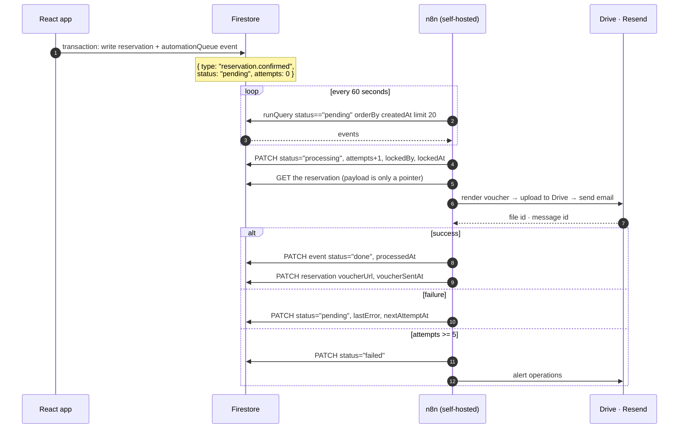
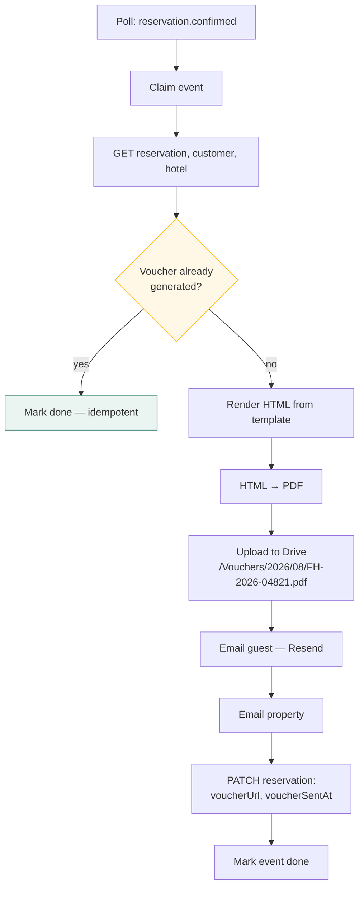

← [06 — Sprint](06-sprint-and-commits.md) · [Index](README.md)

---

# 07 — Phase 2.5: the n8n architecture

**Written now, built later.** Its purpose is to make Phase 2 build the right extension points so
that Phase 2.5 needs no refactoring.

Everything here is design. Nothing in this document is built during Phase 2.

---

## 7.1 What Phase 2.5 delivers

| | |
|---|---|
| Voucher generation | HTML → PDF from a reservation |
| Google Drive | Voucher and invoice filing |
| Email | Guest confirmations, property notifications, overdue chasers |
| Status updates | n8n writes back to Firestore |
| Retry and failure handling | Bounded retry, dead-letter, an operator view |

---

## 7.2 The one hard constraint: there is no push

Firestore triggers need Cloud Functions. Spark has none. **n8n must poll.**



### Polling trade-offs

| | |
|---|---|
| Latency | Up to 60 s from event to action. Acceptable for vouchers and email |
| Cost | 1,440 polls/day × ~1 read = well inside the Spark quota |
| Failure mode | n8n down → events queue up and drain on recovery. **No loss** |
| Alternative | Blaze + a Function gives sub-second push. A cost decision, not a design one |

---

## 7.3 The locking problem

Two n8n workers polling the same query will both claim the same event.

⚠️ **Firestore has no atomic claim over the REST API.** The mitigation is a conditional update
plus a lease:

```json
{
  "status": "processing",
  "lockedBy": "n8n-worker-1",
  "lockedAt": "2026-08-01T10:00:00Z",
  "leaseExpiresAt": "2026-08-01T10:05:00Z"
}
```

- Poll for `status == "pending"` **or** (`status == "processing"` and `leaseExpiresAt < now`) —
  the second clause recovers events orphaned by a crashed worker.
- Use a Firestore **transaction via REST** (`:commit` with a precondition on `updateTime`) so a
  second worker's claim fails.

**Simplest safe answer for this scale: run exactly one n8n worker.** With ~150 reservations a
day, concurrency buys nothing and costs correctness risk. Document it as a deliberate limit.

---

## 7.4 Workflows

| Workflow | Trigger event | Steps |
|---|---|---|
| **Voucher** | `reservation.confirmed` | render → PDF → Drive → email guest → email property → write back `voucherUrl` |
| **Approval alert** | `reservation.created` where `requiresApproval` | email the manager → in-app notification |
| **Cancellation** | `reservation.cancelled` | email guest → email property → Drive: move to `cancelled/` |
| **Invoice delivery** | `invoice.created` | render → PDF → Drive → email billing contact |
| **Payment receipt** | `payment.recorded` | receipt → email |
| **Overdue chaser** | scheduled daily | query overdue invoices → email → log |
| **Welcome** | `user.invited` | email the invitation link |

### Voucher workflow in detail



⚠️ **Idempotency is not optional.** A retry after a timeout must not send a second voucher. The
check is `reservation.voucherUrl != null` — which is why Phase 2 must add that field even though
nothing writes it yet.

---

## 7.5 What Phase 2 must provide

🔧 **These are the extension points. Build them in Phase 2 even though nothing consumes them.**

| # | Requirement | Where | Why |
|---|---|---|---|
| 1 | `automationQueue` written in the entity's transaction | All write repos | An event must never describe a document that does not exist |
| 2 | `status`, `attempts`, `lastError`, `lockedBy`, `lockedAt`, `leaseExpiresAt` on every event | `types.ts` | Retry and locking need them from day one |
| 3 | Minimal payload — ids, not copies | Write repos | A fat payload goes stale |
| 4 | `voucherUrl`, `voucherSentAt` on `Reservation` | `types.ts` | The idempotency check |
| 5 | `invoicePdfUrl`, `invoiceSentAt` on `Invoice` | `types.ts` | Same |
| 6 | A dedicated n8n service account with its own role | Auth + rules | So its writes are attributable and constrained |
| 7 | Composite index `status ASC, createdAt ASC` | `firestore.indexes.json` | The polling query |
| 8 | Owner/Admin queue viewer | Administration | Operators must see failures |

### The n8n service account

```js
// firestore.rules
function isAutomation() {
  return isSignedIn() && userDoc().role == 'automation';
}

match /automationQueue/{id} {
  allow read:   if hasAnyRole(ADMINS()) || isAutomation();
  allow create: if isSignedIn() && isActive()
                && request.resource.data.status == 'pending';
  allow update: if isAutomation()
                && request.resource.data.diff(resource.data).affectedKeys()
                     .hasOnly(['status','attempts','lastError','processedAt',
                               'lockedBy','lockedAt','leaseExpiresAt']);
  allow delete: if false;
}
```

⚠️ `automation` is a **seventh role**, invisible in the role picker and never assigned to a
person. Phase 2 must define it in `permissions.ts` with the narrow grants above, or Phase 2.5
begins by editing security rules — exactly the refactoring this document exists to prevent.

---

## 7.6 Google Drive structure

```
Fidato CRS/
├─ Vouchers/{yyyy}/{MM}/FH-2026-04821.pdf
├─ Invoices/{yyyy}/{MM}/INV-2607-0193.pdf
├─ Cancellations/{yyyy}/{MM}/FH-2026-04821-cancelled.pdf
└─ Reports/{yyyy}/{MM}/…
```

Year and month folders keep any single folder under Drive's practical listing limits and make
retention obvious later.

n8n authenticates with a **service account** holding write access to that one shared drive —
never a personal Google account.

---

## 7.7 Voucher template

An HTML template rendered with reservation data, then converted to PDF — the same approach as
the Phase 1 manual's PDF build (`tools/pdf/`), which already proves the toolchain works.

| Section | Source |
|---|---|
| Header | Fidato logo, Georgia wordmark — matches the invoice |
| Reference | `reservation.reference` |
| Guest | `customerName`, contact |
| Property | `hotelName`, address, phone |
| Stay | check-in, check-out, nights, rooms, meal plan |
| Confirmation | `hotelConfirmationNumber`, `hotelRepName` ← **why C-5 exists** |
| Charges | Line items, GST breakdown, total |
| Terms | Cancellation policy from the season |
| Footer | Support email and phone from `settings/org` |

⚠️ The confirmation fields added in [01 C-5](01-scope-and-changes.md) are exactly what a guest
needs when they arrive at the property. That requirement and this template are the same
requirement, seen from two ends.

---

## 7.8 Email — Resend

| Template | To | Trigger |
|---|---|---|
| Booking confirmation + voucher | Guest | `reservation.confirmed` |
| Property notification | Hotel | `reservation.confirmed` |
| Cancellation | Guest + hotel | `reservation.cancelled` |
| Approval needed | Manager | `reservation.created` ≥ ₹50,000 |
| Invoice | Billing contact | `invoice.created` |
| Payment receipt | Payer | `payment.recorded` |
| Overdue reminder | Billing contact | Scheduled |
| Invitation | New user | `user.invited` |

Phase 1 already ships 12 message templates with merge fields at `/notifications/templates`.
**Those become the Resend templates** — the wording is written and reviewed. Phase 2.5 ports
them rather than authoring them.

---

## 7.9 Retry and failure

| Attempt | Delay |
|---|---:|
| 1 | immediate |
| 2 | 1 min |
| 3 | 5 min |
| 4 | 30 min |
| 5 | 2 h |
| 6+ | `status: "failed"` — dead letter |

Failed events surface in Administration → Automation queue with the error and a **Retry** action
that resets `status` to `pending` and `attempts` to 0.

⚠️ **Distinguish transient from permanent.** A 500 from Drive is worth retrying; a malformed
email address is not — retrying it five times just delays the operator finding out. n8n should
mark 4xx responses `failed` immediately and only back off on 5xx and timeouts.

---

## 7.10 Webhook security

Phase 2.5 may add webhooks *into* n8n (for example, a "resend voucher" button). If so:

| Control | Implementation |
|---|---|
| Shared secret | HMAC-SHA256 over the body, `X-Fidato-Signature` header |
| Timestamp | Reject anything older than 5 minutes |
| Replay | Cache recent request ids |
| Transport | HTTPS only |
| Allowlist | n8n accepts only the app's origin |

⚠️ **The secret must never reach the browser.** A React app cannot hold an HMAC key — anything
in the bundle is public. A "resend voucher" button must therefore write an
`automationQueue` event and let n8n poll it, not call a webhook directly. **This is why the queue
is the only integration path**, and why the rule at the top of [the index](README.md) exists.

---

## 7.11 Firestore write-back

n8n writes back through the `automation` service account:

| Collection | Fields it may write |
|---|---|
| `automationQueue` | `status`, `attempts`, `lastError`, `processedAt`, lock fields |
| `reservations` | `voucherUrl`, `voucherSentAt` only |
| `invoices` | `invoicePdfUrl`, `invoiceSentAt` only |
| `notifications` | create only |
| `auditLogs` | create only |

Constrained with `affectedKeys().hasOnly(...)` so a compromised n8n instance cannot alter
commercial data.

---

## 7.12 Sequencing

| | Phase 2 | Phase 2.5 |
|---|---|---|
| Write events | ✅ | — |
| Process events | — | ✅ |
| Voucher fields on documents | ✅ (unused) | ✅ (written) |
| `automation` role | ✅ (defined) | ✅ (used) |
| Queue viewer | ✅ (read-only) | ✅ (+ retry) |
| Message templates | ✅ (in-app) | ✅ (ported to Resend) |
| Drive, PDF, email | ❌ | ✅ |

**If Phase 2 delivers the eight items in [7.5](#75-what-phase-2-must-provide), Phase 2.5 adds no
fields, changes no rules and refactors nothing.** That is the whole purpose of writing this
document before building Phase 2.

---

## 7.13 Open questions for Phase 2.5

| # | Question |
|---|---|
| 1 | Where is n8n hosted — self-hosted VPS, or n8n Cloud? |
| 2 | Is 60 s polling latency acceptable, or does this justify Blaze and a Function? |
| 3 | Shared Drive or a service-account-owned folder? |
| 4 | Does the guest voucher come from a Fidato domain, and is SPF/DKIM configured? |
| 5 | Who is alerted when an event dead-letters? |
| 6 | Retention — how long do vouchers stay in Drive? |

---

← [Index](README.md)
