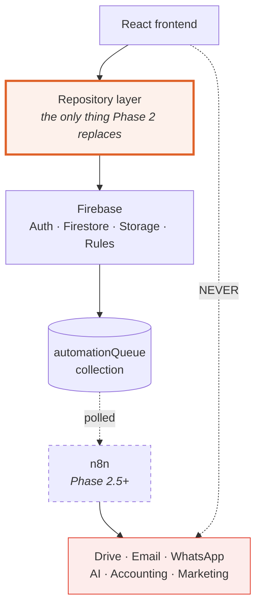

# Phase 2 — Production Backend

**Sprint document.** Read this before writing any code.

| | |
|---|---|
| **Objective** | Convert the Phase 1 prototype into a functional production backend on Firebase, **Spark plan only** |
| **Not** | The final launch. Communication workflows arrive in Phase 2.5 via n8n |
| **Repository** | `https://github.com/hotelsfidato-ai/Crs-Test-.git` |
| **Branch model** | `main` protected · one branch and one commit per module |
| **Estimate** | 21–25 working days — see [06](06-sprint-and-commits.md) |

---

## Documents

| # | Document | Read when |
|---|---|---|
| **01** | [Scope and breaking changes](01-scope-and-changes.md) | First. The 7 requested changes and what they break |
| **02** | [Architecture and the Spark constraint](02-architecture-and-spark.md) | **Before designing anything.** Four Phase 1 recommendations do not survive Spark |
| **03** | [Data model changes](03-data-model.md) | When touching `src/data/types.ts` |
| **04** | [RBAC and security rules](04-rbac-and-security-rules.md) | Before implementing any permission |
| **05** | [Module specifications](05-module-specs.md) | While building each module |
| **06** | [Sprint sequence and commits](06-sprint-and-commits.md) | Daily |
| **07** | [Phase 2.5 — n8n architecture](07-phase-2.5-n8n.md) | Now, so Phase 2 builds the right seams |

---

## The architecture, unchanged for the life of the project

**The rule that must never be broken:** the React application never talks to Drive, WhatsApp,
email providers, AI APIs, accounting or marketing systems. Those belong to n8n. The app writes
an event to `automationQueue` and forgets about it.

---

## Read this before you start

Three things in this plan will surprise you if you skip [02](02-architecture-and-spark.md).

**1 — Custom claims are impossible on Spark.** Setting a custom claim requires the Admin SDK,
which requires a server or a Cloud Function. Neither is available. Roles therefore live in a
Firestore document and security rules read them with `get()`. This is workable and it is what
the plan specifies, but it is not what the Phase 1 handover assumed.

**2 — Hiding a field in the UI is not security.** Firestore rules are document-level, not
field-level. If `commissionPercent` sits on the hotel document, **every role that can read a
hotel can read the commission** — regardless of what the interface shows. The requirement that
commission be visible only to Owner and Admin forces it into a subcollection. See
[04 §4.6](04-rbac-and-security-rules.md).

**3 — Four Phase 1 recommendations do not survive.** Roll-up counters, the merge operation,
invoice numbering and audit-log immutability were all specified in Volume XIV as Cloud
Functions. All four need a different design on Spark. [02 §2.3](02-architecture-and-spark.md)
gives the replacement for each, with the risk each one carries.

---

## Definition of done

| # | Criterion |
|---|---|
| 1 | Every mock repository replaced by a Firebase repository; `repositories/mock/` deleted |
| 2 | Firebase Authentication working: login, logout, session persistence, password reset, profile |
| 3 | Firestore holds all business entities |
| 4 | Hotel, Company, Customer, User, Reservation and Invoice modules operational |
| 5 | GST calculated automatically at 5% / 18% |
| 6 | RBAC enforced in the UI **and** in security rules |
| 7 | Commission readable only by Owner and Admin, enforced by rules |
| 8 | Inventory hidden from navigation and routes, code preserved |
| 9 | Business events written to `automationQueue` |
| 10 | Runs entirely on the Firebase Spark plan |
| 11 | CSV import working for customers, companies and hotels |
| 12 | Security rules have tests |
| 13 | One commit per module, all pushed to `main` |

---

## Out of scope — do not build

Voucher generation · PDF generation · email delivery · Google Drive · WhatsApp · marketing ·
AI · calendar · accounting integration · n8n workflows themselves · inventory management.

Prepare the architecture for them. Build none of them.
